# RecClaw Research Line 三臂实施路线图

> - 工作 ID：`HELIX-ABC-001`（在 WP0 冻结前为工作标识）
> - 基线日期：2026-07-23（Asia/Shanghai）
> - 路线图修订日期：2026-07-24（Asia/Shanghai）
> - 任务模式：架构实施规划 / development experiment
> - 运行车道：Non-authoritative Exploration Lane
> - Authority：`NONE`
> - Evidence class：`DEVELOPMENT_ONLY`
> - Formal acceptance：`false`
> - 当前实施 Profile：`MINIMUM_SUFFICIENT_V1`
> - Hardening Profile：`DEFERRED_NOT_CANARY_PREREQUISITE`
> - Roadmap status：`LOCAL_COMPLETE`
> - Implementation status：`NOT_STARTED`
> 当前状态只描述本文档，不代表实现、实验、gate 或 authority 状态。

## 0. 一页结论

当前 `feat/research_line` 不是一个可直接运行的三臂系统。它包含：

1. 已接入旧 BPR/LightGCN 主循环的 Research Line 原型；
2. 独立、静态且较完整的 BL-ICF mechanism-space compiler；
3. 尚未接入本分支、但在本地 `phase1/evidence-guard-ab002` 交付线中有可复用实现和实验基础设施的 development Evidence Guard。

三者目前没有组成同一条身份闭合的运行链。本路线图保留原有严谨规范作为
**Hardening 上界**，但当前工程只执行
`MINIMUM_SUFFICIENT_V1`：先用单写者事务存储和最小核心合同守住相同实验不变量，把
Producer、Router、Meta 与 BL-ICF 科研能力做强，再在出现明确扩展触发条件时实施分布式
容错硬化。正确的当前实施顺序是：

```text
M0 冻结三臂、核心 typed models、SearchRound、预算与单写者状态库
  -> M1 建立共同 BL_ICF_EXECUTABLE_PROFILE_V1 与 CommonExecutionGuard vertical slice
  -> M2 先验证 bounded independent Producer Agents，再验证 Search-Utility Router/Meta 与 Research Quality Gate
  -> M3 在 Gate 后仅经 helix/guard_adapter.py 接入 EvidencePort 并完成三臂 composition
  -> M4 完成 pre-Canary crash/replay/concurrency/mount adversarial checks
  -> M5 Canary
  -> M6 Pilot 与 Main freeze
  -> M7 Main Campaign
  -> M8 盲化分析与交付
```

Codex 每次只能执行一个Milestone。只有当前Milestone的代码、测试、execution record与
人工可复核handoff全部完成后，才能由用户启动下一个Milestone；不得顺手预建未来
Milestone的schema、writer、orchestrator或兼容层。

该路线图建立以下必要条件：

- 实现边界清晰；
- 在所有冻结不变量、隔离检查和协议检查实际通过时，A/B/C contrasts 可解释；
- 共同 BL-ICF 身份可验证；
- schema/protocol/path/compile/import/smoke/budget/runner基础检查由三臂同一
  CommonExecutionGuard承担，Research Router Hard Gates只优化Search Utility；
- 一个SearchRound最多一个普通训练、恰好一个round-close feedback，并报告Round、
  Execution Count、Token、GPU Cost四轴；
- `SingleWriterExperimentStoreV1`以SQLite WAL、事务、UNIQUE/CHECK约束、append-only
  events、payload SHA-256和原子文件写入维护round、execution、feedback、triplet与stop
  不变量；
- Main V1的BL可执行空间达到推荐算法研究的明确科学下限，而不是仅能调BPR/LightGCN参数；
- Main默认Producer target为`BOUNDED_INDEPENDENT_PRODUCER_AGENTS_V1`；三臂公平单位是
  每round一个ProposalGenerationSession与相同总资源包络，不是相同physical call count；
- Research Line在Guard接入前必须通过`ResearchCapabilityQualityGateV1`；
- `ADVISORY_ONLY`只允许作为开发期shadow instrumentation，不能成为Main的Meta模式；
- 失败、缺失和污染不会被静默修复；
- 中性或负向结果仍然可解释、可复现、可指导下一步。

它不能预先保证正向 NDCG 提升，也不能把 development experiment 自动升级为正式科研结论。

### 0.1 两级规范与冲突处理

本文存在两个层级：

1. **当前实施 Profile：`MINIMUM_SUFFICIENT_V1`**
   - 是Codex从现在到Canary/Main实际执行的唯一工程路线；
   - 使用单项目、单调度器、单写者事务存储；
   - 只激活当前Milestone需要的typed models与tests。
2. **Hardening 上界**
   - 保留原CAS、publication head、custody、复杂recovery和多writer设计，作为未来高可靠
     多机/多写者平台的审计上界；
   - 当前不实现，不阻塞Research Capability Quality Gate、Guard Adapter或Canary。

全文所有标题含“Hardening Appendix”的小节共同构成后置附录；其位置用于保留原规范
上下文，不改变其`DEFERRED`状态。

两者冲突时，不变量、实验归因和authority边界取更严格解释；实现机制与实施顺序以
`MINIMUM_SUFFICIENT_V1`为准。只有出现以下任一触发条件，才可另立
`HARDENING_V1` Milestone：

- 需要两个及以上并发writer或独立调度器；
- round状态跨主机/远程存储协调；
- SQLite WAL和单写者恢复在实测中不能满足完整性或吞吐；
- 进入authoritative evidence lane或正式custody/permission服务；
- 用户明确要求生产级分布式容错。

不得为了“未来可能需要”提前实现Hardening。

## 1. 来源、身份与解释优先级

### 1.1 当前实施基线

| Subject | Exact identity | 用途 |
|---|---|---|
| Research Line 基线 | commit `7aeca9278bbe7aac4aaa5de38d67d507c7e172b7` | 本路线图的代码起点 |
| Research Line tree | `ca29f0c1b1883f723a66ebd72b4dc42ba6e112db` | 源树身份 |
| 新工作分支 | `feat/research-line-abc` | 后续实施分支 |
| 新 worktree | `/root/projects/RecClaw_research_line_abc` | 与原脏工作树隔离 |
| 最新本地 Guard 交付线 | `phase1/evidence-guard-ab002` at `0c868c2db3ccd810a88b4bce197d678113b5b9ed` | 只作为选择性移植来源，不整体合并 |

当前 commit/tree只是规划与实施起点。Main Campaign 必须在全部实现和冻结检查完成后重新绑定最终 commit/tree，不能把 `7aeca927...` 当成未来运行身份。

新 worktree checkout 后有三个纯换行表象修改：

```text
notes/method_change_space.md
recclaw_ext/models/lightgcn_lw.py
scripts/agent.py
```

这些修改在开始实施前必须单独处理或在 diff 审核中显式排除，不能与功能变更混在一起。

2026-07-23版本的路线图曾以
`9b5994787d97e9d84859218876e17925b379945f37a410d84339a0f70cac3b2d`
完成本地逐字节复审。该digest只标识修订前的Hardening-heavy文档快照；本次
`MINIMUM_SUFFICIENT_V1`修订产生新bytes，旧审计结论不得冒充对当前文档的独立确认。

### 1.2 GPTPro Final Reference Package

已从以下目录验证 exact-byte manifest：

```text
C:/Users/gtrho/Downloads/RecClaw_v2_0_Final_Reference_Package_2026-07-13
```

| 文件 | SHA-256 |
|---|---|
| Evidence and Decision Record | `dc0c0ba41ed07d17a1c9d83535d1998ca729409bc49f04c1ed2ab8d962347ef2` |
| Architecture / Execution Spec v2.0-RC2 | `2084eb7db0c6534c65e7627c61bac02c15c175def763857627f1980124feb6af` |
| Paper 1 contract draft05 | `a265d4dbd11d07f5c166500b801e6eb6824c6e6f2dfd03f966e398fc2d32a2ce` |
| Final Implementation Blueprint | `f4dfe1bde9ae9bee8049af0f6fdb98884a92e49381d09ec826129cfe84741151` |

这些文件是 content-frozen operational references，但不是 GateDecision。截至
`2026-07-23`（Asia/Shanghai），本路线图没有解析到适用于
`HELIX-ABC-001`、Research Line、BL-ICF 或 development Evidence Guard 的
active external decision。因此以下是当前派生的保守状态，不是页首硬编码的永久事实：

```text
SpecApproved = false
ReferenceImplementationConformant = false
PermissionReleaseGranted = false
ResearchClaimSupported = false
```

每个工作包开始和结束时都必须从指定 decision/access ledger 重新解析状态，并把
resolver 输入、`as_of`、结果与缺失原因写入执行记录。文件 hash、manifest、branch、
commit 或本地 review 只能建立 development integrity，不能成为 registration、
permission、acceptance 或 GateDecision 的独立 trust root。

解释优先级：

1. 用户本轮修正后的三臂定义；
2. RC2 Spec 的 authority、接口、状态与 gate 边界；
3. Paper contract 的研究协议边界；
4. Blueprint 的实施编排；
5. Evidence and Decision Record 的理由与历史；
6. 当前 development 实现。

### 1.3 名称边界

参考包没有直接定义 `research_line`、BL-ICF、Evidence Guard 或本路线图的实验 A/B/C。它们是参考包之后的新 development subjects。

Blueprint 自身也使用 A/B/C 表示 Stage 1A、Profile Static、H1 Pilot 三个执行切片。本文一律使用“Arm A/B/C”表示实验处理，使用“Blueprint Slice A/B/C”表示参考包切片，禁止混称。

## 2. 冻结的实验问题与三臂定义

### 2.1 唯一实验定义

| Arm | Proposal / selection controller | Research Line / Router Hard Gates | CommonExecutionGuard | EvidencePort | Search space |
|---|---|---:|---|---|---|
| A | Original RecClaw controller，输出 BL-ICF program | OFF | 同一 exact `CommonExecutionGuardV1` | `NullEvidencePortV1` | 相同 exact BL-ICF |
| B | Research Line controller | ON | 同一 exact `CommonExecutionGuardV1` | `NullEvidencePortV1` | 相同 exact BL-ICF |
| C | 与 B 相同的 Research Line controller | ON | 同一 exact `CommonExecutionGuardV1` | `EvidenceGuardPortV1` | 相同 exact BL-ICF |

解释规则：

- `B - A`：在冻结 BL executable profile 内，Research Capability bundle 的条件系统增量；
- `C - B`：在同一 Research controller、BL executable profile 与最大资源包络内，
  development Evidence Guard V1 的条件系统增量；
- `C - A`：完整 Helix 组合的总体效果，只作描述性总体比较；
- “Original”只表示原 proposal/selection/feedback 逻辑，不再表示旧窄搜索空间。

由于没有 `Original + Guard + BL-ICF` 第四臂，本设计不是完整 2×2 factorial，不能单独估计 Research Line 与 Guard 的交互项。

### 2.2 核心研究问题

在完全相同的 BL-ICF 可执行空间、`CommonExecutionGuardV1`、development 数据协议、
运行环境、初始状态和最大资源包络下：

1. Research Line 是否提高固定50-SearchRound预算后的最佳
   development-protocol-conformant candidate 质量及搜索效率？
2. Evidence Guard 的完整 PRE+POST bundle 是否通过阻止越界action进入执行请求，并
   对已通过Common mechanical closure的observation独立处理claim ceiling、evidence
   use、protocol branch、cross-protocol contamination与duplicate/replay，避免其污染
   search memory并进一步提高搜索轨迹质量和可靠性？

Main V1把外层比较单位命名为 `SearchRoundV1`。每个opened round恰好创建一个
`ProposalGenerationSessionV1`，代表一次有界proposal-generation session、一个普通候选
执行机会和一个round-close结果反馈机会。A可以在该session中使用一次Original invocation；
B/C可以在同一总资源包络内使用多个有界、独立的Producer invocations。Producer、Router、
Router Hard Gates与Meta仍全部是轮内子步骤，不得创建额外round、普通训练执行或反馈事件。

“相同预算”不再要求三臂拥有相同physical/logical LLM call count，而精确定义为：相同的
50个不可退款`scheduled_slots`、每round恰好一个ProposalGenerationSession，以及相同的
总input-token、总output-token、总billed-token、总proposal count、wall-time、
retry/proposal-attempt、ordinary execution、CommonExecutionGuard validation、GPU
device-time与GPU cost ceilings。A/B/C的session内部调用结构可以不同，但任何Arm都不得
突破共同资源包络。

每轮最多启动一个普通候选训练。PRE block只能沿同一已冻结slate顺位推进；不得刷新
proposal、创建第二个ProposalGenerationSession、增加execution opportunity或把未用预算
转入后续round。invalid proposal、compile failure属于固定proposal batch内的candidate
sub-attempt；可以继续检查同一batch其余项，但不能补充或刷新batch。只有batch最终没有
common-eligible candidate时才以typed no-execution关闭round。slate耗尽、terminal
selection后的materialization/gate failure和candidate crash均关闭当前round，不能退款或
fall-through。

physical call count、per-call latency、session latency、actual input/output/billed tokens、
普通训练启动数、GPU device time和wall time都是treatment costs，必须完整报告。路线图
同时报告Round、Execution Count、Token与GPU Cost四种横轴；“总资源上限相同”不得被误写
为“三臂调用次数或实际消耗完全相同”。

### 2.3 明确非目标

本实验不建立：

- Paper 1 ProtocolFlip 结论；
- Stage 1A conformance；
- accepted evidence、ClaimRecord 或 scientific truth；
- production execution permission；
- general AI Scientist 能力；
- general RecSys 有效性；
- 绝对安全、零失败或一定正向提升；
- A/B/C 组件效果自动等于系统协同的因果证明。

若未来要把结果升级为正式 search-quality / DecisionPolicy 科研主张，必须另立 Paper 2 research protocol、独立分析冻结与结果 gate。本实验的 development artifacts 不能原地升级。

## 3. 当前客观状态与差距矩阵

| 层 | 当前状态 | 可保留部分 | 阻断三臂的缺口 |
|---|---|---|---|
| BL-ICF 静态空间 | development 静态完成 | closed provider、program schema、compiler、IR、program/semantics identity、binding checker | 无 runtime materializer/adapter；尚未冻结达到科学下限的`BL_ICF_EXECUTABLE_PROFILE_V1`，全部 valid program 仍为 `VALID_NEEDS_IMPLEMENTATION` |
| Proposal | 旧链可生成 BPR/LightGCN proposal | LLM/heuristic 调用、基础 proposal lifecycle | 不生成 MechanismProgram；Prompt 仍注入旧 `ACTION_SPACE` |
| Validation | 旧 schema 可验证旧 proposal | 一部分 malformed/parameter checks | 不调用 BL compiler，不绑定 BL identity |
| CommonExecutionGuard | 尚不存在 | schema、allowed-path、compile/import/smoke、budget、runner checks散落在旧脚本 | 未基于BL-ICF抽取；检查可被不同路径旁路；无三臂同字节/phase/record合同 |
| Materialization | LLM 可直接生成 Python/config/registry | 旧开发经验可作失败样本 | 不消费 BL IR；写共享源码/config/registry；无 implementation manifest |
| Runner | 可运行旧 registry candidate | RecBole 启动与结果采集路径 | 只识别旧 BPR/LightGCN；接受裸 candidate ID；宿主动态 import |
| Result | 可采集 metrics | 旧 CSV/log parser | 不携带 space/program/semantics/materializer/binding/arm identity；存在 valid fallback 风险 |
| Research Line | 主循环部分接入 | Search Memory、Router、Producer directive、trace、advisory | Producer仍为泛化旧角色；Falsification不是一等slot；Meta只advisory；无Research Capability Quality Gate；disable不能表达typed composition |
| Evidence Guard | 当前分支缺失 | 本地 AB002 交付线有 evaluator、hook、broker、auditor、canary infra | 旧合同为 narrow-space 两臂，不能直接合并或视为三臂完成 |
| Comparison planner | 两臂命令计划 | 参数组装框架 | 比较不同 repo/loop/intensity；无 C、共同 BL、隔离、盲化或 identity equality |
| Arm isolation | 部分 result/memory 路径隔离 | pilot root 参数 | 自动实现仍写共享 repo；registry/config/source 可跨 Arm 污染 |
| Experiment state | 散落文件、CSV与脚本状态 | 少量已有日志和run记录可作迁移输入 | 无单写者事务真值；不应先实现分布式publication/custody系统 |
| Environment | BL 两项依赖有单独 requirements | exact `jsonschema`/`rfc8785` | 无统一实验环境/RecBole/runtime lock |

### 3.1 BL-ICF 当前身份

| 字段 | 值 |
|---|---|
| search space ID | `BL_ICF_MECHANISM_SPACE_V1` |
| provider ID | `recclaw.search-space-provider.bl-icf.v1` |
| search-space digest | `782c5a0d743c014a7b8a5312f96a7fa8e558429454bfdf2c25c42ae77fe7d4a4` |
| provider source digest | `c327bcafa5d464a38c6675902998fc7707f720335186b311f797c892d7d3eee6` |
| catalog digest | `76ed450476c61c2e21e7082c1c3daa61be7f6f984aa4ae6093379da07d8e7e1b` |
| typed axes | 16 |
| primitives | 238 |
| operators | 21 |
| runtime posture | `VALID_NEEDS_IMPLEMENTATION` |

当前 `search_space_digest` 是 compiler/provider resource identity，不是完整实验或 runtime identity。完整 Arm identity 还必须绑定 materializer、runner、environment、protocol、budget 和初始状态。
这些本地 digest 只证明 exact-byte development identity 和可重放性，不证明 provider
已注册、实现已 conform、执行已获许可或任何 gate 已通过。

### 3.2 Research Line 当前完成度

已有：

- Search Memory 汇总；
- role-specific Producer directives；
- proposal/runnable-candidate Router；
- route trace；
- Meta-Research advisory；
- 主循环中的部分接线。

未完成：

- Producer 独立上下文、独立调用、独立 quota 和独立 RNG stream；
- `target_count` 的实际预算执行；
- blocker/plateau 信息完整进入 Router；
- policy update 的版本化和下一轮真实应用；
- producer lineage 贯穿 candidate/result/memory；
- `--disable-research-line` 对全部 Research Line 行为的真实旁路。
- 当前`AgentConfig.proposal_count`默认5且planner可在运行中改写，`llm_max_tokens`
  默认4096；它们只是当前代码默认，不是三臂冻结budget contract；
- 现有seed validation与3-epoch smoke可能在一个外层round内增加训练，尚不满足
  one-ordinary-execution invariant。

当前更准确的名称是“单控制器内的角色化 proposal multiplexing”，不是已完成的 multi-agent research line。

### 3.3 Evidence Guard 可复用事实

本地 `phase1/evidence-guard-ab002` 已提供：

- development-only Evidence Guard evaluator；
- Original RecClaw adapter/hook；
- paired LLM broker；
- neutral raw-run/outcome auditor；
- clean-start materialization、preflight、pair runner、blind packager、analysis；
- 一个旧窄空间二臂 Canary 的 `LOCAL_COMPLETE` 记录。

本地最新候选中的关键 source identity 为：

| Source | SHA-256 |
|---|---|
| development Guard core | `d47df73feec97a01f2528cbf110b62c473d16414fcfc94ffefaaad3ff0a7c1af` |
| paired broker | `5024041fcc2df65f02172be25bdf25038c0c3804a8fec030aad5ba0d3570feb7` |
| neutral outcome auditor | `aef39ef549dc9159d8df5d04d0103c10c9cf64ce5d53b512e6dad9eef0bd0fe1` |

但：

- external Canary GO 仍为 `NOT_STARTED`；
- Full A/B 为 `NOT_STARTED`；
- 后继合同仍是旧窄空间两臂；
- Guard hook 与 AB002 infrastructure 后续多次修订；
- 其 S0、overlay、阈值、arm manifest 和结果合同不适用于新三臂。

因此采用“选择性移植 + 重新冻结”，禁止整分支 merge。

## 4. 目标架构

当前实施架构是单调度器、单写者事务系统。状态真值只存在于
`SingleWriterExperimentStoreV1`；大payload写入Arm-private临时文件，完成
`fsync + atomic rename`后以SHA-256登记到`artifact_index`。Controller、Runner、Guard和
analysis均不能直接更新实验状态表。

```mermaid
flowchart LR
  X["Frozen experiment, Arm manifest and milestone"] --> DB["SingleWriterExperimentStoreV1; SQLite WAL"]
  DB -->|"one transaction: slot PLANNED to OPEN, round debit and budget snapshot"| C["Arm Controller propose"]
  S["Common BL_ICF_EXECUTABLE_PROFILE_V1 projection"] --> C
  C --> P["CandidateProposalV2 with MechanismProgram"]
  P --> K["Common BL-ICF compiler"]
  K --> CGP["CommonExecutionGuardV1 plan_check"]
  CGP --> EA["CommonEligibleActionV1"]
  EA --> SEL["Controller select; Research Router Hard Gates are B/C-internal"]
  SEL --> SL["Freeze ProposalBatch and CandidateSlate"]
  SL --> TR["Same-slate traversal"]
  TR --> CE["Immutable CandidateEnvelope"]
  CE --> EPRE["EvidencePort.pre_run: Null or Guard"]
  EPRE --> FPRE["Same DeterministicFusionV1"]
  FPRE -->|"ADVANCE_SAME_SLATE"| TR
  FPRE -->|"TERMINAL_SELECTION"| Z["Package-owned materializer and ExecutionBinding"]
  Z --> CGE["Common pre-execute and development execution gate"]
  CGE -->|"PASS"| CLAIM["SQLite transaction: UNIQUE execution claim before launch"]
  CGE -->|"DENY or INCONCLUSIVE"| TERM["One typed terminal outcome"]
  CLAIM --> R["At most one ordinary SEARCH_FEEDBACK Runner start"]
  R --> AR["Atomic artifact write and SHA-256 index"]
  AR --> CGR["CommonExecutionGuardV1 close_result"]
  CGR -->|"COMMON_PASS + raw result"| RR["RawResultEnvelopeWriter"]
  CGR -->|"DENY / INCONCLUSIVE / no result"| TERM
  RR --> EPOST["EvidencePort.post_run: Null or Guard"]
  EPOST --> FPOST["Same DeterministicFusionV1"]
  FPOST --> TERM
  TERM --> FF["FusedFeedback plus one RoundFeedback"]
  FF --> CLOSE["SQLite close transaction: round, feedback, resource, controller, memory and barrier"]
  CLOSE -->|"all three current index closed"| N["Authorize next matched index"]
  CLOSE -->|"stop or integrity failure"| STOP["No further round opens"]
  EPRE -. "C full PRE event only" .-> EAW["C-private Evidence Audit"]
  EPOST -. "C full POST event only" .-> EAW
  SF["Arm-blind sealed finalists and comparator"] --> ST["PostSelectionStabilityTaskV1"]
  ST --> HE["Independent held-out evaluator"]
  HE --> SC["Atomic stability artifacts and neutral audit projection"]
```



该图是Canary前唯一需要实现的事务路径。它必须守住原路线图的不变量，但不要求
`ScheduledRoundOpenClaimV1`、publication head、finalization fence、独立custody writer或
多种CAS winner/loser状态。

### 4.1 单向组件边界

```text
Experiment Contract
  -> ArmPolicy
  -> SingleWriterExperimentStoreV1 current-index authorization
  -> BEGIN IMMEDIATE transaction
     (scheduled slot PLANNED -> OPENED + unique SearchRound + one round debit)
  -> immutable round budget snapshot
  -> ProposalController.propose
  -> BL compiler
  -> CommonExecutionGuardV1.plan_check
  -> CommonEligibleActionV1
  -> ProposalController.select (including B/C-internal Research Router Hard Gates)
  -> ProposalController freezes CandidateSlateV1
  -> CandidateEnvelopeWriter
  -> EvidencePort.pre_run
  -> DeterministicFusionV1.pre_run
  -> PreRunTraversalV1 terminal selection
  -> Materializer
  -> ExecutionTrustClassification
  -> CandidateExecutionBindingV2
  -> import/smoke/allowed-path/budget/runner subchecks
  -> DevelopmentExecutionGate
  -> CommonExecutionGuardV1.pre_execute decision
  -> CommonExecutionPermitV1
  -> SQLite UNIQUE execution claim committed before launch
  -> at most one ordinary SEARCH_FEEDBACK launch attempt
  -> append-only execution event + atomic artifact write
  -> CommonExecutionGuardV1.close_result
  -> RawResultEnvelopeWriter
  -> EvidencePort.post_run
  -> DeterministicFusionV1.post_run
  -> first typed terminal outcome
  -> FusedSearchFeedbackV1 (Controller-visible; no raw ref)
  -> PromptFeedbackProjectionV1 (LLM-visible; no fused control fields)
  -> one RoundFeedbackV1
  -> single SQLite close transaction:
     resource debit + feedback create-once + Search Memory/Controller successor
     + round CLOSED/ABORTED + arm_state + triplet_barrier
  -> next round only after all three current-index rows are closed
```

上列是成功到POST的主路径。materialization/trust/gate/common pre-execute/execution claim或
common close任一非PASS，均按§9.4直接生成typed no-execution/failed-execution
terminal outcome，再经同一resource-closure/one-feedback/state-transition尾部关闭round；
不得构造伪`RawResultEnvelopeV1`，不得调用POST EvidencePort，也不得fall-through到
下一candidate。

`PostSelectionStabilityTaskV1` 是另一条独立pipeline：

```text
arm-blind sealed finalist/comparator
  -> independent held-out evaluator
  -> stability result custody
  -> NeutralAuditProjectionV1
  -> frozen analysis
```

它不得调用Proposal Controller、common Router、EvidencePort、Fusion或Search Memory，
也不得复用SEARCH_FEEDBACK runner的mount set。两条pipeline只通过sealed finalist
identity和共同protocol/comparator identity关联；其状态登记同样通过单写者store，但使用
独立artifact root和cost scope。

禁止反向依赖：

- BL provider 不 import Research Line、Guard 或 experiment harness；
- CommonExecutionGuard不import Research Line、Evidence Guard或Fusion；
- Runner 不决定 Guard disposition；
- EvidencePort 不改变 BL schema、compiler、materializer 或 runner；
- CommonExecutionGuard不读取或输出Claim Ceiling、Evidence Admission、Protocol Branch、
  cross-protocol contamination、Router score或Producer reward；
- Evidence Guard不重复执行CommonExecutionGuard的schema、compile、allowed-path、
  import、smoke、budget或runner checks；
- Router Hard Gates只消费Search Utility features，不读取EvidencePort或Guard-private
  records；
- Fusion不持有filesystem writer capability；
- Research Line 不写 accepted evidence/claim state；
- neutral auditor 不读取 Guard verdict或 arm label；
- analysis 不修复、补跑或丢弃不利结果。

### 4.1.1 Research Utility / Evidence Authority 融合边界

Research Capability Line必须先作为独立、完整的Search Utility能力线完成。Producer、
Router和Meta只能预测或优化：

- runnable probability；
- useful signal；
- post-selection-stable frontier value；
- information gain；
- cost；
- blocker risk；
- `DEVELOPMENT_ONLY` Search Memory与Developmental Mechanism Belief。

Research Line不实现、代理或学习Claim Ceiling、Evidence Admission、Protocol Branch、
cross-protocol contamination或正式证据准入。不得以“protocol risk score”“evidence
quality reward”等别名把Guard逻辑提前吸收进Producer/Router/Meta。

Evidence Guard只负责development Evidence Authority adjudication。它只能经稳定接口读取
candidate/result，不能修改candidate bytes、Router权重、Producer quota、Meta policy，
也不能输出Router总分或Producer reward。这里的“Evidence Authority”仍是
`authority=NONE`的development guard语义，不是RC2 authoritative
`EvidenceAdmissionDecision`、`AdmissibleEvent`、ClaimRecord或accepted evidence。

依赖方向冻结为：

```text
shared typed contracts
      ↑           ↑
Research Line   Evidence Guard
      \           /
       Helix Fusion Bridge
```

建议package边界：

```text
src/recclaw_core/helix/contracts.py
src/recclaw_core/research_line/...
src/recclaw_core/evidence_guard/...
src/recclaw_core/helix/guard_adapter.py
src/recclaw_core/helix/fusion_bridge.py
```

Research Line core只能import shared contracts，禁止直接或间接import Evidence Guard或
Helix Fusion。Evidence Guard只能通过`helix/guard_adapter.py`接入组合根。

提前冻结以下closed interfaces：

```text
CandidateEnvelopeV1                # common writer输出；deeply immutable
RawResultEnvelopeV1                # common runner/result writer输出；deeply immutable
EvidencePortV1.pre_run(candidate_envelope) -> PreRunAdjudicationV1
EvidencePortV1.post_run(candidate_envelope, raw_result_envelope)
  -> PostRunAdjudicationV1
DeterministicFusionV1.pre_run(...)
DeterministicFusionV1.post_run(...) -> FusionDispositionV1
RawOutcomeProjectionV1             # common, controller-visible minimum outcome
FusedSearchFeedbackV1              # controller唯一可见的result feedback payload
CompactFeedbackV1
CompactFeedbackControlEnvelopeV1
RoundFeedbackV1
```

`CandidateEnvelope`绑定candidate/program/protocol/profile/budget/slate/round/controller
identity；`RawResultEnvelope`绑定raw metrics、partition purpose、run/config/artifact
closure。Port不得改变两个envelope的任何byte；pre/post前后hash必须相同。

`CompactFeedbackV1`只包含：

```text
candidate_id
protocol_status
outcome_class
claim_ceiling
reason_codes
comparator_delta
evidence_use
recommended_validation
```

八字段逐项派生规则也必须冻结，禁止LLM或adapter自由摘要：

| 字段 | 唯一来源 |
|---|---|
| `candidate_id` | immutable CandidateEnvelope |
| `protocol_status` | shared PostRunAdjudication中的closed development label |
| `outcome_class` | CommonResultClosure + RawResultEnvelope的closed outcome mapping |
| `claim_ceiling` | Guard adjudication的closed development label；Research/Null port不生成 |
| `reason_codes` | Guard shared-adjudication reason registry，排序去重 |
| `comparator_delta` | frozen development metric/comparator mapping；缺失用typed `NOT_AVAILABLE` |
| `evidence_use` | POST Fusion destination的closed label |
| `recommended_validation` | §4.1.1 POST truth table对应的fixed validation mapping |

其中`claim_ceiling`与`evidence_use`只是Guard派生的closed development labels，不能由
Research Line预测、复刻或学习，不能写ClaimRecord、accepted evidence或formal ledger。
进入LLM的Guard-feedback prompt slot正文必须恰为上述八字段，拒绝第九字段。单独的
`CompactFeedbackControlEnvelopeV1`绑定schema/policy/source/input/output digests和
`authority=NONE / DEVELOPMENT_ONLY / formal_acceptance=false`；control metadata和Full
Guard Event均不进入LLM正文。

shared pre/post adjudication、Fusion disposition和CompactFeedback schemas全部
`additionalProperties=false`，显式禁止`router_score`、`candidate_rank`、
`utility_score`、`producer_reward`、`producer_quota`、`meta_update`、
`policy_gradient`或任何等价搜索控制字段。Guard只能返回closed evidence-authority
labels，不能以新字段成为第二套Router/Producer/Meta policy。

A/B/C使用同一EvidencePort ABI与同一`DeterministicFusionV1` source/policy digest：

- A/B：`NullEvidencePortV1`，pre/post只返回typed `NOT_ADJUDICATED`；禁止伪装成
  `ALLOW`、`ADMISSIBLE`、permission或“Guard disabled bypass”；
- C：`EvidenceGuardPortV1`，由`helix/guard_adapter.py`包装exact Guard core；
- CommonExecutionGuard plan/pre-execute与DevelopmentExecutionGate独立决定能否形成/启动run；
  EvidencePort不授予execution permission。

Search Memory与`DevelopmentEvidenceAuditLedgerV1`严格分离：

- `SearchMemoryWriterV1`是Search Memory namespace/root的唯一writer；
- `EvidenceGuardLedgerWriterV1`是完整development Audit/Evidence Ledger
  namespace/root的唯一writer；
- writer identity、capability、filesystem root与digest分别冻结；
- 每个audit event/ledger record固定
  `authority=NONE / evidence_class=DEVELOPMENT_ONLY / formal_acceptance=false`，不得
  alias RC2 accepted-evidence history；
- Full Guard Event永不进入LLM context；
- Fusion只产生typed `SearchMemoryWriteCommandV1 | NO_WRITE`，自身无filesystem
  capability；共同baseline信息只能以`RawOutcomeProjectionV1`进入，任何Guard-derived
  信息只能以`CompactFeedbackV1`进入C的Search Memory；
- A/B的`NOT_ADJUDICATED`不得生成伪Guard event或development audit-ledger entry。

Main V1只允许deterministic typed fusion，不实现Learned Guard Fusion。PRE总映射为：

| `PreRunAdjudicationV1.status` | `PreRunFusionDispositionV1` |
|---|---|
| `NOT_ADJUDICATED` | `RUN_REQUEST_UNCHANGED` |
| `RUN_REQUEST_UNCHANGED` | `RUN_REQUEST_UNCHANGED` |
| `BLOCK_BEFORE_RUN` | `ADVANCE_NEXT_INDEX_SAME_SLATE` |
| `QUARANTINE_PRE` | `ADVANCE_NEXT_INDEX_SAME_SLATE_AND_AUDIT` |
| `GUARD_INCONCLUSIVE` | `FAIL_CLOSED_INTEGRITY_STOP` |
| missing/unknown/invalid | `FAIL_CLOSED_CONTRACT_ERROR` |

POST总映射为：

| `PostRunAdjudicationV1.status` | `FusionDispositionV1` |
|---|---|
| `NOT_ADJUDICATED` | `PASS_THROUGH_BASELINE_OUTCOME_PROJECTION` |
| `DEVELOPMENT_EVIDENCE_USE_ALLOWED` | `INCLUDE_COMPACT_FEEDBACK_AND_CURRENT_FRONTIER` |
| `REQUIRES_CONFIRMATION` | `VALIDATION_ROUTER` |
| `DIAGNOSTIC_ONLY` | `DIAGNOSTIC_MEMORY` |
| `NOT_ADMISSIBLE` | `ENGINEERING_EXPERIENCE_ONLY_NO_ACCEPTED_EVIDENCE` |
| `PROTOCOL_BRANCH` | `PROTOCOL_BRANCH_DIAGNOSTIC_EXCLUDE_MAIN_FRONTIER` |
| `QUARANTINE_POST` | `QUARANTINE_NO_MEMORY_WRITE` |
| `GUARD_INCONCLUSIVE` | `QUARANTINE_NO_MEMORY_WRITE_AND_INTEGRITY_SIGNAL` |
| missing/unknown/invalid | `FAIL_CLOSED_CONTRACT_ERROR` |

只有`NOT_ADJUDICATED`的Research-only ordinary path和
`DEVELOPMENT_EVIDENCE_USE_ALLOWED`可以更新各自当前development Search Frontier。
`REQUIRES_CONFIRMATION`在确认前只进入下一round可消费的Validation Router queue；
`DIAGNOSTIC_ONLY`、`NOT_ADMISSIBLE`和`PROTOCOL_BRANCH`均不进入当前main frontier，
但可按表进入相应development engineering/diagnostic destination。Validation Router没有
额外budget：任何确认都必须占用未来正常scheduled round与同一Proposal/Token/Execution
ceilings。

`PASS_THROUGH_BASELINE_OUTCOME_PROJECTION`不等于丢弃普通实验反馈：共同Fusion从
RawResultEnvelope确定性生成最小、closed `RawOutcomeProjectionV1`；A按Original
`close_round`消费该projection，B按Research-only基线把它写入Search Memory。A的
`research_memory_mode=OFF`使Research `SearchMemoryWriteCommand=NO_WRITE`。C与B共享
同一baseline projection生成代码，但C只有在POST truth table允许的destination上才能
收到它；Guard-specific信息只能以`CompactFeedbackV1`附加或限制destination。Full
RawResultEnvelope、Full Guard Event及其refs永不进入Controller、Router、Meta、
Search Memory或Prompt。这个差异由typed ArmPolicy/port adjudication输入驱动，Fusion
实现、truth table和source digest本身三臂相同。

`RawOutcomeProjectionV1`只含共同development搜索所需的
`candidate_id / outcome_class / comparator_delta / metric_contract_digest`，不含
RawResultEnvelope ref、artifact path、stdout/stderr、Guard字段或可回查raw root的locator。
private `RawOutcomeProjectionControlRecordV1`在Fusion control root绑定raw input digest与
projection digest，但Controller没有该root的reader capability。

`FusedSearchFeedbackV1`是Controller、Router、Meta和Search Memory唯一可见的result
payload：

```text
candidate_id_or_NONE
search_feedback_class =
  BASELINE_RESULT | GUARDED_RESULT | VALIDATION_ONLY | DIAGNOSTIC_ONLY
  | ENGINEERING_ONLY | PROTOCOL_BRANCH | NO_SEARCH_UPDATE
  | COMMON_NO_EXECUTION | COMMON_FAILED_EXECUTION
raw_outcome_projection_ref_or_NONE
compact_feedback_ref_or_NO_FEEDBACK
search_utility_failure_projection_ref_or_NONE
frontier_eligibility = CURRENT_FRONTIER | EXCLUDED
memory_destination
```

`SearchUtilityFailureProjectionV1`只允许
`candidate_id_or_NONE / common_failure_class / runnable_observation /
resource_debit_class`，来源必须是CommonExecutionGuard、共同budget/runner closure或
Search-Utility-only `RouterHardGateDecisionV1`；
schema禁止Guard reason、claim/evidence/protocol字段、raw locator和outcome metric。

closed construction table：

| Source | Raw outcome projection | CompactFeedback | Controller-visible class |
|---|---|---|---|
| A/B POST `NOT_ADJUDICATED` | exact common projection | `NO_FEEDBACK` | `BASELINE_RESULT` |
| C `DEVELOPMENT_EVIDENCE_USE_ALLOWED` | exact common projection | exact 8-field object | `GUARDED_RESULT` |
| C `REQUIRES_CONFIRMATION` | `NONE` | exact 8-field object | `VALIDATION_ONLY` |
| C `DIAGNOSTIC_ONLY` | `NONE` | exact 8-field object | `DIAGNOSTIC_ONLY` |
| C `NOT_ADMISSIBLE` | `NONE` | exact 8-field object | `ENGINEERING_ONLY` |
| C `PROTOCOL_BRANCH` | `NONE` | exact 8-field object | `PROTOCOL_BRANCH` |
| C `QUARANTINE_POST` | `NONE` | `NO_FEEDBACK` | `NO_SEARCH_UPDATE` |
| C/port/Fusion inconclusive或contract error | `NONE` | `NO_FEEDBACK` | `NO_SEARCH_UPDATE` |
| POST未到达的common no-execution/failed execution | `NONE` | `NO_FEEDBACK` | `COMMON_NO_EXECUTION`或`COMMON_FAILED_EXECUTION`，只带Search Utility failure projection |
| all-PRE-blocked、PRE Guard inconclusive或Guard-caused pre-terminal | `NONE` | `NO_FEEDBACK` | `NO_SEARCH_UPDATE` |

`NOT_ADMISSIBLE`等engineering/diagnostic class只能到表中typed destination，不得进入
current frontier。`NO_SEARCH_UPDATE`不能改变Controller/Meta policy或Search Memory，
只允许共同resource/integrity bookkeeping；`COMMON_NO_EXECUTION`和
`COMMON_FAILED_EXECUTION`最多更新Search-Utility blocker/runnable memory，不得更新
frontier或Evidence Authority字段。任何
Controller-visible对象含raw ref、raw digest locator或第九个CompactFeedback字段都失败
关闭。

LLM context builder不得直接读取`FusedSearchFeedbackV1`。package-owned
`PromptFeedbackProjectionWriterV1`从fused payload生成closed
`PromptFeedbackProjectionV1`：

```text
baseline_outcome_slot = exact four-field RawOutcomeProjection payload | ABSENT
guard_compact_feedback_slot = exact eight-field CompactFeedback payload | ABSENT
```

两个slot的名称和顺序由`PromptVisibilityMapV1`静态定义，不作为Guard正文第九字段。
projection正文禁止`search_feedback_class`、`frontier_eligibility`、
`memory_destination`、任何ref/digest/control metadata或Full Guard Event字段。
`PromptFeedbackProjectionControlRecordV1`可在private fusion/closure root绑定输入输出
digests，但不挂载给LLM。next-round memory若被投影进Prompt，也必须重新生成相同slot
schema；LLM context builder不能直接遍历FusedSearchFeedback或Search Memory内部records。

这些`NOT_ADMISSIBLE`等均是development namespace中的Guard标签，不等于RC2
authoritative verdict。Fusion是closed total pure function：无clock、random、network、
mutable state或writer；相同canonical input必须产生byte-identical output。它不能修改
Router weights、Producer rewards/quotas或Meta checkpoint。任何新mapping都要求新
schema/policy digest和新campaign version。

### 4.1.2 三臂共同的 `CommonExecutionGuardV1`

原RecClaw已有但散落在`configs/candidate_proposal_schema.yaml`、
`scripts/validate_candidate_proposal.py`、`scripts/implement_candidate_proposal.py`、
`scripts/agent.py`及相关tests中的schema、固定runner type、allowed implementation roots、
compile、restricted import、smoke、budget和runner检查，必须抽取、去除旧action-space
假设，并升级为基于BL-ICF的package-owned `CommonExecutionGuardV1`。它不是Evidence
Guard，也不是Research Router Hard Gate。

现状迁移表冻结为：

| 当前来源 | 可抽取的mechanical check | V1处置 |
|---|---|---|
| `configs/candidate_proposal_schema.yaml`、`configs/action_space.yaml` | proposal字段、runner type、base model、旧allowed roots | 只作迁移输入；由BL-ICF closed schemas/policy取代，不再作实验真值 |
| `scripts/validate_candidate_proposal.py::path_is_allowed`及proposal validation | ID/parent/runner/runnable/parameter/allowed-path checks | mechanical部分进入`plan_check`；字符串协议启发式不直接复用 |
| `scripts/implement_candidate_proposal.py`的`ALLOWED_WRITE_ROOTS`、overwrite/root containment | 写路径和覆盖限制 | 升级为realpath、symlink/hardlink/mount与materialization closure negatives |
| 同文件的compile、entrypoint normalization、restricted import | Python/entrypoint/import可用性 | 仅package-owned handler/attestation进入`pre_execute`；caller-controlled callable拒绝 |
| 同文件当前3-epoch training smoke | import后短训练与失败回滚 | Main内只改为non-training interface smoke；任何训练型diagnostic只能在Canary/pre-freeze独立lineage/root/budget运行 |
| `scripts/agent.py` candidate health、runnable/wired、budget与seed validation | 机械完整性、历史crash、family budget、额外seed run | 机械检查进common guard；历史utility进Router Hard Gates；轮内额外seed training移出Main |
| `configs/search_policy.yaml` | fixed protocol文字、family budget/freeze | fixed protocol机器化进common guard；family downweight/freeze留在Search Utility |
| `scripts/run_candidate.py` | registry、runner type、fixed config、result/crash | 裸candidate ID、任意registry/override与宿主动态import必须重写 |
| BL `mechanism_space/kernel.py`与`bl_icf_v1/provider.py` | strict bytes、schema、compile、binding/capability/write-root closure | common guard重新计算并校验，不信caller-supplied report |

现有检查的“存在”不等于它们已经满足三臂、BL-ICF、confinement或authority边界；迁移后
旧路径只能作为non-experimental compatibility path，禁止与新guard并行形成双真值。

该guard在三个Arm中使用exact相同的source、policy、config、reason-code registry和
phase schedule。`CommonExecutionGuardPolicyV1`绑定closed schema registry/loaders、BL
provider/compiler/catalog/coverage、development protocol、package-owned handler
registry、allowed read/write roots、import/smoke policy、RuntimeRelease/backend/runner
ABI、Proposal/LLM/Token/Execution/validation/GPU budget policy、
result/metric-source policy及全部source digests。只有以下三个
固定phase：

1. `plan_check`：验证`CandidateProposalV2` closed schema，重新编译exact BL program并
   与caller compile report逐字段比对，验证
   `DevelopmentRecSysProtocolV1`、CampaignProjection/coverage、capability、fixed
   runner ABI、planned paths与proposal/round budget；输出`CommonEligibleActionV1`；
2. `pre_execute`：验证materialization manifest、allowed-path closure、restricted
   import attestation、non-outcome-bearing bounded smoke attestation、trust
   classification、BindingV2、budget和`DevelopmentExecutionGateV1`；只在全部通过时
   生成绑定exact round/candidate/backend/budget且single-use的
   `CommonExecutionPermitV1`；
3. `close_result`：消费exact permit与`ExecutionStartReceiptV1`，验证run identity、
   runner/config/seed、exit/closure、raw metric source、
   finite serialization和budget/GPU accounting是否机械闭合；输出
   `CommonResultClosureV1`，不判断证据可采纳性。

统一输出domain仅为：

```text
COMMON_PASS | COMMON_DENY | COMMON_INCONCLUSIVE
```

reason code只能来自mechanical execution域，例如`SCHEMA_INVALID`、`BL_COMPILE_FAILED`、
`FROZEN_PROTOCOL_CONTRACT_MISMATCH`、`CAPABILITY_UNSUPPORTED`、`PATH_OUT_OF_SCOPE`、`IMPORT_FAILED`、
`SMOKE_FAILED`、`BUDGET_DENIED`、`RUNNER_IDENTITY_MISMATCH`和
`RESULT_CLOSURE_FAILED`。schema明确禁止`claim_ceiling`、`evidence_use`、
`admissible`、`protocol_branch`、cross-protocol contamination、Router score、Producer
reward或Meta update字段。

`CommonExecutionPermitV1`不另建CAS ledger。`SingleWriterExperimentStoreV1`在
`BEGIN IMMEDIATE`事务内向`execution_claims`按`round_id` create-once写入
permit/candidate/backend/budget digest；`UNIQUE(round_id)`和唯一writer共同保证最多一次
ordinary launch。Runner入口重验该claim的完整scope与digest。

claim后进程崩溃、重启或无法证明backend未启动时，recovery必须生成
`START_AMBIGUOUS ExecutionStartReceiptV1`，令execution count增加1并禁止retry；明确证明
未start时可记录`NOT_STARTED`且execution delta为0，但permit和round opportunity仍已
消费。duplicate claim只可返回同一idempotency key的原记录，或以typed conflict失败；
无rollback、退款、第二次claim或新的candidate launch。

Main SearchRound内只允许不含optimizer step、training backend、dataset evaluation或搜索
metric的synthetic interface/shape/forward/loss smoke。当前3-epoch training smoke、
seed-validation training与multi-seed training全部禁止进入Main；如确需训练型diagnostic，
只能在Canary/pre-freeze独立lineage/root和独立diagnostic budget运行，永不进入
SearchRound、ONLINE_SEARCH GPU denominator、Frontier或feedback。

三个phase的decision和subcheck records都进入共同identity closure。任一Arm使用不同
release bytes、顺序、阈值、allowed paths、validation envelope或fail-open规则，整个
matched triplet失效。跨臂exact-equality subject是
`CommonExecutionGuardReleaseProjectionV1`（source/policy/config/reason registry/phase
schedule）；包含opaque arm ID和private roots的`CommonExecutionGuardInstanceBindingV1`
只允许closed schema中预声明的instance字段不同，其common projection必须byte-identical，
结构同构且不得有Arm/treatment分支。

Research Line另有`RouterHardGateDecisionV1`，但它只面向Search Utility，可处理语义
重复、明显低utility、重复blocker、预注册cost/runnable-risk阈值和slate ceiling。它是B/C
treatment内部轮内步骤，不授予execution permission，不输出或读取Evidence Authority
字段，也不能替代`CommonExecutionGuardV1`。A没有Research Router Hard Gates；这正是
`B-A` treatment的一部分。

### 4.2 Proposal 合同

新增 `CandidateProposalV2`，最少包含：

```text
proposal_id
proposal_schema_version
experiment_id
opaque_arm_instance_id
replicate_id/search_seed
arm_policy_digest
controller_and_research_policy_digests
producer_trace
round_id
parent_semantics_digest_or_NONE
input_context_digest
llm_request_record_ref_or_NONE
mechanism_program
expected_effect
failure_modes
ablation_relation
resource_estimate
authority = NONE
evidence_class = DEVELOPMENT_ONLY
formal_acceptance = false
```

每个opened round先生成并冻结一个`ProposalBatchV1`，再允许任何item compile：

`ProposalSourceRecordV1`先绑定本round exact LLM response bytes/digest，或明确标记的
deterministic non-LLM fixture及其digest；不得在parse失败后重新请求或改写source。

```text
proposal_batch_id
round_id
pre_round_memory_root
ordered_batch_item_refs_and_digests
producer_slot_and_quota_refs
llm_request_record_ref_or_NONE
proposal_attempt_ceiling
proposal_attempt_debits
batch_size
freeze_predecessor_ref
batch_digest
```

每个ordered entry都是`ProposalBatchItemV1`，包括无法构造typed proposal的slot：

```text
proposal_batch_item_id
proposal_batch_id
producer_slot_and_ordinal
raw_response_slice_ref_and_digest_or_EMPTY
parse_schema_status = PARSED | EMPTY | MALFORMED | SCHEMA_INVALID
candidate_proposal_ref_and_digest_or_NONE
proposal_attempt_debit = 1
terminal_reason_or_NONE
item_digest
```

因此empty/malformed/schema-invalid producer slot仍占据原ordinal、扣一次Proposal Budget，
不会因无法成为`CandidateProposalV2`而从batch消失。`batch_digest`冻结后，
size/order/item/raw-slice bytes不可append、delete、replace或rerank。单个
invalid/duplicate/compile-denied item只关闭对应sub-attempt；继续检查同一frozen batch的
其余项。只有batch没有任何`CommonEligibleActionV1`时，round才以typed no-execution
关闭。不得生成第二个batch或由Producer/Router/Meta/Guard触发refresh。

规则：

1. LLM 不再自行决定 `candidate_id`；
2. `proposal_id` 从canonical proposal bytes与producer/request lineage规范派生；
3. `candidate_id` 由 compiler 从 exact program 派生；
4. proposal产生后先compile，再由三臂共同`CommonExecutionGuardV1.plan_check`检查
   executable coverage、fixed protocol、planned paths/runtime/budget和runner ABI，
   之后才可构造`CommonEligibleActionV1`并进入Controller selection；
5. compiler 的 `INVALID`、`UNSUPPORTED`、`PROTOCOL_BRANCH_REQUIRED` 与eligibility的
   `COMMON_DENY`/`COMMON_INCONCLUSIVE`在执行前失败关闭，不能混为同一状态；这里
   `PROTOCOL_BRANCH_REQUIRED`是BL compiler的program-family结果，Research Line不得把它
   实现为证据协议分支判断；
6. 若一个已opened scheduled slot没有任何common-eligible action，该round仍消费一个
   `round_slot_debit=1`并记录typed no-execution outcome，不从后续借round；
7. 三个 Arm 使用相同 `CampaignProjectionV1`、program schema、profile ref 和
   exact `CommonExecutionGuardV1`；
8. BL anchor fixture 名称、答案 recipe 和历史 outcome 不进入 Prompt。

### 4.2.1 Canonical identity 与无环 record graph

所有machine objects使用同一个`CanonicalIdentityV1`：

- RFC 8785 JCS canonical bytes；
- domain separator绑定object type、schema ID与version；
- identity preimage显式排除对象自己的ID/digest/signature字段；
- `proposal_id`只从`proposal_id`为空的typed proposal preimage与producer/request
  lineage派生；
- content digest只从声明的owned bytes与rooted dependency closure派生；
- path、branch、author-supplied hash或opaque label不是trust root。

每个预分配slot从experiment、opaque instance、search seed和schedule index派生稳定
`slot_id`；只有slot被事务性打开时，才从`slot_id + pre_round_state_digest`派生
`round_id`。每个slate item从`round_id + slate_index + candidate_id`派生
`candidate_sub_attempt_id`。当前profile只要求下列无环关系：

```text
FrozenCampaignContract
  -> scheduled_slots
     -> opened round + budget snapshot
        -> ordered proposal batch
           -> compile/common-plan records
           -> frozen candidate slate
              -> same-slate traversal
                 -> zero-or-one execution claim
                 -> zero-or-one raw result
        -> terminal event + resource closure
        -> exactly one RoundFeedback
        -> Controller/Meta/Search Memory successor
```

child record只引用已经存在的parent ID/digest；任何对象不把自己的ID放进identity
preimage，也不引用未来successor。PRE-blocked item可有subevent，但不拥有新的round
debit、execution claim或feedback。未打开的`NOT_STARTED_STOP` slot没有round identity。
当前测试只需覆盖canonicalization、self-field exclusion、parent substitution、稳定ID和
上述简单DAG；publication/custody/finalization identity graph属于§4.2.3 Hardening。

### 4.2.2 当前实施：`SingleWriterExperimentStoreV1`

`MINIMUM_SUFFICIENT_V1`只支持一个experiment scheduler writer。所有状态改变通过一个
package-owned service串行提交到SQLite WAL；Arm runtime只获得typed command API和只读
projection，不获得数据库文件writer。推荐设置：

```text
PRAGMA journal_mode = WAL
PRAGMA synchronous = FULL
PRAGMA foreign_keys = ON
BEGIN IMMEDIATE for every state transition
one process-level writer lock per experiment root
```

数据库不得放在未经验证的network filesystem。每次启动先执行migration digest、
`integrity_check`、foreign-key check和experiment identity核对；不一致即停止。

最小表集：

| Table | 关键职责与约束 |
|---|---|
| `scheduled_slots` | 预冻结`arm_instance × search_seed × round_index`；复合主键；状态只允许`PLANNED → OPENED → CLOSED/ABORTED`或`PLANNED → NOT_STARTED_STOP` |
| `rounds` | `UNIQUE(arm_instance_id, search_seed, round_index)`与唯一`round_id/idempotency_key`；保存budget snapshot、terminal class、feedback digest和controller/memory before/after roots |
| `round_events` | append-only ordered events；`UNIQUE(round_id, event_seq)`；对`ROUND_FEEDBACK`建立每round唯一partial index |
| `arm_state` | 每个opaque Arm实例唯一current/next index、Controller/Meta/Search Memory roots与`ACTIVE/STOPPING/STOPPED/INCOMPLETE` |
| `resource_ledger` | ProposalGenerationSession、physical LLM call、input/output/billed Token、wall time、retry/proposal attempt、ordinary Execution、validation、GPU device-time/cost的append-only debit；维度/idempotency key唯一 |
| `execution_claims` | `UNIQUE(round_id)`；claim必须先于spawn提交；状态为`CLAIMED/STARTED/START_AMBIGUOUS/FINISHED/NOT_STARTED` |
| `triplet_barrier` | `PRIMARY KEY(triplet_id, round_index)`；三个opaque instance的closed bitmap、stop状态与next-index authorization |
| `artifact_index` | artifact type、private root-relative path、size、SHA-256、producer和round ref；digest/path/idempotency约束 |

`ResearchStateV1`、Controller state、Search Memory和Guard audit仍使用不同namespace与reader
capability；“同一SQLite文件”不授予任一Arm跨表或跨Arm读取权。在线Arm只通过
arm-scoped read model读取自己的committed public projection。C-private Guard event payload
仍写独立root；数据库只保存opaque digest和typed disposition commitment。

关键事务：

1. **Open round**
   - `BEGIN IMMEDIATE`；
   - 验证milestone、experiment/Arm identity、slot=`PLANNED`、arm next index、triplet
     barrier授权、预算尚未超限；
   - create-once插入`rounds`，把slot设为`OPENED`并记一次round debit；
   - 同一idempotency key重试返回原round；different payload冲突；
   - `COMMIT`后才允许Proposal。
2. **Claim execution**
   - 在任何spawn前create-once插入`execution_claims`并登记permit/binding digest；
   - 同一round的第二次claim由UNIQUE约束拒绝；
   - `STARTED`或无法证明未启动的`START_AMBIGUOUS`均记一次Execution debit且不得重试。
3. **Write artifact**
   - 只在Arm-private root写同目录临时文件；
   - flush/fsync后atomic rename；
   - 重新读取并计算SHA-256，再经writer登记`artifact_index`；
   - 路径越界、digest不符或rename失败时不产生有效引用。
4. **Close round**
   - 所有待引用artifact先完成上一步；
   - `BEGIN IMMEDIATE`，验证terminal、resource debit、唯一feedback、Controller/Memory
     successor和当前barrier head；
   - append terminal/resource/feedback events，create-once写feedback digest，更新
     Controller/Meta/Search Memory roots、slot、round、arm state和barrier bitmap；
   - 只有三个opaque Arm的当前index都`CLOSED/ABORTED`时，barrier才授权下一index；
   - 任一stop在同一事务中把barrier/arm置为`STOPPING`并禁止所有新round；
   - `COMMIT`后public read model才看到新state。
5. **Stop/fill**
   - stop transaction冻结reason与last valid index；
   - 未打开slots在同一writer下按index批量或分批幂等写
     `NOT_STARTED_STOP`，debit=0、feedback=NONE；
   - 已打开round必须以typed terminal/aborted record关闭；不能回写成未开始。

恢复策略保持保守、但不实现分布式ack-loss协议：

- 启动时扫描`OPENED` slots、非terminal rounds、未闭合execution claims和未登记临时
  artifacts；
- round已open但尚无execution claim时，不重复调用LLM；以
  `ABORTED_RECOVERY_BEFORE_EXECUTION`关闭并产生一次typed feedback；
- execution claim存在但start状态无法证明时，写`START_AMBIGUOUS`并扣一次Execution，
  不能再次launch；
- close事务ack丢失时用round idempotency key和当前row重读判断：事务已提交则返回原结果，
  未提交则以相同payload/digests重试；
- 临时artifact没有已提交index引用时保留为quarantine，不能成为结果或feedback；
- 任何无法机械分类的状态令matched triplet和campaign进入`INCOMPLETE/INCONCLUSIVE`，
  禁止next round和效果分析。

这套实现必须以focused crash injection验证：

- crash before/after round-open commit；
- crash before/after execution-claim commit与spawn handshake；
- crash before/after artifact rename/index；
- crash before/after round-close commit；
- duplicate open/claim/feedback/close command；
- stop与next-open竞争。

它不需要自定义publication head、独立custody writer、finalization fence或二十多种
finalization state，也不得在M0-M4提前实现这些对象。

### 4.2.3 Hardening Appendix H.1：Round closure 的 commit-gated visibility

> 本节保留原设计作为未来`HARDENING_V1`的规范与审计上界。除非§0.1触发条件满足且用户
> 单独启动Hardening Milestone，本节所有独立schema、writer、CAS、publication/custody/
> recovery对象均为`DEFERRED`，不是Canary、Pilot或Main V1前置。下文的“必须”只在
> `HARDENING_V1`激活后生效。

每个scheduled slot另有一个位于独立custody failure domain中的
`ScheduledRoundSlotStateV1`。它是open与final publication的唯一durable fence，不由
RoundStart、Controller、closure coordinator或ITT content object自行声明：

```text
PLANNED
  -> OPENED(
       round_id, open_claim_digest, open_fence_token,
       round_start_input_digest, round_slot_debit = 1)
     -> FINALIZING_COMMITTED(
          open_fence_token, closure_intent_digest, round_closure_commit_digest,
          expected_head_predecessor_digest,
          finalization_claim_digest, finalization_fence_token)
        -> FINAL_COMMITTED(
             finalization_fence_token, successor_head_digest,
             itt_content_digest, slot_commit_digest)
     -> FINALIZING_CUSTODY(
          open_fence_token, custody_intent_digest,
          finalization_claim_digest, finalization_fence_token)
        -> FINAL_CUSTODY(
             finalization_fence_token, itt_content_digest, slot_commit_digest)
  -> FINALIZING_NOT_STARTED(
       integrity_stop_digest, finalization_claim_digest, finalization_fence_token)
     -> FINAL_NOT_STARTED(
          finalization_fence_token, itt_content_digest, slot_commit_digest)
```

同一`opaque_arm_instance_id × search_seed`另有唯一
`CampaignRoundOpenCursorV1`，与slot states位于同一linearizable ledger：

```text
READY_TO_OPEN(
  next_schedule_index,
  total_schedule_slots,
  active_campaign_state_predecessor_digest,
  predecessor_slot_final_state_digest_or_GENESIS,
  predecessor_committed_round_view_digest_or_GENESIS,
  expected_memory/controller/resource_before_roots)
  -> ROUND_OPEN(
       schedule_index, scheduled_slot_id, open_claim_digest, open_fence_token,
       round_owned_stop_intent_digest_or_NONE)
ROUND_OPEN
  -> ROUND_OPEN_STOP_REQUESTED(schedule index, open claim/fence, stop intent)
ROUND_OPEN | ROUND_OPEN_STOP_REQUESTED
  -> ROUND_FINALIZING(
       schedule index, finalization class, claim/fence,
       round_owned_stop_intent_digest_or_NONE,
       external_stop_snapshot_digest_or_NONE)
ROUND_FINALIZING
  -> ROUND_FINALIZING_STOP_REQUESTED(
       same finalization claim/fence/snapshots,
       post_finalization_stop_request_digest)
ROUND_FINALIZING | ROUND_FINALIZING_STOP_REQUESTED
  -> RECOVERY_PENDING(
       schedule index, finalization claim/fence, recovery class,
       recovery subject digest, all frozen/post-finalization stop digests)
RECOVERY_PENDING
  -> RECOVERY_PENDING_STOP_REQUESTED(
       same schedule index/finalization claim/fence/recovery class/subject,
       same previously frozen stop digests,
       recovery_stop_request_digest)
ROUND_FINALIZING | RECOVERY_PENDING
  -> READY_TO_OPEN(next index, predecessor FINAL_COMMITTED/view/after roots)
     # only if current index < total and the combined stop set is empty
  OR FINAL_INDEX_DONE_PENDING_BARRIER(
       last FINAL_COMMITTED/view/slot-commit digest,
       own stop intent = NONE)
     # only if current index = total and the combined stop set is empty
ROUND_FINALIZING | ROUND_FINALIZING_STOP_REQUESTED |
RECOVERY_PENDING | RECOVERY_PENDING_STOP_REQUESTED
  -> STOPPING(
       next_schedule_index, stop digest,
       predecessor final-state/slot-commit/fill-chain head)
  OR STOPPED(last final-state/slot-commit, stop digest)
     # only if the combined stop set is non-empty；STOPPED requires no PLANNED slots
FINAL_INDEX_DONE_PENDING_BARRIER(all three exact cursors)
  -> COMPLETED(
       last FINAL_COMMITTED/view/slot-commit digest,
       barrier_resolution_intent_digest)
     # only by all-three final barrier resolution with no stop
FINAL_INDEX_DONE_PENDING_BARRIER(one or more exact pending cursors)
  + MatchedTripletBarrierResolutionIntentV1(STOP)
  -> STOPPED(each affected pending cursor successor, same stop digest)
     # the same atomic resolution may stop the triggering finalizing cursor；
     # non-final siblings enter their typed stop/placeholder closure
ROUND_FINALIZING | ROUND_FINALIZING_STOP_REQUESTED |
RECOVERY_PENDING | RECOVERY_PENDING_STOP_REQUESTED
  -> INCOMPLETE(durable permanent-failure event digest)
READY_TO_OPEN
  -> STOPPING(
       next_schedule_index, stop digest,
       predecessor final-state/slot-commit/fill-chain head)
STOPPING
  -> STOPPING_FINALIZING(
       schedule index, stop digest,
       not-started finalization claim/fence, predecessor fill-chain head)
STOPPING_FINALIZING
  -> STOPPING(next index, stop digest, latest FINAL_NOT_STARTED/slot-commit)
  OR STOPPED(last FINAL_NOT_STARTED/slot-commit, stop digest)
  OR INCOMPLETE(exact durable PlaceholderFinalizationFailureV1 digest)
```

`ScheduledRoundSlotLedgerWriterV1`必须把cursor与slot-state变更放进同一原子CAS：

- 第1个slot只接受campaign genesis cursor；其后slot `n`只接受exact
  `READY_TO_OPEN(next_schedule_index=n)`，并绑定`n-1`的
  `FINAL_COMMITTED` state、matching `CommittedRoundViewV1` commitment及其中公开的
  memory/controller/resource-after roots。open claim的before roots必须逐字节等于这些
  predecessor after roots。
- open transaction原子执行
  `READY_TO_OPEN(n) + slot[n].PLANNED ->
  ROUND_OPEN(n) + slot[n].OPENED`。因此乱序slot、两个slot复用同一before roots、同一cursor
  head的并发opener及prior slot尚未slot-commit/view-verified的next opener全部失败。
- normal final ITT transaction原子执行slot commit/`FINAL_COMMITTED`，验证matching
  precomputed committed-view commitment（该view只在本事务成功后才可读），并把cursor从
  `ROUND_FINALIZING(n) | ROUND_FINALIZING_STOP_REQUESTED(n) |
  RECOVERY_PENDING(n) | RECOVERY_PENDING_STOP_REQUESTED(n)`唯一推进到：
  无stop且`n < total`时`READY_TO_OPEN(n+1)`；无stop且`n = total`时先进入
  `FINAL_INDEX_DONE_PENDING_BARRIER`；
  有stop时`STOPPING(n+1)`，若已无remaining slot则`STOPPED`。在这一步之前，next round
  不可打开。
- Round terminal/resource closure、`RoundClosureIntentV1`与
  `ScheduledRoundFinalizationClaimV1`必须绑定由冻结total mapping机械派生的
  `round_owned_stop_intent_digest_or_NONE`。PRE/POST Guard inconclusive、operator/integrity
  stop等本轮已知stop不能先暴露`READY_TO_OPEN`；final slot事务必须直接进入
  `STOPPING/STOPPED`。外部stop在round open时原子写
  `ROUND_OPEN_STOP_REQUESTED`，使同一final事务走stop分支。
- finalization-claim CAS必须同时比较exact cursor/barrier stop snapshot并把cursor从
  `ROUND_OPEN | ROUND_OPEN_STOP_REQUESTED`原子推进到`ROUND_FINALIZING`。若external/barrier
  stop先赢，旧claim CAS失败，staged claim/head/ITT保持unreachable并按新snapshot重建；
  若claim CAS先赢，之后的stop只能原子推进
  `ROUND_FINALIZING -> ROUND_FINALIZING_STOP_REQUESTED`，记录独立
  `post_finalization_stop_request_digest`。它只决定cursor/barrier successor，不改写
  Intent/Claim/Head/ITT bytes。
- external/barrier stop在cursor已进入`RECOVERY_PENDING`后到达时，必须与matched barrier
  在同一CAS中把cursor推进
  `RECOVERY_PENDING_STOP_REQUESTED`并写唯一
  `recovery_stop_request_digest`；不能改写recovery subject、claim/fence或待补交的ITT
  bytes。恢复事务必须重读当前barrier/cursor head并消费该stop；从
  `RECOVERY_PENDING_STOP_REQUESTED`成功恢复只可进入`STOPPING/STOPPED`，不得产生
  `READY_TO_OPEN`、`FINAL_INDEX_DONE_PENDING_BARRIER`或`COMPLETED`。
- custody final ITT transaction原子执行`FINAL_CUSTODY`并把cursor移到
  `STOPPING/STOPPED`。可恢复的publication-head ambiguity或postpublication ITT
  unavailability唯一进入`RECOVERY_PENDING`，保留same-byte recovery边；恢复成功后可由
  上述final transaction消费。只有typed permanent-failure event已durable写入时，cursor才
  原子进入无后继`INCOMPLETE`。禁止在RECOVERY_PENDING与INCOMPLETE之间任选。
- `READY_TO_OPEN`上的campaign integrity-stop CAS与next opener竞争同一cursor：stop先赢则
  slot保持`PLANNED`并进入NOT_STARTED填充；opener先赢则该slot已经`OPENED`，必须先按其
  durable stage闭合或进入custody，且cursor先成为`ROUND_OPEN_STOP_REQUESTED`，不能回写
  NOT_STARTED。
- remaining placeholder reservation必须原子执行
  `STOPPING(n, fill_head) + slot[n].PLANNED ->
  STOPPING_FINALIZING(n, claim/fence, fill_head) +
  slot[n].FINALIZING_NOT_STARTED`；final publication再原子执行
  `FINAL_NOT_STARTED + slot commit + STOPPING(n+1, new fill head)`，last slot改为
  `STOPPED`。same-intent/fence重试幂等；不同index或两个filler从同一STOPPING head并发时
  只能一个winner。crash/ack-loss从cursor history重放同一reservation/row，不得遗留另一
  slot的orphan finalizing state。
- placeholder ITT content/commit暂时不可写时保持同一`STOPPING_FINALIZING`并重放same
  bytes；冻结failure rule确认永久失败时写
  `PlaceholderFinalizationFailureV1`并原子进入`INCOMPLETE`，不伪造final row。若连slot
  ledger本身也不可写，则独立custody event标记`UNRECOVERABLE_ARTIFACT_LOSS`，packet仍为
  `custody_complete=false`，不得以缺少cursor terminal冒充完整STOPPED。
- 所有cursor/barrier CAS在ack丢失时必须重读current head与predecessor history；current
  digest等于本调用candidate successor或history包含该exact successor时按same bytes幂等
  成功，different index/stop digest/final class/cursor successor才是conflict。不得因
  ack-loss生成第二个open、placeholder、final row或barrier completion。

三臂matched seed组再共享一个只含opaque instance IDs的
`MatchedTripletRoundBarrierV1`，同样由slot ledger writer维护：

```text
ACTIVE(schedule_index, frozen_instance_order, completed_bitmap, cursor_heads)
  -> ACTIVE(next schedule index, empty bitmap, successor cursor heads)
     # only after all three current-index final commits and no stop intent
  OR STOP_REQUESTED(schedule_index, stop_intent_digest, cursor_heads)
     -> STOPPED(all three cursor STOPPED digests, custody_complete = true)
     OR INCOMPLETE(permanent failure digest, cursor heads)
  OR COMPLETED(last schedule index, all three cursor COMPLETED digests)
     # atomic all-three resolution from FINAL_INDEX_DONE_PENDING_BARRIER
  OR INCOMPLETE(permanent failure digest, cursor heads)
```

每个open claim还必须绑定barrier head、current schedule index与该opaque instance的冻结
turn；barrier未授权时，即使本Arm cursor为`READY_TO_OPEN`也不能open。每个Arm final slot
transaction原子更新barrier completed bitmap；只有三臂都final且无stop才能推进下一index。
在最后index，无stop的单臂cursor只进入`FINAL_INDEX_DONE_PENDING_BARRIER`；收齐三臂后，
barrier与三臂cursor在同一事务中全部进入`COMPLETED`。若较晚Arm在最后index产生stop，
同一barrier stop事务必须以exact pending/finalizing cursor predecessors和
`MatchedTripletBarrierResolutionIntentV1(STOP)`，把此前pending cursors与触发Arm统一
收口为`STOPPED`；尚未final的sibling则在同一事务进入其合法
`ROUND_OPEN_STOP_REQUESTED/STOPPING` predecessor并按placeholder规则闭合。barrier保持
`STOP_REQUESTED`直至三条cursor都`STOPPED`，不得留下`COMPLETED -> STOPPED`后继或死锁。
任一Arm本轮产生`campaign_stop_intent`时，同一final transaction必须把barrier置为
`STOP_REQUESTED`并把触发Arm cursor置为`STOPPING/STOPPED`；barrier立即阻止所有Arm的
next open，其他READY/ROUND_OPEN cursors随后只可进入stop-requested/placeholder closure。
任一cursor进入`INCOMPLETE`时barrier唯一进入`INCOMPLETE`。这样Guard internal error不会
只截断C，也不会在stop intent与next opener之间多消费一轮。
三臂控制状态的原子比较/更新是唯一允许的cross-arm coordination exception：该service只
能看见当前冻结triplet的opaque cursor/slot-state/final-state/slot-commit commitments、
barrier与上述resolution intent，不能看见treatment mapping或任一Arm的Candidate、raw
output、Result、Feedback、Prompt、Search Memory、Evidence、Fusion、日志、配置和payload
root。任何other-triplet control read/write也必须拒绝。

只有`ScheduledRoundSlotLedgerWriterV1`可以对该closed state machine执行CAS。它是
experiment runtime之外的neutral、control-only matched-triplet coordination service，
不是A/B/C任一Arm runtime principal；每个实例只绑定一个冻结
`opaque_matched_triplet_id`及三个ordered opaque instance IDs，不持有或解析treatment
assignment：

1. Round opener先从exact scheduled slot、pre-round Search Memory/controller-state roots、
   resource-ledger before roots、冻结budget ceilings、Arm/common policy/protocol/runtime
   digests与search seed，确定性构造尚未生效的`ScheduledRoundOpenClaimV1` bytes、
   `round_id`与content-derived `open_fence_token`。先从排除
   claim ID/digest/fence字段的domain-separated open preimage派生fence，再把fence写入
   claim bytes并派生claim digest，禁止claim↔fence self-cycle。Claim冻结重建
   `RoundStartRecordV1`和`SearchRoundBudgetSnapshotV1`所需的全部输入，但不引用这两个
   descendant IDs。Claim还必须绑定expected campaign cursor head、exact next schedule
   index、predecessor slot final state、matching committed-view commitment和active
    campaign-state predecessor digest。slot ledger再以上述双predicate执行cursor+slot原子CAS并安装
   该claim；该durable transition本身就是唯一
   `round_slot_debit=1`事件，不能由RoundStart重复扣账。`RoundStartRecord`与budget
   snapshot必须引用该claim/fence并从其输入幂等派生。
2. `PLANNED -> OPENED` CAS成功后、RoundStart或budget snapshot落盘前crash时，same
   open-intent retry必须返回原claim/fence/round ID并只补写相同descendant bytes，debit仍
   为1。different-intent retry冲突；迟到opener在slot已进入任一finalizing/final状态后
   必然失败。若exact descendants永久无法持久化或重建，只能从该
   `OPENED/open_fence_token`竞争custody finalization，生成
   `OPENED + ARTIFACT_CUSTODY_FAILURE` row并停止；不得回退为NOT_STARTED。
3. normal closure与prepublication custody closure必须分别用同一个exact
   `OPENED/open_fence_token`竞争
   `FINALIZING_COMMITTED`或`FINALIZING_CUSTODY`；
   该CAS同时消费exact cursor/barrier stop snapshot并安装对应
   `ROUND_FINALIZING` successor；
   integrity-stop placeholder只可从`PLANNED`竞争
   `FINALIZING_NOT_STARTED`。三个finalizing分支互斥、不可回滚、不可互转。
4. same-kind、same-intent bytes的重试返回原
   `ScheduledRoundFinalizationClaimV1`与原fence；different-intent、different-kind或
   stale-open重试为冲突。已经取得`FINALIZING_COMMITTED`后若publication仍无法解析，
   slot保持该状态并停止campaign，不能倒退生成custody row；若可证明CAS未生效且
   same-intent publication永久无法完成，则记录
   `UNRECOVERABLE_COMMITTED_FINALIZATION_FAILURE`，不生成final ITT row。
5. successor `RoundClosurePublicationHeadV1`必须绑定exact
   `FINALIZING_COMMITTED` claim/state digest与`finalization_fence_token`；
   `RoundClosureTransactionWriterV1`只接受由slot ledger对该不可撤销状态签发的
   publication predicate。没有该predicate，或slot已被custody/not-started分支占有，
   head CAS必须拒绝。
6. final ITT publication由slot ledger将exact
   `ROUND_FINALIZING | ROUND_FINALIZING_STOP_REQUESTED | RECOVERY_PENDING |
   RECOVERY_PENDING_STOP_REQUESTED | STOPPING_FINALIZING` cursor、matched barrier head、
   finalizing state、exact ITT bytes与
   对应head/custody/stop predecessor一起比较，并原子执行
   `FINALIZING_* -> FINAL_* + ScheduledRoundITTSlotCommitV1 create-once + cursor
   successor`。same bytes/fence
   幂等成功；different bytes/fence/final class拒绝。ITT content row不得反向引用
   final slot commit，避免identity环。

`RoundClosureIntentV1`采用无环方案B：它只冻结本round terminal/resource closure、
controller/search-memory before roots、derivation policy/schema digests、各writer目标
root、ordered expected output type/schema bitmap、机械派生的
`round_owned_stop_intent_digest_or_NONE`与publication-head predecessor；明确
禁止包含任何descendant output content ID。之后每个typed writer构造引用该Intent的
immutable content-addressed object，并fsync到自身root的unpublished object namespace；
root中“物理存在”不等于生效，在线principal禁止枚举objects namespace。

`ProposalController.close_round`在隔离、side-effect-free derivation context中从exact
before state与staged feedback派生`ControllerStateTransitionV1`；它不能原地修改live
Controller、Meta或Search Memory head。`SearchMemoryCommitV1`同样只是staged successor。
`RoundClosureCoordinatorV1`在所有expected objects read-back/digest验证完成后，构造
列出exact `output_type -> content_id` closed map的`RoundClosureCommitV1`；只有Commit可
引用这些descendant IDs。随后从exact `OPENED` state/open fence、Intent、Commit、
expected publication-head predecessor与final class确定性构造尚未生效的
`ScheduledRoundFinalizationClaimV1` bytes和content-derived finalization fence；同样先从
排除claim ID/digest/fence的domain-separated finalization preimage派生fence，再派生claim
digest，禁止self-cycle。随后构造
`RoundClosurePublicationHeadV1(predecessor_head_digest, round_id, commit_digest,
scheduled_slot_finalization_claim_digest, finalization_fence_token)`，
以及引用该head/commit/claim的COMMITTED ITT bytes。只有全部bytes已fsync/read-back后，
slot ledger才可CAS安装该exact claim；staged claim/head/ITT bytes本身不代表slot
state已改变。随后由`RoundClosureTransactionWriterV1`执行唯一publication CAS：

```text
expected RoundClosurePublicationHeadV1 predecessor
  -> fsync all intent-bound staged objects
  -> verify exact object IDs against Intent's closed output type/schema bitmap
  -> fsync RoundClosureCommitV1
  -> deterministically construct and fsync proposed
     ScheduledRoundFinalizationClaimV1 bytes/fence
  -> fsync successor RoundClosurePublicationHeadV1
  -> deterministically construct, schema-validate and fsync the
     ScheduledRoundITTRecordV1(OPENED, COMMITTED) content object
     in independent custody storage; it references successor head + commit
  -> ScheduledRoundSlotLedgerWriterV1 CAS:
       exact OPENED/open_fence_token
       + exact ROUND_OPEN/ROUND_OPEN_STOP_REQUESTED cursor
       + exact matched-barrier/external-stop snapshot
       -> FINALIZING_COMMITTED with exact Intent/Commit/head-predecessor/fence
       + ROUND_FINALIZING with immutable stop snapshot
  -> atomic CAS(current-head pointer:
       expected predecessor head digest -> successor head digest;
       require exact immutable FINALIZING_COMMITTED publication predicate)
  -> ScheduledRoundSlotLedgerWriterV1 atomically transitions
       FINALIZING_COMMITTED -> FINAL_COMMITTED
       and create-once publishes scheduled_round_slot_id -> exact ITT digest
       and advances exact cursor + matched barrier to the unique
       READY_TO_OPEN | FINAL_INDEX_DONE_PENDING_BARRIER |
       STOPPING/STOPPED successor selected by schedule index and the
       combined frozen round-owned + cursor post-finalization/recovery stop
       predicate；normal final transaction绝不直接产生COMPLETED
  -> if and only if the last-index completed bitmap is now all-three:
       install MatchedTripletBarrierResolutionIntentV1
       and atomically transition all three exact
       FINAL_INDEX_DONE_PENDING_BARRIER cursors + barrier -> COMPLETED
  -> construct CommittedRoundViewV1 from successor head -> commit
  -> only now expose feedback/prompt/transition/memory successor
```

从current-head pointer指向的`RoundClosurePublicationHeadV1`可达的commit及其完整
expected-output closure只表示closure已经durably published；在matching slot-key ITT
commit完成前仍不得成为online-consumable state。Controller/Router/Meta、LLM context
builder、Search Memory reader和next-round constructor只能经
`CommittedRoundViewReaderV1`读取该view，不能直接列举
`round_feedback/`、`fused_search_feedback/`、`prompt_feedback/`、
`search_memory/`或`controller_state_transitions/` objects。
`CommittedRoundViewV1`是由package-owned reader在每次读取时同时从current head、commit、
closed output map、preconstructed ITT bytes和
`ScheduledRoundITTSlotCommitV1(slot_id -> exact ITT digest)`纯验证/派生的typed ABI。
reader必须验证ITT反向绑定同一slot/round/head/commit；slot commit缺失时返回
`NOT_PUBLISHED`并触发same-byte recovery，digest冲突时返回integrity failure。两种状态均
不返回feedback/prompt/memory/transition payload。View不拥有独立writer或可被caller自报
的持久化truth；其schema closed，任何缺项、wrong-head、unreachable commit、wrong-slot
或object digest mismatch都拒绝。

在取得`FINALIZING_COMMITTED`前crash或永久失败时，已fsync
closure/COMMITTED-ITT objects统一标记
`UNREACHABLE_CLOSURE_OBJECT`：保留物理bytes和digest供custody审计，但没有effective
feedback、memory commit、transition或SearchRound ref。custody failure record逐项记录
expected output的`DURABLE_UNREACHABLE | MISSING | DAMAGED`状态；ITT的effective refs仍为
NONE。CAS成功但ack前crash时，同round retry必须从publication head发现同一commit并返回
预构造的exact ITT bytes；`ScheduledRoundSlotLedgerWriterV1`以原finalization fence和
scheduled-slot key执行幂等final-state/create-once commit，same bytes成功、
different bytes冲突并停止。只有该slot commit完成后才能向
在线reader暴露原`CommittedRoundViewV1`，不得误判custody failure或生成第二套objects。
publication CAS返回false后必须重读current head：若其digest等于本调用的candidate
successor-head digest，或其验证过的predecessor chain包含该exact successor head，且
commit、ITT bytes与closed output map exact一致，则视为并发/恢复winner已发布，继续幂等
same-byte slot commit；不得误报冲突。只有current head chain明确不含candidate head且
指向不同round/commit，或same-round存在different commit时才按conflict立即停止。

若CAS/ack之后current-head状态无法读取或验证，既不能写effective refs为NONE的
prepublication custody row，也不能写COMMITTED row。只能在独立custody root写
`PublicationStateAmbiguityV1(status=RECOVERY_PENDING)`，并由slot ledger从exact
`ROUND_FINALIZING(COMMITTED) | ROUND_FINALIZING_STOP_REQUESTED(COMMITTED)`把cursor唯一推进
到`RECOVERY_PENDING(PUBLICATION_STATE_UNRESOLVED)`，保留same claim/fence与全部既有stop
digests；此时不做任何slot-key ITT commit，
不暴露online view、不启动下一round或效果分析。slot保持原
`FINALIZING_COMMITTED` fence，任何custody、not-started或新open claim都必须失败。
恢复后必须写immutable `PublicationStateResolutionV1`：若candidate successor head已发布，
同一recovery transaction补same-byte COMMITTED ITT并推进cursor；若可证明predecessor仍为
current且CAS从未生效，只能继续同一publication intent，不得回滚custody；其他head/commit
为conflict。只有custodian按冻结failure rule写
`PublicationStateResolutionV1(PERMANENTLY_UNRESOLVED)`后，cursor才原子进入
`INCOMPLETE`，campaign才标记
`UNRECOVERABLE_PUBLICATION_STATE_AMBIGUOUS`。该terminal没有恢复边；不得用猜测选择
final row。

若可证明publication CAS未生效，但exact committed-finalization claim已经安装，恢复仍只
能重试同一claim/head/ITT bytes。若因durable conflict或永久storage failure确定无法完成，
`ArtifactCustodyWriterV1`只写`CommittedFinalizationFailureV1`，campaign标记
`UNRECOVERABLE_COMMITTED_FINALIZATION_FAILURE`；slot保持
`FINALIZING_COMMITTED`，slot ledger在同一permanent-failure declaration中把cursor原子
推进`INCOMPLETE`；不提交COMMITTED、custody或not-started final ITT row，不启动
下一round或效果分析，且没有恢复边。该失败不是`ARTIFACT_CUSTODY_FAILURE`，因为后者只允许在
committed-finalization claim生效前从exact `OPENED`状态取得。

若publication CAS已经成功，但independent ITT storage随后不可写，则published head/
commit仍是effective，不能回退为effective refs全NONE的
`ARTIFACT_CUSTODY_FAILURE` row。暂时不可写时先写
`PostPublicationITTRepairStateV1(RECOVERY_PENDING)`并把cursor推进对应
`RECOVERY_PENDING`，其CAS predecessor只能是exact
`ROUND_FINALIZING(COMMITTED) | ROUND_FINALIZING_STOP_REQUESTED(COMMITTED)`；storage恢复后
只可在同一recovery transaction补交同一slot/same-byte ITT并推进cursor，不能另造row。
recovery期间新stop按上述`RECOVERY_PENDING_STOP_REQUESTED`处理并强制stop successor。
只有冻结failure rule确认永久损失并写immutable
`PostPublicationITTRepairStateV1(PERMANENT_LOSS)`后，cursor才原子进入`INCOMPLETE`，
campaign标记`UNRECOVERABLE_ARTIFACT_LOSS_AFTER_PUBLICATION`。该terminal没有恢复边，
禁止下一round与效果分析。

identity方向固定为
`Intent -> staged output payloads -> Commit -> FinalizationClaim ->
PublicationHead -> ITT content -> final slot commit/state -> campaign cursor successor`。
Intent不得引用
payload/Commit/Claim/Head，payload不得引用Commit/Claim/Head，Claim只引用open
state/fence、Intent、Commit与expected head predecessor，successor publication head只引用
predecessor head、current commit digest与Claim/fence，ITT content不得引用final slot
commit/state/cursor successor；final slot commit/state不得引用cursor successor；
任何反向引用、descendant substitution或self-digest均为schema error。
cursor/barrier的同事务identity顺序固定为
`barrier predecessor + cursor predecessors + resolution/stop intent ->
precomputed cursor successors -> barrier successor`。cursor successor只可引用barrier
predecessor/resolution-intent digest，不能引用同事务barrier successor；slot state、
slot commit与final row也不能引用barrier successor。barrier successor可单向列出exact
cursor-successor heads。`active_campaign_state_predecessor_digest`不得由同事务barrier
successor填充。该规则必须覆盖normal、last-index all-complete、late-stop、custody、
recovery和placeholder-fill事务。

`MatchedTripletBarrierResolutionIntentV1`是该顺序中唯一可作为
`barrier_resolution_intent_digest`的closed、content-addressed合同，写在
`scheduled_slot_state/<opaque_matched_triplet_id>/barrier/intents/`。其canonical
preimage必须且只能含schema/policy digest、opaque triplet ID、schedule index/total、
`ADVANCE_INDEX | COMPLETE | STOP` resolution class、exact barrier predecessor、
冻结ordered opaque instance IDs、三个exact cursor predecessors、completed bitmap、
冻结stop digests，以及每个instance恰好一个closed tagged control projection：
`FINALIZED(exact current-slot final-state, exact slot-commit)`或
`NOT_FINALIZED(exact current cursor/slot-state, final-state=NONE, slot-commit=NONE)`；
`ADVANCE_INDEX/COMPLETE`要求三项全部`FINALIZED`，`STOP`允许两种tag的冻结组合。不得含
treatment label/mapping、Candidate/Result/Feedback/Memory/Evidence引用或任一successor
digest。中性ledger writer先持久化并复核该Intent，再预计算只引用其digest的affected cursor
successors，最后让barrier successor单向引用这些cursor heads；任何caller自报intent、
successor-in-preimage或different-byte retry均拒绝。

### 4.3 Materialization 合同

Materializer identity依赖Runner ABI、RecBole和environment，不能先后各自冻结。开始
materializer前先创建 `RuntimeReleaseContractV1`，绑定：

- runner adapter ABI/schema与source digest；
- RecBole commit/package identity；
- environment lock/image digest；
- execution config contract；
- `DevelopmentRuntimeConfinementV1`；
- allowed entrypoint和artifact schema。

新增 package-owned、closed `ExecutionTrustClassificationV1` verifier。分类不能由
proposal、LLM、materializer caller或record writer自报，必须从exact materialization
manifest与实际executable dependency closure确定性派生：

```text
PACKAGE_OWNED_TYPED_TEMPLATE
CANDIDATE_CONTROLLED_EXECUTABLE
INCONCLUSIVE
```

只有byte-frozen package-owned handler/template，且candidate仅能控制closed schema内的
typed data/config，才可归入`PACKAGE_OWNED_TYPED_TEMPLATE` development path。任何
candidate-controlled callable、source bytes、module、import path、entrypoint、template
widening、dynamic import或自由生成代码，一律归入
`CANDIDATE_CONTROLLED_EXECUTABLE`；未知情况为`INCONCLUSIVE`并失败关闭。classification
record与classifier/source digest必须进入BindingV2、pipeline和run identity。

新增 provider-specific `MaterializerV1`：

```python
materialize(
    resolved_ir,
    program_bytes,
    common_plan_check_ref,
    terminal_selection_ref,
    pre_run_fusion_disposition_ref,
    candidate_slate_ref,
    pre_run_traversal_ref,
    arm_runtime_root,
    budget_ref,
) -> MaterializationReportV1
```

`MaterializationReportV1` 必须绑定：

- BL space/provider/catalog digests；
- mechanism program/semantics/candidate identity；
- profile ref；
- materializer ID/version/source digest；
- runner-adapter ID/version/source digest；
- exact generated source/config manifest；
- 每个输出文件的 SHA-256 和 byte length；
- entrypoint；
- dependencies、RecBole/runtime identity；
- implementation digest；
- required capabilities；
- campaign coverage manifest；
- stable status/diagnostics。

现有 `CandidateExecutionBindingV1` schema/verifier属于BL closure，不能原地扩展后仍
声称同一V1语义。保留V1不变；实验运行链新增 `CandidateExecutionBindingV2` 和独立
runtime verifier。若必须修改package closure，则显式bump provider/manifest/version并
重新计算最终space digest，不能只换hash不升合同版本。

Materialization、trust classification、BindingV2与mechanical subchecks完成后，必须先由
不可旁路的package-owned `DevelopmentExecutionGateV1`产生decision；随后
`CommonExecutionGuardV1.pre_execute`把该decision连同所有subcheck records作为输入并
决定是否签发permit。Controller、Research Line、EvidencePort或Runner均不能跳过Gate或
共同guard。该permission verifier消费：

- `MaterializationReportV1` 与actual executable closure；
- `ExecutionTrustClassificationV1`；
- validated `CandidateExecutionBindingV2`；
- `RuntimeReleaseContractV1` 与confinement policy；
- 当前task execution authorization ref；
- 独立的permission-release resolution ref（如适用）；
- per-run authorization decision ref（如适用）；
- permission-verifier verdict与evidence refs。

Main V1只允许`PACKAGE_OWNED_TYPED_TEMPLATE`到达Runner；
`CANDIDATE_CONTROLLED_EXECUTABLE`和`INCONCLUSIVE`一律在Runner启动前拒绝。Gate输出
`DevelopmentExecutionGateDecisionV1`，其后外层共同guard输出
`CommonPreExecutionDecisionV1`。Runner必须把两个exact decision作为必填参数并自行
重验digest；任一缺失、替换、非ALLOW/COMMON_PASS或scope不匹配时不得启动。这个ALLOW只表示当前明确
授权范围内的development run可启动，不是Stage 1B certification、scientific permission
或未来run授权。

禁止写共享：

```text
recclaw_ext/models/
configs/candidates/
configs/candidate_registry.yaml
```

每个 Arm/replicate 必须在自己的 materialized runtime tree 内写：

```text
recclaw_ext/generated/<candidate_id>/
artifacts/<run_id>/
```

### 4.4 Campaign executable coverage

BL-ICF 静态空间比当前 runtime 能力大。进入 Canary 前必须生成内容绑定的 `BLRuntimeCoverageManifestV1`：

```text
search_space_digest
campaign_capability_policy_digest
supported primitives
supported operators
supported parameter domains
supported materialization patterns
unsupported reasons
materializer and runner digests
prompt projection digest
```

Controller不得直接消费当前暴露全部238 primitives的base `prompt_projection()`。
新增：

```text
CampaignProjectionV1 =
filter(base_prompt_projection, BLRuntimeCoverageManifestV1)
```

它分别绑定base projection digest、coverage digest和effective campaign projection
digest。coverage target、handler closure、runtime ABI和environment必须在任何真实
Proposal Prompt接线前冻结。若最终实现full coverage，effective projection可以与base
projection等价；否则只能暴露用户明确确认的executable profile。

Main V1默认冻结三臂共同的`BL_ICF_EXECUTABLE_PROFILE_V1`，而不是把完整238
primitives作为Canary前置。该profile必须达到以下科学下限：

1. BPR-MF与LightGCN anchors；
2. 至少一种非默认negative-sampling mechanism；
3. pairwise/ranking objective机制轴；
4. graph propagation/aggregation机制轴；
5. regularization/geometry机制轴；
6. self-supervision或contrastive mechanism轴；
7. 至少一个package-owned、确定性、非自由代码的architecture operator/template。

profile逐项绑定supported primitive/operator/parameter domain、handler/template source
digest、positive recipe、single-fault negative、materialization replay与Runner ABI。
只有同时通过compile、deterministic materialize、import、non-training smoke和result
identity的capability才能标记supported。BPR/LightGCN加参数扫描本身不满足该下限。

允许完整实现`BL_ICF_MECHANISM_SPACE_V1`，但它是profile扩展，不是当前阻塞项。禁止
Prompt宣称238个primitive全可运行而runtime只支持少数旧模型；也禁止为了追求238全覆盖
无限推迟Research Line。三个Arm只暴露并读取同一exact
`BL_ICF_EXECUTABLE_PROFILE_V1` projection，coverage外program在compile/eligibility阶段
一致拒绝。所有Main V1结论明确限定到该profile，不能外推整个静态BL-ICF空间。

任何扩展profile都必须在相关Proposal/Canary/Pilot outcome可见前创建新version与digest，
并重新通过三臂common identity检查。profile内容不能由B/C单独扩大。

Main V1 排除自由形式 Custom Model executable code。通过 package-owned、closed、
deterministic handlers/templates 表达的新机制可以进入 coverage；candidate-supplied Python、
任意动态 import 或自由生成 executable code 只能保留为 spec/proposal-only observation，
并关闭其所属scheduled round而不启动普通训练。若未来需要执行这类 code，必须另立 campaign version，并先具备
exact permission release、per-run authorization、runtime closure、declassification
chain 和对应 negative tests；independent code review 不能替代这些条件。

### 4.4.1 Development RecSys protocol 与数据可见性

Main V1 必须新增 exact、closed `DevelopmentRecSysProtocolV1`。在没有 accepted
RecSys profile decision 时，只能写
`development_protocol_conformance = PASS|FAIL|INCONCLUSIVE`，不得使用无限定的
“protocol-valid”或暗示 authoritative profile acceptance。

合同至少冻结：

- profile family（当前目标为 `OFFLINE_TOPN`）；
- dataset identity/snapshot、population、estimand、split、preprocessing和partition lineage；
- evaluation candidate mode `FULL` 或 `SAMPLED`；
- training negative sampling 与 evaluation candidate sampling 的独立定义；
- candidate universe、seen/repeat policy、item availability；
- metric cutoff、ties、short list、zero relevant、nonfinite和aggregation；
- derivation read scope、fit scope、transitive reads和feature as-of规则；
- fixed comparator identity；
- ordinary development feedback metric、held-out post-selection stability metric和各自访问主体；
- Search controller、Guard、neutral auditor、selector和analyst的字段级 visibility。

Main V1 固定使用 handoff 中指定的 `ML-1M`、`frozen_full_sort` 和 `NDCG@10`，但这些
标签必须在 WP0 展开成上述 machine contract并绑定 exact data/derivation identity。

协议必须构造性区分：

```text
SEARCH_FEEDBACK
  partition_role = DEVELOPMENT_VALIDATION
  search_feedback_partition_ref/digest/lineage

POST_SELECTION_STABILITY
  partition_role = HELD_OUT_TEST
  stability_partition_ref/digest/lineage
  no_overlap_proof_ref
```

两者的target interaction/event IDs与evaluation-label derivation roots必须不相交，
lineage closure必须给出no-overlap proof。冻结的user population与item candidate
universe允许共享，而且三臂必须相同；不得把“同一用户/候选item集合”误判为泄漏。
搜索container只挂载train与development-validation partition；普通search runner根本
不能读取held-out test，也不产生test metric。finalists arm-blind封存后，由独立
post-selection evaluator挂载held-out partition。purpose、partition role和digest
不匹配时失败关闭，transitive read也必须受同一边界约束。

Search controller 和在线 Guard 只能看 ordinary execution seed `2026` 的development
validation feedback；finalist冻结前，任何held-out result、aggregate或其
test-correlated derivative均不得进入Prompt、Router、Guard或Search Memory。
post-selection stability结果永不回流搜索。

handoff固定的stability seeds `[2026,2027,2028]` 中，`2026` 与selection execution
seed重合。因此本路线图不称其为“完全独立的三-seed confirmation”：它是held-out
partition上的post-selection stability evaluation，只有`2027/2028`是unseen execution
seeds。主报告同时给出三seed结果和仅unseen-seed sensitivity。若要三个完全不相交的
execution seeds，必须由用户批准新数值合同并升campaign version。

### 4.5 Runner 与 result identity

新 Runner 入口只接受：

```text
--round-start
--candidate-slate
--pre-run-traversal
--terminal-selection
--candidate-envelope
--pre-run-adjudication
--pre-run-fusion-disposition
--program
--compile-report
--common-plan-check
--binding
--implementation-manifest
--trust-classification
--common-pre-execution-decision
--common-execution-permit
--execution-permit-claim
--round-launch-slot-claim
--execution-gate-decision
--experiment-manifest
--opaque-arm-instance
--evaluation-purpose SEARCH_FEEDBACK
--partition-ref
```

不接受裸 `candidate_id` 作为完整身份。

package-owned `ExecutionLauncherV1`是唯一可以向
`SingleWriterExperimentStoreV1.execution_claims`申请claim并spawn Runner的principal；
Runner自身只读验签，不创建claim或receipt。唯一write-ahead顺序冻结为：

```text
launcher receives exact permit
  -> BEGIN IMMEDIATE + UNIQUE(round_id) returns exact execution claim
  -> append durable RunnerLaunchAttemptV1(PREPARED, launch_nonce)
  -> invoke one spawn attempt
  -> package-owned wrapper emits START_CONFIRMED before any optimizer/training step
  -> append ExecutionStartReceiptV1(STARTED)
  -> acknowledge receipt and allow Runner to proceed
```

Runner CLI中的permit/claim参数是上述SQLite事务产物的不可变引用，不自证ledger状态；
Runner入口必须经launcher回读并重验scope/digest。数据库提交与OS process spawn不被声称
为原子事务。
若durable launch-attempt存在而receipt缺失/冲突，恢复为`START_AMBIGUOUS`并计execution；
只有package-owned launcher能以spawn未被调用或spawn syscall明确失败的closure证明
`NOT_STARTED`。没有成功claim、durable launch-attempt、receipt handshake或ledger重验，
launcher不得主动放行candidate training；若仍落入无法证明未start的crash window，
accounting必须保守记`START_AMBIGUOUS`和execution debit=1。permit、claim、attempt和
receipt均不得由Controller、EvidencePort、Fusion、Runner或candidate实现写入。

`DevelopmentRunRecordV1`只在execution debit为1时记录mechanical run/attempt事实：
`STARTED`可记录已确认的实际run facts，`START_AMBIGUOUS`只能记录已知launch-attempt、
typed no-output与不确定性，禁止断言backend实际启动或伪造stdout/metric。它至少包含：

```text
experiment_id
opaque_arm_instance_id
replicate_id
round_id
candidate_slate_ref_and_digest
pre_run_traversal_ref_and_digest
terminal_selection_ref_and_selected_index
candidate_envelope_ref_and_digest
pre_run_adjudication_ref_and_digest
pre_run_fusion_disposition_ref_and_digest
run_id
source_commit_and_tree
arm_policy/controller/research_policy_digests
input_context/request/response_digests
search_seed
execution_seed
base_projection/coverage/campaign_projection_digests
space_provider_catalog_digests
profile_protocol_dataset_digests
program_semantics_candidate_digests
proposal/compile/common_plan_check_digests
implementation_materializer_binding_digests
budget_and_environment_digests
runtime_layout_and_confinement_digests
runner_adapter_and_config_digests
stdout_stderr_artifact_digests
exit_and_closure_status
execution_trust_classification_ref_and_digest
task_execution_authorization_ref
permission_release_resolution_ref_or_NONE
permission_verifier_verdict
permission_verifier_evidence_refs
per_run_authorization_decision_ref_or_NONE
development_execution_gate_decision_ref_and_digest
common_pre_execution_decision_ref_and_digest
common_execution_permit_ref_and_digest
execution_permit_claim_ref_and_digest
round_launch_slot_claim_ref_and_digest
execution_start_receipt_ref_and_digest
execution_start_status = STARTED | START_AMBIGUOUS
ordinary_launch_attempt_ordinal = 1
permission_gate_passed_derived
evaluation_purpose = SEARCH_FEEDBACK
partition_role_ref_digest_and_lineage
no_overlap_proof_ref_or_NOT_APPLICABLE
visibility
metric_source
normalized_metrics
ordinary_execution_start_index
gpu_allocation_and_meter_refs
run_record_digest
authority/evidence_class/formal_acceptance
```

Runner输出先形成`RawRunOutputV1`；`CommonExecutionGuardV1.close_result`验证其mechanical
closure。只有`COMMON_PASS`且raw result完整可构造时，
`RawResultEnvelopeWriterV1`才生成deeply immutable`RawResultEnvelopeV1`；DENY、
INCONCLUSIVE或typed no-output直接按§9.4关闭round且POST EvidencePort调用数为0。合法
envelope至少绑定：

```text
candidate_envelope_ref_and_digest
development_run_record_ref_and_digest
common_result_closure_ref_and_digest
actual_seed/config/environment/budget refs
evaluation_purpose/partition/metric_source
raw_and_normalized_metrics
stdout/stderr/checkpoint/artifact closure
exit/crash/timeout/nonfinite status
ordinary_execution_start_index
token_and_gpu_meter refs
authority = NONE
evidence_class = DEVELOPMENT_ONLY
formal_acceptance = false
```

`RawResultEnvelopeV1` schema明确禁止Guard-private event、post adjudication、Fusion、
CompactFeedback、Router/Producer/Meta和memory-after字段；`EvidencePort.post_run()`前后
envelope bytes/hash必须不变。

最终 `PipelineAttemptRecordV1` 索引scheduled slot、round budget snapshot、proposal
batch item、compile、CommonExecutionGuard plan check、selection/slate、PRE、
materialization、trust、binding、subchecks、execution gate、
CommonExecutionGuard pre-execute、permit、atomic claim、launch attempt、start receipt、
raw output、run record、CommonResultClosure、raw envelope、POST、Fusion、
fused/prompt feedback projections、round resource closure、round feedback、memory effect与
private round-feedback control、ControllerStateTransition stage records。proposal
invalid、common denial、PRE block、trust denial、
execution-gate denial和materialization failure都产生以last completed stage为terminal的
closed attempt；只有`STARTED | START_AMBIGUOUS`才产生`DevelopmentRunRecordV1`。
`NOT_STARTED`保留permit/claim/launch-attempt/receipt和closed pipeline records，但不伪造
run record。Crash、timeout和missing metric必须同时保留run record与pipeline status，
不能通过缺文件消失。

`best-valid` 或 `last-valid` 只能作为明确标记的 validation artifact，禁止冒充 test result。

这里的 `DevelopmentRunRecordV1` 不是 RC2 的 `EffectReceipt`、
`SealedAuditReceipt` 或 `RunClosureDecision`；它只记录本地 development 事实。
默认值必须是：

```text
task_execution_authorization_ref = NONE
permission_release_resolution_ref_or_NONE = NONE
permission_verifier_verdict = NOT_PERFORMED
permission_verifier_evidence_refs = []
per_run_authorization_decision_ref_or_NONE = NONE
development_execution_gate_decision = NOT_PERFORMED
permission_gate_passed_derived = false
```

`permission_gate_passed_derived`只是便于查询的派生值，不能替代release resolution、
permission-verifier verdict/evidence或per-run decision。

`CommonPlanCheckV1=COMMON_PASS`和EvidencePort的PRE `RUN_REQUEST_UNCHANGED`只表示
controller可以形成一个run request，不授予OS、runtime或scientific permission。
真正执行前仍须按verifier派生的execution trust classification解析适用权限。任何 candidate-supplied、
自由生成或可执行 custom code，在 exact permission release、per-run authorization、
runtime closure 和 declassification chain 缺失时不得执行。代码审查、普通 subprocess、
WSL 或 manifest 不能替代 Stage 1B。

POST阶段不得回写`RawResultEnvelopeV1`。Port只生成
`PostRunAdjudicationV1`；同一`DeterministicFusionV1`再生成
`FusionDispositionV1`与可选的`CompactFeedbackV1`/control envelope：

```text
attempt_id
predecessor_raw_result_envelope_ref
post_run_adjudication_ref
fusion_policy_ref_and_digest
fusion_destination
compact_feedback_ref_or_NO_FEEDBACK
raw_outcome_projection_control_ref_or_NONE
fused_search_feedback_ref_and_digest
search_memory_write_command_ref_or_NO_WRITE
memory_snapshot_before_ref
fusion_disposition_digest
```

`FusionDispositionV1`是control-plane record，所在root不向Controller/Router/Meta/
LLM挂载；其中的raw predecessor ref只能由custodian/auditor读取。Fusion无writer
capability；`FusedSearchFeedbackWriterV1`只写public fused payload，
`SearchMemoryWriterV1`单独消费write command并生成
`SearchMemoryCommitV1`或`NO_WRITE`。A/B的Null port必须有typed
`NOT_ADJUDICATED` records；对实际调用的port stage，缺失PRE/POST record不是合法Null
行为，而是stable contract error并失败关闭。pipeline已在该stage前terminal时使用typed
`NOT_REACHED`，不得伪造Null adjudication。

每个正常闭合的opened `SearchRoundV1`最终恰好生成一个`RoundFeedbackV1`：

```text
round_id
feedback_kind = RESULT | NO_EXECUTION | FAILED_EXECUTION
public_terminal_class =
  RESULT | COMMON_NO_EXECUTION | COMMON_FAILED_EXECUTION | NO_SEARCH_UPDATE
fused_search_feedback_ref_and_digest
frontier_update_ref_or_NO_IMPROVEMENT
search_round_resource_closure_ref_and_digest
```

private `RoundFeedbackControlRecordV1`另行绑定：

```text
first_terminal_source_status
closure_status = COMMITTED
execution_outcome/frontier_outcome/integrity_signal
post_port_status =
  NOT_REACHED | NOT_ADJUDICATED | DEVELOPMENT_EVIDENCE_USE_ALLOWED
  | REQUIRES_CONFIRMATION | DIAGNOSTIC_ONLY | NOT_ADMISSIBLE
  | PROTOCOL_BRANCH | QUARANTINE_POST | GUARD_INCONCLUSIVE | CONTRACT_ERROR
raw/fusion/ITT control refs
```

该control record只能由`RoundFeedbackControlWriterV1`写入独立
`round_feedback_control/`并进入sealed audit packet，Controller没有reader capability。
Round/Execution/Token/GPU cumulative coordinates只从public
resource closure确定性派生；
RoundFeedback不得复制`*_debit`或维护第二套累计数。
`public_terminal_class`不能泄露Guard status或PRE traversal reason；
`frontier_update_ref`只能引用从FusedSearchFeedback派生的public update record，不能反向
指向raw/control root。

它只在round关闭后交给对应Controller一次。Producer、Router、Meta、slate traversal和
candidate sub-attempt均不得产生额外结果反馈。C的所有PRE-blocked/quarantined item只生成
完整、audit-only PRE event；它们不得生成`CompactFeedbackV1`、
`SearchMemoryWriteCommandV1`，不得影响本round或下一round的Search Memory。只有唯一
terminal selected candidate的POST adjudication可在round close产生零或一个
`CompactFeedbackV1`。因此每个由SQLite close事务闭合的`OPENED` round恰好一个
`RoundFeedbackV1`、至多一个Search Memory write command和至多一个commit；slate耗尽
或全部PRE block时产生typed
`NO_EXECUTION` feedback、public `NO_SEARCH_UPDATE`和不含raw/compact/failure projection
的`FusedSearchFeedbackV1`；private control record使用
`post_port_status=NOT_REACHED`。

`NOT_REACHED`是合法private stage status，只能用于pipeline在POST前已terminal-close的情形。
如果POST stage实际被调用，则A/B必须返回typed `NOT_ADJUDICATED`，C必须返回closed Guard
status；被调用后缺失output是`CONTRACT_ERROR`，不能伪装成`NOT_REACHED`、
`NOT_ADJUDICATED`或`NO_FEEDBACK`。`NO_FEEDBACK`只描述CompactFeedback对象不存在，不承载
port adjudication语义。

### 4.6 Controller，而不是散落 flags

新增不可变 `ArmPolicyV1`：

| Arm | Controller | Research memory/router/meta | CommonExecutionGuard | EvidencePort | Fusion |
|---|---|---|---|---|---|
| A | `OriginalControllerV1` | `NOT_APPLICABLE` | exact共同V1 | `NullEvidencePortV1` | exact共同V1 |
| B | `ResearchLineControllerV1` | frozen policy | exact共同V1 | `NullEvidencePortV1` | exact共同V1 |
| C | 与 B exact 相同 | 与 B exact 相同 | exact共同V1 | `EvidenceGuardPortV1` | exact共同V1 |

统一接口：

```python
ProposalController.propose(context, space_projection, budget) -> proposals
ProposalController.select(common_eligible_actions, context, budget)
  -> CandidateSlateV1
ProposalController.close_round(round_feedback, search_memory_commit_or_no_write)
  -> ControllerStateTransitionV1
```

`ControllerStateTransitionV1`是immutable successor record，至少包含：

```text
round_id
controller_state_before_digest
controller_state_after_digest
controller_policy_before_digest
controller_policy_after_digest
meta_policy_before_digest_or_NOT_APPLICABLE
meta_policy_after_digest_or_NOT_APPLICABLE
search_memory_before_ref_and_digest
search_memory_commit_ref_or_NO_WRITE
search_memory_after_ref_and_digest
round_feedback_ref_and_digest
fused_search_feedback_ref_and_digest
prompt_feedback_projection_ref_and_digest
applied_transition_class
transition_digest
```

schema禁止RawResultEnvelope、raw artifact、Guard full event或Fusion control ref。next-round
context root只能从`controller_state_after + meta_policy_after + search_memory_after`派生；
transition必须进入stage DAG、PipelineAttempt/SearchRound records和deterministic replay。
`NO_SEARCH_UPDATE`、Guard inconclusive/quarantine或contract error只能形成identity/resource/
integrity bookkeeping transition；其中`controller_policy_after=before`、
`meta_policy_after=before`且`search_memory_after=before`，bookkeeping字段不得进入下一
Prompt/Router feature。不得以raw outcome、ref presence或hidden Meta update改变下一round
policy。`VERSIONED_POLICY_UPDATE`只能由controller-visible fused payload和冻结Meta rule
导出。

`common_eligible_actions`元素必须是只能由`CommonExecutionGuardV1.plan_check`构造的
`CommonEligibleActionV1`，并绑定proposal、compile report与common decision digest。
Controller接口不接受raw compiled proposal作为selection输入。B/C的Multi-Producer、
Research Router、Router Hard Gates和Meta均封装在`propose/select/close_round`内部，
是一个SearchRound的轮内子步骤；它们不得调用EvidencePort、CommonExecutionGuard
pre-execute/close-result、Runner或额外round feedback。

`CandidateSlateV1`使用Arm-conditional non-empty invariant：

- 若A的`common_eligible_actions`非空，slate必须`minItems=1`并遵守Original frozen
  selection/stop trace；无common-eligible才可进入typed no-common-eligible terminal；
- B/C只有在每个common-eligible item都有一条closed
  `RouterHardGateDecisionV1=REJECT`时才可返回empty slate，并唯一映射
  `NO_EXECUTION_EMPTY_AFTER_ROUTER_HARD_GATES`；
- 遗漏decision、soft abstain、非空eligible输入上的无解释empty或selection trace不全，
  均映射`NO_EXECUTION_PIPELINE_CONTRACT_ERROR`，不能自由归类为低utility/all-block。

`OriginalControllerV1` 的来源必须在 WP0 确定：

- 找到最后一个 pre-Research-Line 原 controller subject；
- 建立 golden traces；
- 仅把输出投影改为共同 BL program contract；
- 不引入 Producer role、Research Router、Search Memory aggregation 或 Meta advisory。

在fixed context、canonical LLM fixture、RNG stream、history和budget下，adapter必须与
冻结pre-Research-Line subject执行golden trace equivalence。唯一允许差异是旧action到
BL MechanismProgram的显式projection adapter及其派生identity；proposal refresh schedule、
Original invocation pattern、selection order、feedback consumption、stop行为和budget
debit必须等价。A不需要复制B/C的physical call count；它只需在同一个
`ProposalGenerationSessionV1`与总资源包络内保持Original真实性。任何其他trace差异都
表示Arm A不再是Original并触发Stop。

禁止继续依赖一个不完整的 `--disable-research-line`。

### 4.7 Research Line 的完成定义

本节与§4.7.1由
`docs/research_line/AMENDMENT_01_BOUNDED_MULTI_AGENT.md`作M0前窄修订；其他三臂、
EvidencePort、SearchRound、SQLite与Hardening边界不变。

新增closed `ProducerExecutionModeV1`：

```text
BATCHED_ROLE_PORTFOLIO_V1
NEUTRAL_MULTISAMPLE_CONTROL_V1
BOUNDED_INDEPENDENT_PRODUCER_AGENTS_V1
```

Main V1默认目标改为`BOUNDED_INDEPENDENT_PRODUCER_AGENTS_V1`，但只有§4.7.1的
agentization sub-gate实际通过后才可冻结为Main treatment。三个mode都必须位于每Arm每round
唯一的`ProposalGenerationSessionV1`内，消费相同总资源ceiling并输出同一
`ProposalBatchV1`/typed BL-ICF candidate schema：

- `BATCHED_ROLE_PORTFOLIO_V1`：一个physical LLM invocation在同一response内生成四个
  预分配role slots；这是role-conditioned portfolio，不是独立Multi-Agent成功；
- `NEUTRAL_MULTISAMPLE_CONTROL_V1`：使用预冻结数量的独立physical invocations，但每次
  使用同一个neutral research prompt、同一scoped context/memory projection和不同RNG
  stream，不分配专业角色；它只用于拆分“多采样/多调用”与“角色专业化”收益，不是Main
  treatment候选；
- `BOUNDED_INDEPENDENT_PRODUCER_AGENTS_V1`：四个Producer各自执行一次独立physical LLM
  invocation。每个Producer在调用前拥有固定identity、role-specific prompt、scoped
  context、scoped prior-round memory view、独立RNG stream和独立request ID；必须记录
  request/response/context/memory digests，并只返回typed BL-ICF proposal。任一Producer
  不读取同round其他Producer的request、response或scratch state。

三种mode比较与Main运行都禁止扩大为open Agent Society：

- 无自由Agent-to-Agent dialogue或同round消息传递；
- 无recursive debate、动态role创建或角色转让；
- 无heterogeneous base models；
- Main无online Critic、free-form Implementer Agent或Literature Agent；
- Router、Meta、Runner、Evaluator、CommonExecutionGuard和Evidence Guard始终是
  non-agentic typed components。

B/C必须使用exact相同的Producer mode、四个role identities、base model、每role
token-allocation policy、prompt/context/memory projection policy、RNG derivation和Meta
checkpoint。physical call count不要求与A相等；它与latency、actual token debit一样属于
treatment cost。无论mode为何，Producer、Router、Router Hard Gates和Meta都只形成同一个
`SearchRoundV1`的subevents；一个round最多一个frozen slate、一个terminal selection、
一个ordinary Runner start和一个`RoundFeedbackV1`。

发现型 Producer set冻结为：

```text
slot_1 = mechanism_composer
slot_2 = lineage_refiner
slot_3 = falsification_designer
slot_4 = frontier_architect
```

角色语义：

- `mechanism_composer`：组合可执行profile中的机制轴，目标是产生非参数调优的新
  MechanismProgram；
- `lineage_refiner`：从已确认frontier/negative lineage提出有明确父子关系的结构改进；
- `falsification_designer`：一等发现角色，提出最可能推翻当前mechanism belief的候选或
  诊断性对照，不得被repair/parameter slot替代；
- `frontier_architect`：面向尚未覆盖的机制轴、architecture template与高
  information-gain frontier。

两个非发现型、non-agentic typed services不占四个Producer identity，也不获得
algorithm-discovery credit：

```text
control_ablation_builder  # 由确定性package-owned代码生成
repair_engineer           # 只执行typed、bounded repair transform
```

服务输出必须保留source candidate lineage，计入冻结Proposal/slate ceiling且不触发额外
LLM invocation。`repair_engineer`不是free-form Implementer Agent；其产物只能计为repair
yield，即使修复后指标改善，也不能伪装成新的discovery Producer。任何将这两个service
改为LLM Agent的方案必须另立campaign version，不属于Main V1。

Producer identity在canonical request前写入`ProposalBatchV1` slot plan。缺slot、重复slot、
响应后relabel、把repair/control伪装成discovery、或用一个Producer占用其他slot均为
Research contract failure。Arm A保持Original逻辑，不接收Research role directive；它只
与B/C共享ProposalGenerationSession和总Token、Proposal、wall-time、retry、execution与
GPU最大包络。

Search Memory新增最小`DevelopmentalMechanismBeliefV1` payload：

```text
hypothesis_id
mechanism_axis
competing_hypotheses
predicted_outcome_signature
evidence_for
evidence_against
unresolved_confounds
next_discriminative_test
```

它只保存`DEVELOPMENT_ONLY`的机制假设与下一步判别建议。字段中的`evidence_for`和
`evidence_against`只是Search Utility observation refs，不是admitted evidence；
该payload不得包含Claim Ceiling、Evidence Admission、Protocol Branch或accepted-evidence
状态，也不得被Evidence Guard写入。Producer只能读取`PromptVisibilityMapV1`为其role
投影的prior-round belief view。

Research Router：

- 先按 semantics digest 去重；
- 只消费Search Utility域的runnable probability、useful signal、confirmed-frontier
  value、information gain、cost、blocker risk与development implementation history；
- 记录完整 feature vector、policy version和 route reason；
- 不把 parameter signature 覆盖为唯一去重真值；
- Router Hard Gates可拒绝重复、低utility、重复blocker或超出冻结search-cost阈值的候选，
  但不得读取/输出Claim Ceiling、Evidence Admission、Protocol Branch或Guard reason；
- 不允许被共同guard拒绝或Router hard-gated的proposal获得隐藏额外Proposal、Token、
  round或execution budget。
- 必须记录完整common-eligible candidate pool、每项producer/service lineage、closed hard
  gate reason、Search Utility feature vector、route rank与selection disposition；
- duplicate history和blocker history必须是实际使用的typed feature，不能只存在于日志；
- static policy必须可从同一pool、feature和policy digest byte-deterministic replay。

Meta-Research：

- `ADVISORY_ONLY`只允许在M2开发/shadow阶段产生诊断，不是Main可选模式；
- Main前必须选择两个诚实profile之一：
  - `RESEARCH_META_V1`：`VERSIONED_POLICY_UPDATE`真实改变下一轮白名单内的Research
    policy；
  - `RESEARCH_STATIC_V1`：Multi-Producer + Static Research Router，明确移除
    Meta-Learning Highlight；
- 本路线图默认目标是`RESEARCH_META_V1`。其update只在round boundary应用，输入只来自
  controller-visible Search Utility feedback，输出new policy digest并可deterministic
  replay；
- Meta唯一允许更新：
  `Producer token allocation / Producer mechanism-axis targeting /
  memory retrieval policy / Router priors and acquisition parameters`；
- Meta不得改变ProducerExecutionMode、role identity/count、base model、candidate schema、
  role prompt contract、总资源ceiling、Router Hard Gates、CommonExecutionGuard、
  EvidencePort/Fusion或任一Evidence Authority字段；
- versioned update必须通过held-out offline replay、calibration、no Candidate-ID
  leakage、no collapse to one Producer和no collapse to parameter tuning；
- update rule、feature schema和可变policy字段在Pilot前冻结；Campaign只执行冻结rule，
  不是运行中改变语义；
- shadow gate失败时，禁止把advisory包装为Meta-Learning。用户只能选择继续
  `RESEARCH_STATIC_V1`或返回M2建立新Meta version。

### 4.7.1 `ResearchCapabilityQualityGateV1`

该Gate位于Research Line standalone与Guard Adapter之间。它只审查Search Utility能力，
不读取Evidence Guard、held-out outcome或Arm间效果；Gate本身不得成为调参到正向NDCG的
通道。

Gate严格分两步，先验证Producer execution mode，再在选定mode上验证Meta。禁止先调Meta
来补救较弱Producer mode，也禁止用Guard或held-out Main outcome选择mode。

#### A. Agentization sub-gate

在同一个frozen Static Router下比较：

```text
BATCHED_ROLE_PORTFOLIO_V1
NEUTRAL_MULTISAMPLE_CONTROL_V1
BOUNDED_INDEPENDENT_PRODUCER_AGENTS_V1
```

三者使用同一base model、总input/output/billed-token ceilings、总proposal count、
BL projection、candidate schema、fixture lineage与Static Router bytes。生成器和Router看
不到evaluation outcome；候选与cost records封存后，由不知道mode label的offline evaluator
执行outcome-masked scoring。threshold、denominator、missing/failure处理和tie-break必须在
首次运行前冻结。

每个mode必须报告：

```text
schema_valid_rate
bl_compile_rate
semantic_uniqueness
mechanism_axis_coverage
falsification_completeness
parent_ablation_completeness
duplicate_rate
static_router_topk_utility
latency
physical_call_count
token_cost
```

agentization verdict只有：

```text
PASS_INDEPENDENT_MULTI_AGENT
PASS_BATCHED_ONLY
FAIL
```

- `PASS_INDEPENDENT_MULTI_AGENT`：四个有界独立Producer的身份、调用、scope、lineage和
  resource accounting全部闭合，并通过预冻结的质量/non-collapse标准；允许选择
  `BOUNDED_INDEPENDENT_PRODUCER_AGENTS_V1`；
- `PASS_BATCHED_ONLY`：batched portfolio通过基础Research能力要求，但independent mode
  未通过预冻结门槛；它是诚实fallback，不是Multi-Agent成功，不得自动进入Main。若要
  继续，必须在M6 freeze前取得用户对exact batched treatment的显式批准；
- `FAIL`：没有合格Research Producer mode，M2立即停止，不得开始Guard Adapter、
  Canary或效果运行。

Neutral Multisample只用于估计独立采样/physical-call增益，不是可选Main treatment。不得
把它的结果事后重新标为role-specialization或Multi-Agent收益。

#### B. Selected-mode Meta sub-gate

只有A步骤非`FAIL`后，才在选定Producer mode上用相同fixture与候选生成记录比较Static
Router和`VERSIONED_POLICY_UPDATE`。最小closed输出：

```yaml
producer:
  producer_execution_mode: BOUNDED_INDEPENDENT_PRODUCER_AGENTS_V1 | BATCHED_ROLE_PORTFOLIO_V1
  producer_lineage_complete: 1.0
  posthoc_producer_relabel_count: 0
  producer_slot_quota_respected: true
  falsification_slot_present: true
  control_and_repair_credit_separated: true

router:
  complete_candidate_pool_logged: true
  hard_gate_reason_domain_closed: true
  static_router_replay_available: true
  duplicate_and_blocker_features_used: true
  no_guard_features: true

meta:
  mode: VERSIONED_POLICY_UPDATE | STATIC_RESEARCH_ROUTER
  deterministic_replay: true
  policy_digest_recorded: true
  round_boundary_only: true
  update_field_allowlist_respected: true
  shadow_evaluation_complete: true
  calibration_complete: true
  candidate_id_leakage_count: 0
  single_producer_collapse: false

search_behavior:
  parameter_tuning_collapse: false
  single_family_collapse: false
  mechanism_axis_coverage_reported: true
```

Meta verdict保持：

```text
PASS_VERSIONED_META
PASS_STATIC_ONLY
FAIL
```

- `PASS_VERSIONED_META`：允许在选定Producer mode上使用`RESEARCH_META_V1`；
- `PASS_STATIC_ONLY`：Producer/Router/search behavior通过但Meta shadow未通过；后续必须
  标为所选Producer mode + Static Research Router，不能声称Meta-Learning；
- `FAIL`：selected mode的Static/Meta Research treatment均不能满足完整性或non-collapse
  要求，M2停止。

Gate顶层同时记录`agentization_verdict / selected_producer_mode / meta_verdict /
progression_status`。`PASS_BATCHED_ONLY`对应的`progression_status`只能是
`USER_APPROVAL_REQUIRED_BEFORE_M6`，不能被Meta结果提升为Multi-Agent成功。

Gate artifact绑定Research source、三种Producer mode contracts、四role identities、
ProposalGenerationSession/resource envelope、Static Router/HardGate policy、Meta
mode/policy digest、Search Memory与Developmental Mechanism Belief schema、BL executable
profile、fixture lineage、outcome-masked replay output和所有acceptance results。Guard
Adapter及C-private任何bytes不得出现在Gate输入闭包。

### 4.8 Evidence Guard 的实验定位

当前三臂使用的是 development-only Guard，不是 authoritative Semantic Core `EvidenceAdmissionDecision`。

三个Arm使用同一`EvidencePortV1` ABI与同一Fusion：

```text
CandidateEnvelope
  -> EvidencePort.pre_run()
  -> A/B Null: NOT_ADJUDICATED
  -> C Guard: RUN_REQUEST_UNCHANGED
            | BLOCK_BEFORE_RUN
            | QUARANTINE_PRE
            | GUARD_INCONCLUSIVE

CandidateEnvelope + RawResultEnvelope
  -> EvidencePort.post_run()
  -> A/B Null: NOT_ADJUDICATED
  -> C Guard: DEVELOPMENT_EVIDENCE_USE_ALLOWED
            | REQUIRES_CONFIRMATION
            | DIAGNOSTIC_ONLY
            | NOT_ADMISSIBLE
            | PROTOCOL_BRANCH
            | QUARANTINE_POST
            | GUARD_INCONCLUSIVE
```

共同BL compiler与`CommonExecutionGuardV1.plan_check`负责所有Arm的
space/schema/capability/runtime legality。Controller先生成并冻结ordered
`CandidateSlateV1`；Guard不能改写、重排或扩展该slate。A/B的`NullEvidencePortV1`对
首个common-eligible slate item返回`NOT_ADJUDICATED`，随后由同一Fusion映射为
`RUN_REQUEST_UNCHANGED`，再由共同pre-execution checks决定是否执行。

Evidence Guard不得重新运行或另行实现schema、compile、allowed-path、import、smoke、
budget、runner、finite-serialization等mechanical validators。机械缺陷由
CommonExecutionGuard按其实际stage失败关闭，不能为追求“port调用数0”而前移runtime
identity或把implementation字段塞入PRE：

| mechanical terminal stage | PRE calls | Runner | POST calls |
|---|---:|---:|---:|
| compile/`plan_check` DENY/INCONCLUSIVE | 0 | 0 | 0 |
| selected item在materialization/path/import/binding/gate/`pre_execute`失败 | 已完成该slate traversal所需PRE；至少selected item为1 | 0 | 0 |
| Runner start后`close_result`发现missing/nonfinite/fallback/identity defect | 已完成PRE | 按start receipt计0或1 | 0 |

pipeline随后生成typed no-execution/failed-execution feedback。Guard adapter只校验shared
envelope的引用/digest完整性，不能重新读取原始路径、重新计算metric或形成第二套机械
真值。Guard独立拥有的范围仅是
claim ceiling、evidence use/admission语义、protocol branch、cross-protocol
contamination与duplicate/replay adjudication；这些字段不得回流CommonExecutionGuard。

C按冻结顺序调用`EvidenceGuardPort.pre_run()`。若当前item被PRE block，Helix Fusion
只能把cursor推进到同一slate的下一项；不得重新调用Router/Producer/LLM，不得追加
proposal，不得改变slate order或增加本轮最多一次actual execution。slate耗尽则该round
记录`NO_EXECUTION_ALL_PRE_BLOCKED`并结束。blocked items不各自创造新round或execution
slot，但pre-adjudication count必须完整记录。所有PRE读取同一个pre-round memory root；
PRE full events始终audit-only，不生成CompactFeedback或Search Memory effect。首个
run-unchanged item成为唯一terminal selection；
之后materialization、common guard、gate或Runner失败均不得fall-through到下一item。
`GUARD_INCONCLUSIVE`不是普通block，不得顺位推进，而是按冻结integrity-stop路径失败关闭。
all-PRE-blocked与PRE Guard inconclusive的public fused class均为`NO_SEARCH_UPDATE`，
`SearchMemoryWriteCommand=NO_WRITE`，ControllerStateTransition除round/resource/integrity
bookkeeping外必须保持policy、Meta和memory digests不变。
POST只裁决共同baseline projection是否可见，以及Guard-derived
`CompactFeedbackV1`如何影响C下一round的Search Memory；raw envelope本身永不进入。

A/B必须使用`NullEvidencePortV1`，C必须使用`EvidenceGuardPortV1`。
`NOT_ADJUDICATED`是明确的未裁决状态，不是ALLOW、ADMISSIBLE、permission或缺失记录。

PRE 与 POST 必须是两个不同schema：

`CandidateEnvelopeV1` / `PreRunAdjudicationV1` 至少绑定：

- experiment/opaque arm instance/replicate identity；
- frozen slate ID/index、proposal、compile report和common plan-check decision；
- profile/protocol/dataset identity；
- planned runtime、seed、budget和capability；
- canonical candidate-subject commitment；Guard adapter只能据此派生私有、PRE-domain
  separated duplicate subject key；
- opaque current development-memory snapshot commitment，仅用于freshness/provenance
  绑定；Guard没有Search Memory reader，不能解引用正文。

PRE发生在materialization前，因此不得要求尚不存在的implementation、binding、run或
result identity；它只评估一个已选action，不参与proposal排序，也不重复
CommonExecutionGuard checks。

`RawResultEnvelopeV1` / `PostRunAdjudicationV1` 至少绑定：

- exact proposal/program/implementation/binding/runner identity；
- actual seed、budget、config和environment；
- `DevelopmentRunRecordV1`、`CommonResultClosureV1`和raw artifact closure；
- evaluation purpose、partition、metric source与有限性；
- canonical result-subject commitment；Guard adapter只能据此派生私有、POST-domain
  separated duplicate subject key；
- opaque prior development-memory snapshot commitment，仅用于freshness/provenance
  绑定；Guard不能解引用正文。

duplicate/replay adjudication需要durable、C-private prior state，但不改变
`EvidencePortV1.pre_run/post_run`方法ABI。当前profile使用串行
`EvidenceGuardLedgerWriterV1`，不使用replay-head CAS或多writer commit DAG。该writer与
`SearchMemoryWriterV1`拥有不同principal、namespace、root和root digest；Research Line
没有该ledger的reader/import capability。adapter为每次调用派生两个不可混用的私有
identity：

```text
guard_call_id =
  H("GUARD_CALL/V1" || opaque_arm_instance_id || round_id
    || candidate_sub_attempt_id || PRE_or_POST)

duplicate_subject_key =
  H("GUARD_DUPLICATE_SUBJECT/PRE/V1" || canonical candidate subject)
  or
  H("GUARD_DUPLICATE_SUBJECT/POST/V1" || canonical result/evidence subject)
```

`guard_call_id`标识同一个port stage，重试不得改变；`duplicate_subject_key`排除round、
call nonce、路径和序列化偶然量，用于识别不同调用中的同一语义candidate/result subject。
PRE/POST必须使用不同domain separator。

当前执行次序保持单写者、同步和确定性：

```text
EvidenceGuardLedgerWriterV1.begin_immediate()
  -> exact guard_call_id exists:
       same request/policy/stage digest -> return stored adjudication
       mismatch -> GUARD_INCONCLUSIVE
  -> lookup current duplicate_subject_key first-seen projection
  -> deterministically evaluate exact Candidate/Raw envelope
  -> atomically write full-event bytes under C-private evidence_audit root
  -> create-once insert call_id, subject key, decision digest and event digest
  -> commit
  -> return shared typed adjudication
```

outer SearchRound对一个C实例串行调用Guard，因此当前版本不接受并发port writers。event
bytes在ledger commit前完成temp-write、SHA-256和atomic rename；commit前crash留下的孤儿
文件不可见且由启动恢复隔离，commit后response丢失则同一`guard_call_id`返回原裁决。
request mismatch、index/event digest不一致或writer/integrity failure返回
`GUARD_INCONCLUSIVE`并走冻结停止路径。A/B不创建或挂载该ledger。full event、索引规模和
duplicate map永不进入Prompt、Search Memory或Search Utility projection，不能成为第二套
search policy。若未来确有多进程Guard writer需求，再在独立Hardening Milestone评估
replay-head/CAS设计，不前置到M3或Canary。

Guard 必须：

- deterministic；
- closed reason-code domain；
- stable ordering/serialization；
- 不调用 LLM；
- 不增加训练预算；
- 不写 accepted evidence或 claim；
- 不成为最终 outcome judge；
- PRE自身error产生`GUARD_INCONCLUSIVE`并触发失败关闭；POST自身error quarantine C的
  memory effect，同时保留raw run供盲化分析，并在本opened round按one-feedback规则关闭后
  触发预注册integrity stop；不得追加execution或只重跑C。

传回Research controller的反馈必须是§4.1.1定义的exact
`CompactFeedbackV1`。完整audit event不得进入Prompt。Guard可以计算closed
development `claim_ceiling` label，但不能生成、扩大、缩小或改写registered claim
scope、ClaimRecord或accepted-evidence authority。

B shadow assessment不是B online Arm的子步骤，也不是M0-M8必需交付。若M8显式保留该
diagnostic，只能在online packets全部sealed后运行：使用独立input manifest、Guard
policy、writer/root/digest和diagnostic budget；不挂载或写B/C online roots；处理顺序固定
且missing/duplicate不替换；结果只与独立reference disposition计算单独denominator，不进入
B的agent/memory、50个SearchRounds、四资源横轴或三臂主estimand。

### 4.9 Neutral outcome boundary

在线 C Guard 影响搜索轨迹，但不能决定实验胜负。完整raw records由custodian封存，
不能直接交给neutral auditor，因为controller/policy digest和Guard ref本身即可泄露
treatment。新增严格 `NeutralAuditProjectionV1`，只投影共同identity closure、opaque
instance、outcome、failure和artifact commitments。

它必须验证：

- dataset/protocol/split/candidate universe；
- source/environment/RecBole critical bytes；
- Arm common identity vector；
- program/materialization/binding/result identity；
- training seed和metric source；
- candidate artifact closure；
- source tree before/after；
- cross-arm filesystem access；
- failure/missingness归属。

它不得读取：

- arm 名；
- Guard classification；
- Producer role；
- treatment-specific trace；
- Research Router score。
- arm policy、controller、research policy或Guard policy/decision digest；
- 可由`NONE`/非`NONE`、字段存在性或路径命名推断treatment的任何值。

treatment-specific字段在audit projection中删除或只保留不可关联的commitment。Auditor
先对projection产生签名输出；分析冻结后，custodian才将完整record、assignment envelope
和audit result join。必须有negative test证明auditor不能通过policy digest、Guard ref、
controller/producer字段或字段presence区分Arm。

## 5. 三臂不变量与允许差异

### 5.1 必须完全相等

三个 Arm 在每个 paired replicate 中必须拥有相同：

- source commit/tree；
- BL space/provider/catalog/program schema/prompt projection；
- Campaign executable coverage manifest；
- complete `DevelopmentRecSysProtocolV1`、dataset snapshot、derivation与partition；
- `PromptVisibilityMapV1` 的共同字段、own-arm history规则和确定性裁剪规则；
- RecBole/runtime/environment；
- materializer/runner adapter；
- fixed baseline/comparator；
- primary/secondary metrics；
- search seed和execution-seed policy；
- 50个预冻结`scheduled_slots` rows；每个实际`OPENED`的`SearchRoundV1`拥有一个
  ordinary execution opportunity并在事务闭合时产生恰好一个typed round feedback；
  未启动slot只标`NOT_STARTED_STOP`；
- 每round一个ProposalGenerationSession、Proposal/slate ceilings、总input/output/
  billed-token、wall-time、retry/proposal-attempt、ordinary execution与
  CommonExecutionGuard validation envelopes；
- `CommonExecutionGuardV1` source/policy/config/reason registry/phase order；
- Fusion source/policy digest；
- GPU class/fraction policy、metering semantics与normalized rate-table digest；
- LLM model/provider API contract；
- base model、sampling contract、session count、total token/wall-time ceilings与实际
  physical-call cost reporting policy；
- initial search-memory exact bytes/digest；
- initial registry和fixed anchors；
- keep/revise/discard/missingness规则；
- output schema和neutral auditor；
- canary/pilot/campaign analysis code。

B/C还必须使用相同ProducerExecutionMode、四role identities、base model、
token-allocation与dispatch policy、Router、Meta checkpoint、Research Line source
digest、CandidateSlate policy、BL-ICF、初始状态、总资源包络和execution backend；
共同source可包含Guard模块，但Research Line runtime/import graph不得加载它。

### 5.2 唯一允许的处理差异

| 字段 | A | B | C |
|---|---|---|---|
| proposal controller | Original | Research Line | Research Line |
| producer architecture | one Original invocation/session | selected frozen `ProducerExecutionModeV1` | 与 B exact相同 |
| research router/hard gates/memory/meta | OFF | ON | 与 B 相同 |
| CommonExecutionGuard | exact共同V1 | exact共同V1 | exact共同V1 |
| EvidencePort implementation | `NullEvidencePortV1` | `NullEvidencePortV1` | `EvidenceGuardPortV1` |
| Helix Fusion | exact `DeterministicFusionV1` | exact同一V1 | exact同一V1 |

合法派生差异包括proposal、program、route、C的Guard裁决、运行结果、实际资源使用和后续
memory。其他差异必须导致preflight failure或matched replicate invalidation。C不能因
Guard获得额外proposal/token/execution/GPU ceiling；A/B的Null结果经同一Fusion成为typed
no-op，而不是跳过Fusion。

### 5.3 B/C 前 Guard 等价

在同一 search seed 的第一轮及任何拥有相同 prior memory root 的轮次：

- B/C Research controller bytes相同；
- input context digest相同；
- ProposalGenerationSession、ordered child-call plan及逐call
  request/response/context/memory/RNG digests相同；
- compiled proposal set相同；
- frozen CandidateSlate bytes/order相同；
- route policy相同；
- execution policy相同；
- port ABI与input envelopes相同；
- CommonExecutionGuard bytes、phase schedule与相同输入上的decision bytes相同；
- 唯一差异只能出现在C的PRE/POST adjudication、same-slate cursor推进、
  deterministic CompactFeedback fusion及其后续memory。

一旦PRE block或POST memory effect使轨迹合法分叉，后续proposal可以不同，但每一步必须能追溯到先前Guard decision。

### 5.4 Same-slate budget accounting

预定slot与实际opened round必须分开。每个Arm × search seed的50个
`scheduled_slots`在任何outcome前写入同一SQLite state store，并由
`UNIQUE(experiment_id, opaque_arm_instance_id, search_seed, schedule_index)`保证
create-once。分析时以left join派生固定50行ITT view：

```text
scheduled slot
  + optional opened round
  + optional execution claim/result
  + optional typed round feedback
  + terminal resource ledger values
  -> one derived ITT row
```

`SearchRoundV1`是唯一外层搜索单位，定义为一次普通候选执行机会和一次结果反馈。
`open_round`事务从`PLANNED`唯一推进到`OPENED`并记`round_debit=1`；任何`OPENED` round
都必须由`close_round`写恰好一个typed feedback。stop后的未打开slot只写
`NOT_STARTED_STOP`，debit=0、feedback=NONE，不称为SearchRound。若state store无法完成
integrity/recovery，packet标记`STOPPED_INCOMPLETE`且不进入效果分析；不为此预建
publication/custody状态机。在任何轮内操作前冻结
`SearchRoundBudgetSnapshotV1`：

```text
round_id
pre_round_memory_root
proposal_attempt_ceiling_per_round/total
proposal_attempt_count_before
proposal_generation_session_ceiling_per_round = 1
proposal_generation_session_count_before
producer_execution_mode
physical_llm_call_ceiling_from_mode
physical_llm_call_count_before
input_token_ceiling_per_round/total
input_token_count_before
output_token_ceiling_per_round/total
output_token_count_before
billed_token_ceiling_per_round/total
billed_token_count_before
wall_time_ceiling_per_round/total
wall_time_debit_before
retry_debit_ceiling_per_round/total
retry_debit_before
proposal_batch_freeze_required = true
slate_size_ceiling
ordinary_execution_permit_ceiling = 1
ordinary_execution_count_before
max_terminal_selections_this_round = 1
max_ordinary_runner_starts_this_round = 1
common_validation_ceiling_per_round/total
common_validation_count_before
online_gpu_device_seconds_ceiling_per_round
online_gpu_device_seconds_ceiling_total
gpu_cost_ceiling_per_round
gpu_cost_ceiling_total
gpu_device_seconds_before
gpu_cost_before
gpu_class/fraction/rate/meter_refs
round_feedback_count_required = 1
```

ProposalBatch与CandidateSlate在各自阶段由独立immutable record冻结，不能伪装成
round-open时已知输入。round close另生成immutable successor
`SearchRoundResourceClosureV1`，逐项记录ProposalGenerationSession、physical call、
Proposal、input/output/billed Token、wall time、retry/proposal attempt、ordinary
Execution、validation、GPU device-seconds与GPU cost的
`before/debit/after`，以及`gpu_meter_status = COMPLETE | MISSING | INVALID`。
opening snapshot不得回写final debit。上述ceilings和计量单位在A/B/C exact相同；实际
debit可以因treatment轨迹不同。GPU meter缺失/无效、debit超ceiling或
before + debit != after时失败关闭；若无法继续执法ceiling则触发预注册integrity stop，
不能事后估算或给单个Arm补预算。

A/B对首项取得`NOT_ADJUDICATED`；C可因`BLOCK_BEFORE_RUN`或明确的
`QUARANTINE_PRE`沿同一slate顺位推进。三个Arm都不能生成新candidate、重排/追加slate、
追加LLM call、重进Producer/Router/Meta或在该round启动超过一个ordinary candidate。
每个proposal attempt（包括invalid/duplicate）按冻结单位扣Proposal Budget；unused
proposal/token/validation/execution allowance在round关闭时失效，不跨round、不退款。

首个run-unchanged candidate成为唯一terminal selection。之后materialization、
CommonExecutionGuard、permission gate或Runner失败都关闭该round，不得fall-through。
Runner状态`STARTED | START_AMBIGUOUS`都令`execution_count_delta=1`；crash/timeout仍计
一次execution并禁止第二次普通训练。确定未start时delta可为0，但仍不能换candidate或
再次launch。candidate sub-attempt的`execution_debit`默认0；只有唯一terminal selected
candidate在receipt为`STARTED | START_AMBIGUOUS`时才变为1。每个opened round无论执行、
全部block、invalid、budget-exhausted或crash都恰好结算一个`SearchRoundRecordV1`和一个
`RoundFeedbackV1`。任何无法恢复到这一不变量的state-store故障都令campaign成为
`STOPPED_INCOMPLETE`，不得继续下一round或声称campaign完成。

同时维护四个不可互相替代的development Search Frontier axis：

1. `RoundFrontier(r)`：固定`r=0..50`；整轮无frontier improvement时carry-forward；
2. `ExecutionFrontier(e)`：`e`按ordinary Runner
   `STARTED | START_AMBIGUOUS`累计，crash/timeout计数；
3. `TokenFrontier(t)`：`t`按provider实际billed input+output tokens累计；requested、
   cached与本地估算单列；
4. `GPUCostFrontier(g)`：`g`按ONLINE_SEARCH scope的累计
   `device_fraction × monotonic_lease_seconds / 3600 × frozen_gpu_class_rate`
   计算；若没有可信货币账单，rate冻结为normalized cost unit并同时报告device-hours，
   禁止编造美元价格。

任何round-owned validation/smoke/Guard若取得GPU lease也计入ONLINE_SEARCH GPU成本；
post-selection stability与diagnostic shadow使用不同cost root，不进入该横轴。GPU lease
必须绑定pseudonymous device、class、fraction、monotonic start/end、crash/timeout和rate
digest；utilization sample不能替代lease cost。

主estimand仍使用固定50-round ITT budget。execution/token/GPU frontiers是次级资源效率
轨迹，必须报告actual support且不得隐藏外推，不能把C较少execution或all-block解释为同等
搜索机会/效率胜利，也不得给C补齐额外round。当前held-out stability只评估封存Top-3，
因此这四条曲线明确是development Search Frontier；最终held-out
`heldout_frontier_gain`仍是独立
主终点。若未来声称post-selection-stable四轴曲线，必须另冻所有历史frontier候选的held-out
评估预算，不能从Top-3结果回填未评估候选。

## 6. 隔离与公平性

### 6.1 Clean start

为新实验建立 `S0-BL-V1`：

- 共同 integration source tree；
- package-owned BL compiler/resources；
- frozen executable coverage；
- fixed baseline identities；
- 空 search memory；
- 空 generated candidate registry；
- 无历史 proposal、candidate outcome、search tree、reflection或 best score；
- BL anchor fixtures和历史结果不进入 runtime prompt；
- dataset和baseline只以冻结共同输入出现。

S0 必须有 source-tree digest、file manifest、leakage audit和生成脚本。

### 6.2 Runtime layout

```text
<experiment_root>/
  experiment_manifest.json
  common/
    source_release/
    environment/
    dataset_refs/
    broker/
  search_seed_<seed>/
    instance_<opaque_id_1>/
      proposals/
      candidate_envelopes/
      implementations/
      raw_run_outputs/
      execution_launch_attempts/
      execution_start_receipts/
      development_run_records/
      raw_results/
      common_guard_records/
      execution_permits/
      evidence_port_records/
      evidence_audit/          # C only; A/B root not mounted
        full_events/
        replay_index/
      fusion_records/
      fused_search_feedback/
      prompt_feedback/
      round_feedback/
      round_feedback_control/
      round_closure_transactions/
      search_memory/
      controller_state_transitions/
      pipeline_records/
      resource_ledgers/
      gpu_leases/
      logs/
      cache/
      tmp/
    instance_<opaque_id_2>/
      ...
    instance_<opaque_id_3>/
      ...
  blinded_analysis/
  review_packet/
  diagnostic_shadow/        # optional post-seal diagnostic subject, never online-mounted
    inputs/
    evidence_audit/
    replay_index/
    resource_ledgers/
    outputs/

<independent_custody_root>/  # separate preallocated mount/failure domain
  scheduled_slot_state/
    <opaque_matched_triplet_id>/
      barrier/
        intents/
        state/
      <opaque_arm_instance_id_1>/
      <opaque_arm_instance_id_2>/
      <opaque_arm_instance_id_3>/
  scheduled_itt/
    <opaque_arm_instance_id>/
  artifact_custody/
    <opaque_arm_instance_id>/
```

每个 Arm/seed 使用独立：

- runtime container/mount namespace或独立OS identity；
- 只读 source + private overlay；
- registry；
- generated package；
- config；
- candidate envelope、raw result与pipeline roots；
- Search Memory；
- C-only development evidence audit root；
- resource ledger与GPU lease root；
- LLM transcript；
- results/logs/checkpoints；
- cache/tmp；
- process working directory。

禁止：

- 共享 mutable candidate registry；
- 从另一 Arm seed-from；
- 共享 generated source；
- 同一 output root append；
- 读取其他 Arm 的结果或 Guard trace；
- 在 source checkout内运行 Main Campaign。

所有Arm-owned payload roots必须拥有不同namespace ID、canonical root path和root digest；
symlink、bind-mount或path alias到另一Arm一律拒绝。跨Arm唯一共享可写状态是由neutral
orchestrator独占的`SingleWriterExperimentStoreV1`；Arm runtime无数据库write capability，
也不能枚举其他Arm的rows。`triplet_barrier`只比较opaque instance和round status，不读取
treatment label、candidate、metric、Guard event或Search Memory正文。

当前`WriterCapabilityManifestV1`只保留必要的五类writer：

| Principal | 唯一可写范围 | 明确禁止 |
|---|---|---|
| neutral `SingleWriterExperimentStoreV1` | 八张状态表及arm-private artifact索引 | 直接生成candidate/result/evidence内容，向LLM暴露跨Arm状态 |
| package-owned envelope/result writer | 当前Arm的Candidate、run output、RawResult与common guard artifacts | Search Memory、Evidence Ledger、其他Arm root |
| `SearchMemoryWriterV1` | B/C各自`search_memory/`及其digest | full Guard event、accepted evidence、claim state、其他Arm memory |
| `EvidenceGuardLedgerWriterV1` | 仅C的`evidence_audit/` full events和private duplicate index | Candidate/RawResult mutation、Router/Producer/Meta、Search Memory |
| diagnostic/stability writer | sealed后独立diagnostic或held-out roots | online Arm state、Search Memory、budget或feedback |

Fusion是无filesystem capability的pure function。Guard adapter只能把full event提交给C-only
Evidence Guard writer并返回shared typed adjudication；A/B不创建伪Guard event，也不挂载
`evidence_audit/`。Search Memory与Evidence Ledger必须具有不同writer、namespace、root
和digest；只有`CompactFeedbackV1`经Fusion形成的typed mapping可进入C的Search Memory。

reader capability同样closed：

| Principal | 唯一允许读取 | 明确禁止读取 |
|---|---|---|
| Controller / Router / Meta | own-arm已闭合RoundFeedback、FusedSearchFeedback、Search Memory和policy state projection | raw result、full Guard event、其他Arm、held-out outcome |
| LLM context builder | `PromptVisibilityMapV1`允许的own-arm committed projection | raw/Fused control、full Guard event、Evidence Ledger、其他Arm |
| `EvidenceGuardPortV1` | 当前immutable Candidate/COMMON_PASS RawResult和private exact-call/duplicate projection | Router/Producer/Meta、Search Memory、其他candidate正文 |
| CommonExecutionGuard | mechanical proposal/binding/run/budget records | Guard裁决、CompactFeedback、Search Memory |
| neutral orchestrator | opaque status、resource debits、artifact digests和barrier fields | 把跨Arm outcome反馈给任一online Arm |

任何reader/writer widening都会改变campaign version并使当前matched triplet失效。

Sibling目录本身不构成“不可读”隔离；同一Unix UID通常可以跨目录读取。Canary前必须
冻结 `DevelopmentRuntimeConfinementV1`：

- 每个opaque arm instance独立container/mount namespace或独立OS identity；
- sibling Arm root根本不挂载；
- source与dataset只读；
- output/cache/tmp为private writable mounts；
- network关闭；
- credentials、home、agent sockets和ambient environment剥离；
- process descendants、CPU/GPU/memory/time和termination边界；
- symlink、hardlink、path traversal、`/proc`、environment-variable和cross-arm read
  negatives。

这仍只是development confinement，不是Stage 1B conformance或permission grant。若该
边界无法建立，文档和测试只能声称“独立写目录”，且不得执行任何candidate-supplied
code；不能声称Arm之间不可读。

### 6.2.1 Blinding 与 treatment assignment

raw runtime record、目录和neutral-auditor输入只使用opaque `arm_instance_id`，不得命名
`arm_A/B/C`。单独封存 `TreatmentAssignmentEnvelopeV1`：

```text
experiment_id
opaque_arm_instance_id -> A | B | C
arm_policy_digest
assignment_commitment
custodian_ref
reveal_condition
```

blind packager重命名目录并验证commitment。Neutral auditor只拿
`NeutralAuditProjectionV1`与blinded manifest验证instance内部identity，不读取mapping；
wrong-instance检查依靠opaque expected identity。final analysis冻结后才由custodian
揭示mapping、join完整records并计算 `B-A`、`C-B`、`C-A`。

### 6.3 Paired LLM broker

选择性移植 AB002 paired broker，但把公平单位改为
`ProposalGenerationSessionV1 + total resource envelope`：

- 每Arm每opened round create-once一个`proposal_session_id`；
- session绑定search seed、round、ProducerExecutionMode、base model、token-allocation policy、
  total resource ceilings和ordered child-call plan；
- 每个physical invocation拥有独立`physical_call_id`、producer/neutral/original slot、
  prompt/context/memory/RNG digests和retry/proposal-attempt debit；
- identical canonical child request + occurrence/RNG identity可重放exact provider outcome；
- client retry沿用同physical call ID并消费冻结retry debit，不得变成新增采样；
- 不跨seed cache，不记录credential，Guard不产生额外LLM call；
- A可以只有一个Original child call；B/C可以在同一session内按选定mode分配多个独立
  Producer calls；
- B/C的mode、role order、model、token-allocation、dispatch/concurrency policy和Meta
  checkpoint必须exact相同；
- usage、actual input/output/cached/billed tokens、request/response digest、per-call/session
  latency、failure和physical call count全部记录。

三臂冻结相同的session count与总input-token、总output-token、总billed-token、总proposal
count、wall-time、retry/proposal-attempt、ordinary execution、GPU device-time/cost
ceilings；不冻结相同physical/logical call count。一个session可以因budget exhausted以0个
有效proposal关闭，但不得创建第二个session或用fallback补候选。

`PromptVisibilityMapV1` 必须逐字段列出：

- 三臂共同且 exact-equal 的 static envelope；
- A 与 B/C 的 Research treatment slots；
- 仅 C 可见的 bounded Guard feedback slot；
- 只能读取本 Arm history 的路径；
- 所有 Arm 相同的窗口、排序、去重和确定性裁剪算法。

相同总token ceiling不等于信息公平。每次调用必须同时记录actual input、output、cached
和billed tokens。A/B prompt因treatment不同，若provider不能冻结sampling seed，则残余
LLM随机差异必须进入limitation；不能用broker伪装为相同response。B/C在Guard造成合法
轨迹分叉前，必须拥有相同ordered child-call plan以及逐call request/response/context/
memory/RNG digests。

Research/Guard treatment导致的额外prompt长度、独立Producer调用失败和retry都从同一
session/total envelope扣除并作为treatment cost报告；达到任一上限后停止后续child call，
不给该Arm追加预算，也不把未用预算转给其他Arm。physical call count和latency只作为实际
成本，不作为事后补齐或删减调用的依据。
一旦某Arm耗尽总token ceiling，剩余scheduled rounds仍逐一消费并产生
`llm_budget_exhausted` closed pipeline attempt；不得调用heuristic/fallback、不得退款，
frontier沿用此前值。耗尽round数作为treatment cost单独报告。

### 6.4 执行顺序

单 GPU 时，对每个search seed的每个共同schedule index使用预先冻结的平衡Arm顺序，
例如Latin-square；不是先让某Arm独自跑完50轮再开始下一Arm：

```text
seed group 1: A -> B -> C
seed group 2: B -> C -> A
seed group 3: C -> A -> B
```

顺序在任何结果可见前冻结。每个triplet使用相同GPU class、device-fraction policy、
runtime image、resource ceiling和rate-table digest。每个ONLINE_SEARCH GPU lease使用
monotonic clock记录，crash/timeout也必须闭合成本。若GPU class、MIG/fraction、driver、
计量或rate identity漂移，整组triplet标记inconclusive或在无outcome可见条件下整体重新
分配，不单独补有利Arm。
`MatchedTripletRoundBarrierV1`要求当前index三臂都按冻结顺序final-commit后才允许任何
Arm打开下一index；任一Arm产生stop intent时同一barrier立即阻止三臂next open。barrier只
使用opaque instance ID、index、cursor/final-state digests和non-effect stop class，不读取
NDCG/frontier或treatment mapping。

## 7. 记录与机器合同

### 7.1 当前激活的核心 typed models

M0-M4最多激活以下18个顶层typed models；使用一个Python源码定义
（优先复用现有Pydantic，否则在M0明确选择dataclass + existing schema exporter），JSON
Schema必须由该源码生成，禁止手写第二套真值：

```text
ExperimentContractV1
ArmPolicyV1
ResearchStateV1
ProposalBatchV1
CandidateProposalV2
CandidateSlateV1
CandidateEnvelopeV1
CompileReportV1
CandidateExecutionBindingV2
CommonExecutionPermitV1
RawResultEnvelopeV1
EvidenceAdjudicationV1
FusedSearchFeedbackV1
SearchRoundRecordV1
ResourceLedgerV1
ControllerStateV1
TreatmentAssignmentV1
ResearchCapabilityQualityGateV1
```

`FinalDevelopmentAnalysisRecordV1`只在M8开始时激活，不为M0预建。
`EvidenceAdjudicationV1`使用`PRE | POST` discriminated union，但PRE/POST字段闭包仍不同；
`SearchRoundRecordV1`和`round_events`使用closed event variants表达open、claim、start、
terminal、feedback、stop和recovery，不为每个variant建立独立package schema文件。

推荐当前目录：

```text
src/recclaw_core/experiments/helix_abc_v1/contracts.py
src/recclaw_core/experiments/helix_abc_v1/state_store.py
src/recclaw_core/experiments/helix_abc_v1/migrations/001_minimum_sufficient.sql
src/recclaw_core/experiments/helix_abc_v1/generated_schemas/
configs/experiments/helix_abc_001/
```

Schema generation必须可重复、outside-cwd可加载，并有生成物漂移检查。只有当前Milestone
引用的model可以实现；未来model不得以空壳、optional字段或“先占位”方式提前加入。

### 7.2 内部 event variants

以下对象先作为`round_events`或`artifact_index`中的closed variant，而不是独立schema：

```text
ROUND_OPENED
PROPOSAL_BATCH_FROZEN
EXECUTION_CLAIMED
EXECUTION_STARTED
EXECUTION_START_AMBIGUOUS
ROUND_TERMINAL
ROUND_FEEDBACK
ROUND_CLOSED
ROUND_ABORTED
STOP_REQUESTED
TRIPLET_INDEX_CLOSED
ARTIFACT_WRITE_FAILED
RECOVERY_CLASSIFIED
```

每个variant仍需type/version、round/arm refs、idempotency key、payload digest和closed
payload model。以后只有出现跨包稳定ABI、独立writer/reader或正式Hardening需求时，才
升格为顶层schema。

### 7.3 Hardening Appendix H.2：schema catalog（后置）

下列清单保留原审计意图，但全部是`DEFERRED_CATALOG`。它不是M0任务列表，不能一次性创建
文件；其中OpenClaim、FinalizationClaim、PublicationHead、CustodyFailure、RepairState、
multiwriter ledger等只在`HARDENING_V1`激活后升格。

```text
configs/experiments/helix_abc_001/experiment_contract.json
configs/experiments/helix_abc_001/arm_manifest.json
configs/experiments/helix_abc_001/common_bl_runtime_coverage.json
configs/experiments/helix_abc_001/common_llm_broker_spec.json
configs/experiments/helix_abc_001/neutral_run_audit_policy.json
configs/experiments/helix_abc_001/analysis_plan.json
configs/experiments/helix_abc_001/development_recsys_protocol.json
configs/experiments/helix_abc_001/prompt_visibility_map.json
src/recclaw_core/experiments/helix_abc_v1/resources/
  experiment_contract_v1.schema.json
  arm_policy_v1.schema.json
  canonical_identity_v1.schema.json
  predecessor_stage_record_v1.schema.json
  candidate_proposal_v2.schema.json
  proposal_source_record_v1.schema.json
  proposal_batch_v1.schema.json
  proposal_batch_item_v1.schema.json
  bl_runtime_coverage_manifest_v1.schema.json
  campaign_projection_v1.schema.json
  common_execution_guard_policy_v1.schema.json
  common_execution_guard_release_projection_v1.schema.json
  common_execution_guard_instance_binding_v1.schema.json
  common_execution_guard_subcheck_v1.schema.json
  common_plan_check_v1.schema.json
  common_pre_execution_decision_v1.schema.json
  common_execution_permit_v1.schema.json
  common_execution_permit_ledger_v1.schema.json
  execution_permit_claim_v1.schema.json
  round_launch_slot_claim_v1.schema.json
  runner_launch_attempt_v1.schema.json
  common_result_closure_v1.schema.json
  common_eligible_action_v1.schema.json
  import_attestation_v1.schema.json
  non_training_smoke_attestation_v1.schema.json
  execution_start_receipt_v1.schema.json
  router_hard_gate_decision_v1.schema.json
  development_recsys_protocol_v1.schema.json
  prompt_visibility_map_v1.schema.json
  scheduled_round_slot_v1.schema.json
  campaign_round_open_cursor_v1.schema.json
  matched_triplet_coordination_ledger_v1.schema.json
  matched_triplet_round_barrier_v1.schema.json
  matched_triplet_barrier_resolution_intent_v1.schema.json
  campaign_stop_intent_v1.schema.json
  scheduled_round_slot_state_v1.schema.json
  scheduled_round_slot_state_ledger_v1.schema.json
  scheduled_round_open_claim_v1.schema.json
  scheduled_round_finalization_claim_v1.schema.json
  scheduled_round_itt_record_v1.schema.json
  scheduled_round_itt_slot_commit_v1.schema.json
  artifact_custody_failure_v1.schema.json
  search_round_contract_v1.schema.json
  search_round_budget_snapshot_v1.schema.json
  search_round_resource_closure_v1.schema.json
  round_terminal_outcome_v1.schema.json
  round_closure_intent_v1.schema.json
  round_closure_commit_v1.schema.json
  round_closure_publication_head_v1.schema.json
  committed_round_view_v1.schema.json
  publication_state_ambiguity_v1.schema.json
  publication_state_resolution_v1.schema.json
  postpublication_itt_repair_state_v1.schema.json
  committed_finalization_failure_v1.schema.json
  placeholder_finalization_failure_v1.schema.json
  search_round_record_v1.schema.json
  round_feedback_v1.schema.json
  round_feedback_control_record_v1.schema.json
  resource_ledger_v1.schema.json
  gpu_lease_record_v1.schema.json
  candidate_slate_v1.schema.json
  pre_run_traversal_v1.schema.json
  candidate_envelope_v1.schema.json
  raw_run_output_v1.schema.json
  raw_result_envelope_v1.schema.json
  evidence_port_binding_v1.schema.json
  pre_run_adjudication_v1.schema.json
  post_run_adjudication_v1.schema.json
  pre_run_fusion_disposition_v1.schema.json
  fusion_disposition_v1.schema.json
  helix_fusion_policy_v1.schema.json
  raw_outcome_projection_v1.schema.json
  raw_outcome_projection_control_record_v1.schema.json
  search_utility_failure_projection_v1.schema.json
  fused_search_feedback_v1.schema.json
  prompt_feedback_projection_v1.schema.json
  prompt_feedback_projection_control_record_v1.schema.json
  compact_feedback_v1.schema.json
  compact_feedback_control_envelope_v1.schema.json
  search_memory_write_command_v1.schema.json
  search_memory_commit_v1.schema.json
  controller_state_transition_v1.schema.json
  development_evidence_audit_event_v1.schema.json
  development_evidence_audit_ledger_v1.schema.json
  writer_capability_manifest_v1.schema.json
  research_line_standalone_readiness_v1.schema.json
  runtime_release_contract_v1.schema.json
  execution_trust_classification_v1.schema.json
  permission_verification_record_v1.schema.json
  development_execution_gate_decision_v1.schema.json
  materialization_report_v1.schema.json
  candidate_execution_binding_v2.schema.json
  pipeline_attempt_record_v1.schema.json
  development_run_record_v1.schema.json
  reference_disposition_v1.schema.json
  reference_adjudication_packet_v1.schema.json
  post_selection_stability_task_v1.schema.json
  post_selection_stability_result_v1.schema.json
  runtime_layout_v1.schema.json
  runtime_confinement_policy_v1.schema.json
  treatment_assignment_envelope_v1.schema.json
  neutral_audit_projection_v1.schema.json
  diagnostic_shadow_contract_v1.schema.json
  diagnostic_shadow_input_projection_v1.schema.json
  diagnostic_shadow_record_v1.schema.json
  llm_request_record_v1.schema.json
  exploration_record_v1.schema.json
  execution_task_manifest_v1.schema.json
  work_package_execution_record_v1.schema.json
  development_canary_contract_v1.schema.json
  development_canary_readiness_record_v1.schema.json
  development_pilot_contract_v1.schema.json
  development_pilot_readiness_record_v1.schema.json
  main_campaign_freeze_record_v1.schema.json
  development_campaign_start_record_v1.schema.json
  final_development_analysis_record_v1.schema.json

src/recclaw_core/evidence_guard/resources/
  development_guard_policy_v1.schema.json
  guard_private_pre_input_v1.schema.json
  guard_private_post_input_v1.schema.json
  guard_private_decision_v1.schema.json
  guard_private_full_event_v1.schema.json
  guard_replay_index_snapshot_v1.schema.json
  guard_replay_intent_v1.schema.json
  guard_replay_commit_v1.schema.json
  guard_replay_head_v1.schema.json
```

上述catalog中未激活名称不得出现在M0-M4 acceptance checklist、生成目录或完成声明中。
对已经激活的Schema和loader，必须package-owned且通过outside-cwd/package smoke；禁止重新引入
cwd-relative schema lookup。shared/experiment contracts不得import Guard-private schemas；
`helix/guard_adapter.py`是唯一翻译边。CommonExecutionGuard、EvidencePort、
DeterministicFusion和Research Line的schema closure分别计算digest，禁止一个schema用
optional字段同时伪装多种authority plane。

`ExplorationRecordV1` 不能只是三个状态常量。它至少必须包含：

```text
record_type = EXPLORATION_RECORD
schema_id/schema_version/record_id
producer_ref/decision_policy_ref
objective/hypothesis
input_search_memory_snapshot_ref_or_NONE
read_only_semantic_context_refs
typed_development_input_refs
candidate_proposal_refs
development_observation_refs
diagnostic_and_output_artifact_refs
development_execution_ref_or_NONE
provenance_refs/content_root
may_update_search_memory = true
may_update_accepted_evidence_history = false
may_update_claim_state = false
may_trigger_registration_proposal = true
authority = NONE
evidence_class = DEVELOPMENT_ONLY
formal_acceptance = false
```

Stage 1A boundary tests必须拒绝 `ExplorationRecordV1` 作为 accepted typed input，拒绝它
alias accepted-evidence root，并证明 development record不能原地升级为
`AdmissibleEvent`、accepted evidence或ClaimRecord。还必须分别证明：

- `may_trigger_registration_proposal=true`不会自动注册或接受任何subject；
- ExplorationRecord不能绕过execution permission、final-data access或single-use policy；
- stale advisory/semantic context不能扩大当前authority；
- 修改任何一个`may_update_*`/authority常量都会被single-fault negative拒绝。

首个任务创建 `ExecutionTaskManifestV1`。之后 WP0-WP12 每个工作包都必须产生
`WorkPackageExecutionRecordV1`，至少绑定：

```text
task_id/work_package_id
exact_input_refs_and_digests
exact_command_or_manifest_ref
environment_ref
exit_code_or_NOT_RUN
output_refs_and_digests
observed_result
expected_result
reviewer_ref_or_NONE
verdict
gate_refs_or_NONE
open_risks
authority = NONE
evidence_class = DEVELOPMENT_ONLY
formal_acceptance = false
```

缺少上述记录的工作包不能标记 `LOCAL_COMPLETE`。本地记录不等于独立review或gate。

## 8. 实施工作包

### WP0 — 冻结 subject、Original controller 与三臂合同

目标：

- 将用户修正写成唯一 machine contract；
- 解析 Original controller 的 exact来源；
- 冻结允许差异矩阵和非目标。

行动：

1. 建立development test bootstrap和environment record，按repo manifests补齐
   `jsonschema`、`rfc8785`等package-owned tests依赖；
2. 固定pre-change test commands与baseline results；
3. 选择唯一Python typed-model source并只实现§7.1当前Milestone需要的核心models；
4. 建立 `ArmPolicyV1`；
5. 确定 pre-Research-Line controller source tuple和golden traces；
6. 记录共同 BL身份；
7. 冻结`CommonExecutionGuardV1`三phase、mechanical-only reason domain、现有RecClaw
   checks迁移表与三臂exact-equality contract；
8. 冻结Research `RouterHardGateDecisionV1`的Search-Utility-only字段与Evidence
   Authority forbidden fields；
9. 冻结Candidate/Raw envelopes、EvidencePort enum、Null port语义、Fusion总truth table、
   import allowlist与writer/root capability matrix；
10. 冻结`SearchRoundContractV1`、same-slate状态机、Proposal/LLM/Token/Execution/
    validation/GPU单位、四frontier定义与GPU rate policy；
11. 冻结 `DevelopmentRecSysProtocolV1`、`PromptVisibilityMapV1` 与data-access边界；
12. 冻结`SingleWriterExperimentStoreV1`表、migration、transaction、idempotency与
    crash-classification合同；
13. 建立 `ExecutionTaskManifestV1` 和 WP0 execution record；
14. 解析当前 decision/access status并记录resolver evidence；
15. 记录 Guard来源候选和选择性移植清单；
16. 更新 `docs/search_spaces/bl_icf_mechanism_space_v1.md` 中旧“Research-only vs Full Helix，Original仍旧窄空间”的过时表述，创建新版本或明确 supersession，不能悄悄让旧文字继续指导实验。

验收：

- A/B/C exact tuple可schema验证；
- forbidden组合全部失败；
- `A=旧窄空间` 不能通过；
- contract构造性要求B/C controller ref和所有非Guard ref相同；实际byte equality在
  WP4/WP10验收；
- A/B/C CommonExecutionGuard与Fusion refs必须exact相同，A/B Null port只能返回
  `NOT_ADJUDICATED`；
- Research Line direct/transitive import graph禁止Evidence Guard与Fusion；唯一Guard
  import edge预留给`helix/guard_adapter.py`；
- Search Seeds `[42,43,44]`、每臂每seed 50个预冻结`scheduled_slots` rows；
  每个opened round最多一个ordinary Runner start和恰好一个
  RoundFeedback、ordinary seed
  `2026`、post-selection stability seeds `[2026,2027,2028]`、`ML-1M`、
  `frozen_full_sort`、`NDCG@10` 均被 machine contract冻结；
- ProposalGenerationSession、physical call treatment cost、Proposal attempt、
  input/output/billed token、wall-time、retry、ordinary execution与GPU metering
  units/ceilings均closed且可重算；
- development-validation与held-out partition拥有不同content roots、lineage和
  no-overlap proof；
- runtime layout schema禁止SEARCH_FEEDBACK挂载held-out partition；实际mount
  realization在WP6/WP8验收；
- `tests/test_research_line.py`、`tests/test_candidate_proposal.py`与BL mechanism-space
  targeted suites能在记录的environment中collect/run，不以import error伪装通过；
- status仍为 development-only。

Stop：

- 无法确定 Original controller truth；
- contract仍允许多重解释；
- common BL/CommonExecutionGuard tuple缺失；
- EvidencePort/Fusion truth table、same-slate、资源预算或四横轴口径不是total contract；
- development test environment不能重现或BL suite仍无法import。
- M0创建Hardening catalog中的OpenClaim/PublicationHead/Custody等未激活schema或writer。

### WP1 — Shared seam、Null port、Controller接口与 ProposalV2

目标：

- 在不接真实LLM/Prompt的前提下建立统一Controller边界；
- 让两个thin adapter都产生 `CandidateProposalV2` 和 BL MechanismProgram；
- 在完全没有Evidence Guard依赖时建立shared envelopes、Null port、同一Fusion与
  `SearchRoundV1`骨架。

行动：

1. 新增 `ProposalController` 接口；
2. 以 `2d8c881354e1b536a6c66d7dfbb977e0c5090e50` 作为待验证的
   pre-Research-Line Original来源候选，构建thin Original adapter和golden traces；
3. 用thin Research adapter包装当前Research path，不先重构Router/Memory；
4. 实现shared `CandidateEnvelopeV1`、`RawResultEnvelopeV1`、EvidencePort protocol、
   `NullEvidencePortV1`与pre/post typed `NOT_ADJUDICATED`；
5. 实现pure total `DeterministicFusionV1`、`RawOutcomeProjectionV1`、
   `FusedSearchFeedbackV1`、`PromptFeedbackProjectionV1`、`RoundFeedbackV1`、
   `ControllerStateTransitionV1`；除§7.1顶层model外先作为closed internal variants，
   Fusion不持有writer，Controller无raw reader capability；
6. 实现`SearchRoundRecordV1`、CandidateSlate与same-slate traversal variants；
7. 新增 proposal、`ProposalBatchV1` freeze与immutability contracts/validation；
8. 使用fixed fixture/synthetic projection改造heuristic和parser；
9. compiler派生 candidate ID；
10. 将space/program/semantics/profile/controller identity贯穿route trace；
11. 保留旧proposal path为非实验compatibility path，不能混入HELIX-ABC-001；
12. 暂不把真实Prompt从旧 `ACTION_SPACE` 切到BL；等WP2冻结
   `CampaignProjectionV1` 后再接线，避免先暴露不可执行的238-primitives base projection。

验收：

- Original/Research两个adapter在fixture上输出同一 schema；
- fixed context/LLM fixture/RNG/history/budget下，Original adapter与
  `2d8c881354e1b536a6c66d7dfbb977e0c5090e50` golden trace除显式BL projection外等价；
- every experimental proposal compile before route；
- wrong digest、unsupported family、protocol branch、caller-supplied provider全部稳定拒绝；
- Proposal不接受LLM自报 candidate identity；
- ProposalBatch在首个compile前冻结，invalid/common-denied item不能改变batch或生成第二批；
- `CandidateSlateV1`执行Arm-conditional non-empty invariant：A在存在
  common-eligible action时必须非空；B/C仅可在每个eligible item均有显式
  Router Hard Gate `REJECT`时为空；
- Null port不产生Guard event且只能输出`NOT_ADJUDICATED`；
- 三臂Fusion source/policy相同，truth table total且byte-deterministic；
- Candidate/Raw envelope pre/post hash不变，schema禁止Guard/Fusion/memory-after字段；
- RoundFeedback/ControllerStateTransition只引用controller-visible fused payload，
  不含或可解引用raw result/Fusion control；
- shared seam可以在Evidence Guard package不存在时build/import/run fixtures。

Stop：

- 仍需旧 `candidate_proposal_schema.yaml` 作为实验真值；
- Original来源候选无法由git history和golden trace确认；
- Original adapter出现任何非BL-projection的schedule、selection、feedback或budget差异；
- interface仍允许controller绕开ProposalV2；
- compile前未冻结ProposalBatch，或冻结后仍可append/delete/replace/reorder/refresh；
- 非空common-eligible输入产生无解释empty slate，或B/C empty slate缺少逐项closed
  Router Hard Gate拒绝trace；
- Null port被实现为ALLOW/bypass/missing，或Fusion需要Guard import/writer。

### WP2 — CommonExecutionGuard、runtime release 与共同 executable vertical slice

目标：

- 先关闭runtime依赖，再关闭第一条真实 vertical slice：

```text
RuntimeReleaseContract
  -> MechanismProgram
  -> CompileReport
  -> CommonExecutionGuard.plan_check
  -> MaterializationReport
  -> ExecutionTrustClassificationV1
  -> CandidateExecutionBindingV2
  -> import/smoke/path/budget/runner subchecks
  -> DevelopmentExecutionGateDecisionV1
  -> CommonExecutionGuard.pre_execute
  -> CommonExecutionPermit + SQLite UNIQUE execution claim
  -> confined non-training runner smoke + append-only execution event
  -> CommonExecutionGuard.close_result
  -> RawResultEnvelopeV1
```

行动：

1. 以实际源码为依据建立迁移表：至少覆盖
   `configs/candidate_proposal_schema.yaml`、
   `scripts/validate_candidate_proposal.py::path_is_allowed`、
   `scripts/implement_candidate_proposal.py`中的`ALLOWED_WRITE_ROOTS`、
   restricted import、compile、smoke与`agent.py` budget/runner checks；旧散落检查不作为
   新实验第二套真值；
2. 实现package-owned `CommonExecutionGuardV1` plan/pre-execute/close-result phases，
   用BL-ICF program/coverage/protocol/runtime contracts替换旧action-space假设；
3. 冻结 `RuntimeReleaseContractV1` 的Runner ABI、RecBole、environment和config；
4. 实现 `DevelopmentRuntimeConfinementV1` 与跨Arm读取negative probes；
5. 先用BPR-MF、LightGCN anchors打通vertical slice，再完成§4.4
   `BL_ICF_EXECUTABLE_PROFILE_V1`的全部科学下限；
6. 使用package-owned templates/handlers，不使用自由形式LLM Python；
7. 输出immutable implementation manifest；
8. 在arm-private root生成代码/config；
9. 实现package-owned `ExecutionTrustClassificationV1` verifier；
10. 新增 `CandidateExecutionBindingV2` verifier，实际读取并重算
   implementation/budget refs；保留V1不变；
11. 实现不可旁路`DevelopmentExecutionGateV1`；permission detail先作为
    `CommonExecutionPermitV1`的closed internal variant；
12. 实现同时要求V2 binding、COMMON_PASS和ALLOW gate decision的runner skeleton与closed crash
    record；
13. 在`SingleWriterExperimentStoreV1.execution_claims`实现create-once permit/claim，
    package-owned launcher只接受已commit claim；用append-only events和spawn handshake
    完成claim后crash/restart保守分类；
14. 将训练型smoke排除于Main；只保留冻结的non-outcome-bearing validation smoke，
    并纳入validation/GPU ledger；
15. 生成最终`BL_ICF_EXECUTABLE_PROFILE_V1`、coverage manifest和
    `CampaignProjectionV1`；full 238 coverage不是本Milestone验收项。

验收：

- source/config任一byte变化会改变implementation digest；
- substituted implementation/budget拒绝；
- write-root widening拒绝；
- 从repository外部CWD启动的package import与non-training smoke通过，但所有
  import/source仍严格位于frozen allowed roots；
- schema/protocol/path/compile/import/smoke/budget/runner single-fault negatives分别失败关闭；
- 三臂相同输入上的CommonExecutionGuard decision bytes、subcheck order与policy digest
  exact相同；
- `CommonExecutionGuardReleaseProjectionV1`跨臂byte-identical；instance binding只含
  closed opaque identity/private-root差异且common projection同构；
- `execution_claims` UNIQUE约束保证同round single-use；并发双claim只有一个成功；
- claim后crash、进程重启、spawn handshake missing/tamper/replay均按冻结状态失败关闭，
  无法证明未start时生成`START_AMBIGUOUS`且不可重试；
- Runner CLI、round events、artifact index与RawResult均绑定同一permit/claim closure；
- launcher严格执行claim commit → spawn → handshake → append start event顺序，
  Runner自身无state-store writer；
- raw output与raw result使用Arm-private roots并经artifact index登记；
- CommonExecutionGuard schema不允许Evidence Authority、Router/Producer/Meta字段；
- materializer deterministic replay；
- sibling Arm root不可见、network/credentials/home不可见；
- trust classifier拒绝self-label、source/callable/module/import substitution和template
  widening；
- untrusted/inconclusive classification、缺失permission evidence或非ALLOW gate
  decision时Runner调用计数为0；
- RuntimeRelease/CommonExecutionGuard/Materializer/Trust/Binding/ExecutionGate/Runner/
  Coverage digest闭包；
- coverage manifest与CampaignProjection一致。
- executable profile覆盖§4.4全部科学下限，至少一个非anchor结构机制能
  deterministic materialize/run；仅参数调优+BPR/LightGCN不能通过。

Stop：

- runtime只能支持未披露的旧窄子集；
- materializer需要修改RecBole core；
- caller可注入handler/provider；
- runtime confinement无法支持声明的隔离；
- Runner可在缺失ALLOW execution-gate decision时启动；
- 任一Arm可选择不同CommonExecutionGuard check、policy、fail-open或validation budget；
- 任何Main/`ONLINE_SEARCH` round触发optimizer step、training smoke、seed-validation
  training、额外training backend或multi-seed training，无论被标为validation、
  diagnostic或smoke；
- SQLite execution claim可旁路、复用、回滚，或DAG允许先run后claim commit；
- “smoke”产生搜索metric、第二次普通训练或隐藏feedback；
- 自由生成代码无法形成闭包。

### WP3 — Null-port SearchRound pipeline、records 与 result闭包

目标：

- 建立SEARCH_FEEDBACK与POST_SELECTION_STABILITY两条不可混接的阶段顺序；
- 在Evidence Guard package完全不存在时，用Null port闭合完整scheduled round；
- 每次attempt/result/resource/feedback携带完整身份与evaluation visibility。

行动：

1. 只有`CommonExecutionGuardV1.plan_check`可构造`CommonEligibleActionV1`，
   Controller.select只接受该类型；
2. 固定search顺序为round open/debit → proposal batch → compile/common plan check →
   select/frozen slate → Null port PRE → same Fusion → terminal selection →
   materialize/trust/BindingV2/subchecks/execution gate/common pre-execute →
   SQLite UNIQUE execution claim commit → at most one
   SEARCH_FEEDBACK Runner launch attempt与append-only start event → raw output/run record →
   common close-result → RawResultEnvelope → Null port
   POST → same Fusion → exactly one RoundFeedback → memory/no-write → round close；
3. 实现Proposal、LLM/token、ordinary execution、validation与GPU
   `ResourceLedgerV1`，所有candidate sub-attempt不拥有round/execution debit；
4. 实现STARTED/START_AMBIGUOUS/crash/timeout的execution计数、single-use SQLite
   execution claim、spawn handshake与restart recovery；
5. 定义只接受sealed finalist/comparator的`PostSelectionStabilityTaskV1`与独立evaluator
   interface；该path不链接Controller、Guard或Memory；
6. 在核心models和append-only `round_events`内实现canonical identity与predecessor
   commitments，不创建独立stage schema森林；
7. 将真实Prompt从旧 `ACTION_SPACE` 切换到 frozen `CampaignProjectionV1`；
8. 生成closed run/result internal variants与immutable`RawResultEnvelopeV1`；
9. 强制 `evaluation_purpose`、partition digest/lineage/no-overlap和visibility；
10. 移除best-valid/last-valid静默fallback；
11. metrics有限性和source严格验证；
12. crash/timeout/missing result保留相应record；
13. source tree before/after audit；
14. 在卸载/屏蔽`recclaw_core.evidence_guard`的环境运行one-round A/B Null-port
    synthetic loop；
15. 实现§4.2.2的`SingleWriterExperimentStoreV1` migration、typed command API与
    arm-scoped read models；
16. 以一个round-close SQLite transaction原子提交唯一feedback、resource debit、
    Controller/Meta/Search Memory successor、round/slot terminal和barrier bitmap；
17. 用UNIQUE/CHECK/foreign-key/partial-index约束证明one-open、one-claim、one-feedback与
    monotonic round index；
18. 实现triplet barrier：三个opaque Arm当前index全部terminal后才授权next index，stop
    transaction同时阻断全部新open；
19. 实现atomic artifact write/index与focused crash recovery；原publication/custody/
    finalization state machine保留在§4.2.3，不在WP3实现。

验收：

- wrong program/profile/seed/opaque-instance/config拒绝；
- common-denied action不会进入Controller/Router或EvidencePort；
- Controller无法构造或选择没有CommonPlanCheck PASS的action；
- trust/inconclusive/permission denial不能到达Runner；
- run ID不依赖秒级时间戳作为唯一身份；
- crash产生closed development run record；
- materialization前失败只产生pipeline attempt，不伪造run record；
- post-selection stability observation不能进入online Guard/Controller/Search Memory；
- stability task触发Controller、EvidencePort、Fusion、Memory或SEARCH_FEEDBACK mount的调用数为0；
- search runtime无法读取held-out mount或stability output；
- Null PRE/POST、missing和contract error拥有不可混淆的typed records；
- `NOT_REACHED`、`NOT_ADJUDICATED`、`NO_FEEDBACK`和missing invoked-port output不可混淆；
- no-execution、failed execution、valid Null result及各Guard disposition到
  feedback kind/fused payload/state transition为total mapping；
- 每个正常闭合round恰好一个round debit、最多一个terminal selection/ordinary Runner
  start、恰好一个RoundFeedback；
- 每个opened round最终feedback count只能为1；success、no-execution、crash、artifact
  failure或recovery abort都使用closed typed feedback；未打开的
  `NOT_STARTED_STOP` slot为0且不得伪装opened round；
- selected candidate后任何失败均不能fall-through；
- Round/Execution/Token/GPU ledgers单调且可重建；
- duplicate open/execution claim/feedback/close command由idempotency或UNIQUE约束返回
  原结果或冲突，不能产生第二条有效记录；
- round close事务对feedback、resource、Controller/Meta/Memory、slot与barrier全有或全无；
- 三臂current index未全部terminal时next index open失败；stop commit后任何open失败；
- crash recovery不重复调用LLM或Runner；无法证明未start时按`START_AMBIGUOUS`扣账；
- Controller/Router/Meta无法读取raw result或通过raw ref presence改变next-round state；
- result与artifact digest可重算，实验运行不修改只读source tree；
- Research/shared pipeline在Guard distribution不存在时build/import/run。

#### WP3 Hardening Appendix H.3：验收目录（后置）

以下原验收项只在`HARDENING_V1`激活后实现；它们不阻塞当前WP3、Research Quality Gate或
Canary：

- 所有object digest排除self fields，stage DAG可从root完整重建且不存在环；
- Intent不含descendant IDs，Commit才列exact output-ID map；publication-head CAS前的
  objects对online readers不可见；
- round closure crash只能幂等重放同一successor head、feedback/transition ID，不能重复
  反馈或执行；CAS后ack丢失仍恢复为COMMITTED；
- publication后、ITT slot commit前crash只能补交同一scheduled-slot/same-byte row；
  different bytes或永久custody loss必须停止且不得继续next round；
- COMMITTED、ARTIFACT_CUSTODY_FAILURE与NOT_STARTED三类final ITT rows统一使用slot-keyed
  create-once；任一slot不能出现两个状态或两个digests；
- stale opener在NOT_STARTED finalization/final row后不能产生RoundStart；stale normal
  closer在CUSTODY finalization/final row后不能发布head；committed与custody并发只能有
  一个finalization winner；
- crash-after-open-before-RoundStart必须以same claim/fence/round ID恢复相同start/budget
  bytes且round debit仍为1；不同open intent冲突；永久写失败只能形成
  `OPENED + ARTIFACT_CUSTODY_FAILURE`，不得写NOT_STARTED；
- first slot必须消费genesis cursor；其后slot必须消费exact next index、predecessor
  `FINAL_COMMITTED`与matching committed view，并让before roots等于前一round after roots；
  prior slot未final-commit、乱序open、两个slot复用同一before roots全部拒绝；
- campaign stop与next opener竞争同一cursor且只能一个winner；custody finalization后不得
  打开next slot，remaining PLANNED slots只能顺序finalize为NOT_STARTED；
- 本轮terminal已机械确定stop intent时，final slot commit必须直接进入STOPPING/STOPPED，
  不得短暂暴露READY；matched barrier阻止任何Arm打开next index，不能只截断C；
- external/barrier stop与finalization-claim CAS有唯一winner：stop先赢则重建尚未生效的
  claim bytes；claim先赢则后到stop只写post-finalization request、closure bytes不变且
  final successor不为READY；
- recoverable ambiguity/ITT unavailability只能进入RECOVERY_PENDING并保留same-byte
  recovery；只有durable permanent event能进入无后继INCOMPLETE；最后正常slot进入
  `FINAL_INDEX_DONE_PENDING_BARRIER`而非READY/COMPLETED，三臂barrier再原子决定全体
  COMPLETED或在late stop时全体STOPPED；
- 携带既有round-owned/external stop的unsuffixed `ROUND_FINALIZING/RECOVERY_PENDING`
  与显式`*_STOP_REQUESTED`状态使用同一combined-stop predicate，均只有
  STOPPING/STOPPED后继；pending-barrier late stop有独立typed STOP resolution；
- STOPPING placeholder必须先原子reserve exact next index为STOPPING_FINALIZING，再提交
  row并推进fill-chain；并发filler、crash与ack-loss只能重放同一claim/row/cursor；
- placeholder暂时失败保持same reservation重放；permanent failure进入INCOMPLETE且无
  fabricated final row，custody/slot ledger不可写则packet明确custody-incomplete；
- cursor successors先于barrier successor确定identity，barrier只单向引用cursor heads；
  cursor/slot/ITT不得反引同事务barrier successor；
- neutral slot-ledger principal只能对当前冻结triplet的三个opaque control projections与
  barrier执行原子CAS，不能读取treatment mapping、other triplet或任一跨Arm payload root；
  barrier resolution intent的closed canonical preimage不含successor或效果字段；
- stop在`RECOVERY_PENDING`期间到达时必须原子进入
  `RECOVERY_PENDING_STOP_REQUESTED`并阻止恢复事务产生READY/pending-complete/COMPLETED；
- committed-finalization claim生效后，definitive head-CAS failure只能保留原fence并
  same-intent retry或进入`UNRECOVERABLE_COMMITTED_FINALIZATION_FAILURE`；不得回退为
  custody row，且失败状态无final ITT、不得分析；
- same-intent finalization retry复用原fence；different-intent、cross-kind、wrong-open-fence
  或final-state重写全部拒绝；

Stop：

- Runner继续只信裸 candidate ID；
- 宿主动态import不受边界约束；
- search与stability pipeline共享可见mount、Guard或Memory path；
- SQLite migration/identity/integrity check失败，writer lock不唯一，或Arm runtime可直接写
  database；
- one-open、one-execution-claim、one-feedback或triplet barrier约束可被旁路；
- crash recovery会重复LLM/Runner side effect，或stop后仍可open；
- result无法证明来自exact implementation；
- 轮内出现第二次ordinary training、第二个feedback或candidate sub-attempt被计作round；
- Null port被当作missing/ALLOW，或shared pipeline存在Guard import。

#### WP3 Hardening Appendix H.4：Stop目录（后置）

以下只在`HARDENING_V1`激活后成为WP3 Stop：

- identity graph出现self-reference、descendant-reference或不可重算root；
- 任一staged closure object可在publication CAS前被Controller/LLM/next-round读取，
  或Intent/descendant形成content-ID环；
- RoundStart不依赖`PLANNED -> OPENED` fence、publication head不绑定exact
  `FINALIZING_COMMITTED` predicate，或任一finalizing/final state可回滚、互转或被第二类
  final row覆盖；
- OPENED CAS后RoundStart/budget crash不能same-intent恢复、可能重复round debit，或
  orphan OPENED被错误回退为NOT_STARTED；
- 任一slot未消费campaign cursor的exact next index/previous final/view，两个相邻slot能
  并发复用同一before roots，或campaign stop/custody后仍可open新round；
- cursor可在RECOVERY_PENDING与INCOMPLETE间任选、last slot产生READY(total+1)、
  STOPPING无next-index/fill-head reservation，或本轮stop intent的final commit仍暴露READY；
- 携带非空stop set的base finalizing/recovery state没有STOPPING/STOPPED successor，
  pending-barrier没有late-stop successor，或STOPPING_FINALIZING永久失败不能进入INCOMPLETE；
- external stop能改写已安装finalization claim/head/ITT bytes，或claim安装后到达的stop被
  忽略/导致无法finalize；
- cursor successor反向引用同事务barrier successor，active campaign digest来自未来
  barrier head，或barrier/cursor identity形成环；
- neutral triplet ledger能读取treatment mapping、other-triplet control或任一Arm payload，
  或不能在不读取这些payload的前提下原子比较三个opaque cursor与barrier；
- stop在`RECOVERY_PENDING`期间无typed successor、被恢复提交忽略，或恢复后仍可进入
  READY/pending-complete/COMPLETED；
- matched barrier未阻止next-index open、三臂stop传播只改变触发Arm，或placeholder
  fill可并发claim不同slot；

### WP4 — Original 与 Research Line Controller

目标：

- 让A真正Original，Research Capability Line先成为独立、完整的Search Utility能力线；
- 建立三种可比较的`ProducerExecutionModeV1`，默认目标为有界独立Producer Agents；
- 在接入任何Evidence Guard前，以Null port完成A/B standalone闭环并封存就绪记录。

行动：

1. 提取 `OriginalControllerV1`；
2. 将现有Research Line重构到 `ResearchLineControllerV1`；
3. 在`ProposalGenerationSessionV1`内实现
   `BATCHED_ROLE_PORTFOLIO_V1 / NEUTRAL_MULTISAMPLE_CONTROL_V1 /
   BOUNDED_INDEPENDENT_PRODUCER_AGENTS_V1`的closed dispatch；
4. 为四个discovery Producer预分配固定identity：
   `mechanism_composer/lineage_refiner/falsification_designer/frontier_architect`；独立mode
   下每个role执行一个physical invocation，具有role prompt、scoped context、
   scoped prior-round memory、RNG与request/response/context/memory digests；
5. 让所有mode只输出typed BL-ICF proposals，并使producer lineage贯穿
   compile/route/run/result/memory；
6. 将`control_ablation_builder`与`repair_engineer`实现为non-agentic typed services，
   不给予discovery credit；
7. 新增最小`DevelopmentalMechanismBeliefV1` Search Memory payload与role-scoped
   projection；显式禁止任何Evidence Authority字段；
8. 移除planner对`proposal_count`/总资源ceiling的运行中改写；任何建议只能进入下一
   campaign version或在冻结ceiling内改变slot分配；
9. Router只消费Search Utility features与真实compile/materialization/runnable history；
10. 实现`RouterHardGateDecisionV1`，只处理semantic duplicate、utility、runnable/cost/
   blocker risk与slate ceiling，并记录完整candidate pool与closed feature/reason trace；
11. Search Memory用typed immutable snapshots，只允许`SearchMemoryWriterV1`提交；
12. 先建立Static Router replay；Producer mode由WP4.5选定后，才在该mode上实现
    round-boundary `VERSIONED_POLICY_UPDATE`、policy digest、calibration与shadow replay；
13. 删除实验路径上的散落布尔开关，并禁止Agent-to-Agent dialogue、recursive debate、
    dynamic roles、heterogeneous models、online Critic、Implementer或Literature Agent；
14. 在不安装/不可import Evidence Guard distribution的环境完成A/B Null-port多round
    synthetic E2E；
15. 生成content-addressed `ResearchLineStandaloneReadinessV1`，绑定Research source、
    Controller/Producer modes/Router/HardGate/Meta/SearchMemory/MechanismBelief policy、
    shared contracts、CommonExecutionGuard、Null port、Fusion与通过的tests。

验收：

- `test_arm_a_never_calls_research_line_components`；
- A无research prompt、annotation、router、memory aggregation、meta trace；
- A完整controller在golden suite上保持pre-Research-Line行为等价，唯一差异为BL projection；
- B/C controller source、policy、Producer、Router、Meta与非Guardconfig digests exact相同；
- Research Line direct/transitive import graph不含Evidence Guard或Fusion；
- Router Hard Gate schema/trace不含Claim Ceiling、Evidence Admission、Protocol Branch、
  contamination、Guard reason/score或formal evidence labels；
- frozen Producer mode与实际ProposalGenerationSession/child-call pattern一致；
- independent mode的四个Producer在请求前分配且physical invocation独立；role prompt、
  context/memory scope、RNG和request/response/context/memory digests完整；
- B/C Producer mode、roles、model、token-allocation/dispatch policy与Meta checkpoint
  exact相同；A保持一个Original invocation；
- 四个discovery Producer quota实际执行、lineage 100%完整且post-hoc relabel=0；
- falsification slot始终存在；control/ablation优先确定性生成，repair/control与discovery
  credit严格分离；
- Router、Meta、Runner、Evaluator、CommonExecutionGuard和Evidence Guard保持non-agentic；
  同round Producer之间无通信或共享scratch state；
- Developmental Mechanism Belief恰有八个最小字段，只有Search Utility observation refs，
  无Evidence Authority；
- Router记录完整candidate pool，hard-gate reason closed，duplicate/blocker feature实际
  被policy消费，static replay byte-deterministic；
- Producer mode validation先于Meta validation；Meta advisory只存在于shadow，且只能更新
  token allocation、mechanism-axis targeting、memory retrieval policy与Router
  priors/acquisition parameters；
- Multi-Producer/Router/Meta全部只是SearchRound subevents，不创建额外round、Runner
  start或feedback；
- A在存在common-eligible action时生成非空slate；B/C empty slate当且仅当全部
  common-eligible items被Router Hard Gates显式拒绝，且三臂的异常empty均稳定映射
  `NO_EXECUTION_PIPELINE_CONTRACT_ERROR`；
- fixed seed replay；
- search memory与development evidence audit/accepted evidence namespace隔离；
- A/B standalone在Guard package不存在时完整通过，readiness record可重算；
- WP4 readiness是WP5硬前置；缺失或非PASS时不得开始Guard移植。

Stop：

- 只能通过清空一部分输出伪装A；
- B/C controller bytes不相同；
- B/C Producer mode、role/model/token policy/Meta checkpoint不相同，或把A强制改成四次
  调用以伪造physical-call equality；
- independent mode实际上复用一个batched response、role输出可互相读取，或出现开放式
  Agent society/动态role/recursive debate/online Critic/Implementer/Literature Agent；
- Meta只能停留在advisory却仍被命名为Meta-Learning，或versioned update不能replay；
- Meta在Producer mode选择前参与Gate，或更新白名单外字段；
- Research Line import或复刻Guard/Fusion语义，或Router Hard Gate输出Evidence Authority
  字段；
- Developmental Mechanism Belief写入Claim Ceiling、Evidence Admission、Protocol Branch
  或accepted-evidence state；
- CandidateSlate违反Arm-conditional non-empty invariant，或用soft abstain、missing
  decision、selection trace缺失伪装“全部Hard Gate拒绝”；
- standalone需要Guard包才能build/import/run。

### WP4.5 — Research Capability Quality Gate

目标：

- 在接入任何Evidence Guard前证明B/C的Research Line不仅“接线正确”，而且具备最低限度
  的机制研究行为；
- 先判断有界独立Producer Agents是否相对batched与neutral multisample control成立；
- 再在选定Producer mode上冻结Main使用`RESEARCH_META_V1`还是诚实降级为
  `RESEARCH_STATIC_V1`。

行动：

1. 冻结不含Guard/Main held-out outcome的Gate fixture、lineage、denominator、threshold与
   outcome-masked evaluator；
2. 在exact同一Static Router、base model、总tokens、proposal count、BL projection和
   candidate schema下运行batched、neutral multisample、bounded independent三个mode；
3. 报告§4.7.1规定的十一项agentization quality/cost metrics，并生成
   `PASS_INDEPENDENT_MULTI_AGENT | PASS_BATCHED_ONLY | FAIL`；
4. 运行producer lineage/quota/relabel/falsification/credit separation、完整candidate-pool
   Router trace、hard-gate domain、duplicate/blocker feature与static replay checks；
5. 仅在agentization非FAIL后，在selected Producer mode上比较Static与Meta；
6. 运行Meta deterministic replay、policy digest、round-boundary/field-allowlist、
   calibration、Candidate-ID leakage与collapse checks；
7. 生成parameter-tuning、single-family与mechanism-axis coverage报告；
8. 生成content-addressed`ResearchCapabilityQualityGateV1`，同时记录agentization、
   selected mode、Meta与progression verdicts。

验收：

- 三种Producer mode comparison使用相同Static Router、base model、total resource
  envelope、proposal count、BL projection和schema，且evaluator outcome-masked；
- `PASS_INDEPENDENT_MULTI_AGENT`才允许把bounded independent称为Multi-Agent Highlight；
- `PASS_BATCHED_ONLY`明确选择batched + selected Meta/Static Router，不产生Multi-Agent
  claim，并把M6 entry标为`USER_APPROVAL_REQUIRED_BEFORE_M6`；
- `PASS_VERSIONED_META`还要求selected mode上的全部Meta字段通过；
- `PASS_STATIC_ONLY`只能由Meta shadow不足触发，且Research Arm identity明确包含selected
  Producer mode + Static Research Router；
- Gate输入闭包不含Guard package、Guard output、final held-out partition或Arm间NDCG；
- Gate artifact可从Research source、BL profile、fixture和policy bytes确定性重放。

Stop：

- `producer_lineage_complete < 1.0`、发生post-hoc relabel、缺falsification slot或
  repair/control获得discovery credit；
- agentization comparison的Static Router、base model、total resource envelope、proposal
  count、BL projection、candidate schema或outcome masking不相同；
- independent mode不是四个physical invocations、出现跨Producer同round通信，或成本未完整
  报告；
- Router pool/trace不完整、hard-gate reason开放、使用Guard/Evidence Authority feature；
- 搜索退化为参数调优或单一mechanism family；
- 在selected Producer mode确定前运行或选择Meta；
- Meta shadow失败却继续使用`RESEARCH_META_V1`或Meta-Learning Highlight；
- agentization或Meta verdict=`FAIL`。

WP5的硬前置是WP4 standalone readiness加本Gate的
non-FAIL agentization verdict与`PASS_VERSIONED_META | PASS_STATIC_ONLY` Meta verdict，
不能只凭工程单元测试开始Guard移植。`PASS_BATCHED_ONLY`可继续M3-M5的development验证，
但在用户显式批准exact fallback前不得进入M6 freeze。

### WP5 — 移植 development Evidence Guard

目标：

- 在不修改已封存Research Line的前提下，通过唯一adapter建立C所需的最小、typed、
  non-authoritative evidence port。
- 只在`ResearchCapabilityQualityGateV1`为
  non-FAIL agentization verdict与`PASS_VERSIONED_META | PASS_STATIC_ONLY` Meta verdict后
  开始；Gate同时冻结selected Producer mode与后续Research treatment label。

选择性移植：

- WP5只移植exact versioned Guard evaluator、核心tests和reason-code/serialization模式；
  默认保持core bytes不变；
- broker、neutral auditor、blind packager和preflight只在本WP登记为reuse inventory，
  实际移植与接线延后到WP6，不进入`guard_adapter.py`或WP5 readiness。

需要重写：

- old Original hook；
- 仅`src/recclaw_core/helix/guard_adapter.py`；
- two-arm assumptions；
- narrow-space fields；
- fail-open策略；
- old S0和thresholds。

`guard_adapter.py`职责严格限于：

1. shared Candidate/RawResult envelopes翻译为Guard-private inputs；
2. 调用exact Guard core；
3. 将PRE和POST full events提交给C-private `EvidenceGuardLedgerWriterV1`；
4. 将Guard-private decision翻译为shared pre/post adjudication；
5. 以`guard_call_id`和request digest执行串行create-once事务；commit成功后才返回shared
   adjudication，重试返回同一结果。

它不得生成CompactFeedback（由共同deterministic Fusion生成）、写Search Memory、修改
envelope/slate、排序或补充candidate、调用CommonExecutionGuard、Router、Producer、
Meta、LLM、materializer或Runner。它是唯一允许direct/transitive import
`recclaw_core.evidence_guard`的shared/Research邻接文件；本WP不得修改
`src/recclaw_core/research_line/`或WP4 readiness绑定的bytes。

验收：

- A/B运行时不得实例化Guard、产生Guard decision/state/feedback或把Guard material送入
  context；共同只读source可以包含Guard模块；
- C Guard只经EvidencePort PRE/POST影响same-slate traversal或下一round memory；
- C Guard不调用LLM、不改变BL空间/CommonExecutionGuard/Runner；
- mechanical defect按§4.8 phase table失败关闭：plan-check defect的PRE/POST均为0；
  selected item的path/import/binding/pre-execute defect保留已发生的PRE但Runner/POST为0；
  close-result defect保留PRE与receipt execution accounting但POST为0；
- adapter拒绝shared envelope ref/digest tamper或wrong-arm substitution，但不重做
  common mechanical validation；
- 对已经common-closed的输入，Guard覆盖evidence-semantic protocol branch、
  cross-protocol contamination、claim ceiling/evidence use与duplicate/replay；
- PRE Guard error触发fail-closed integrity path；POST error quarantine memory effect并计入
  reliability；
- PRE block只推进同一frozen slate，不触发Producer/Router/Meta/LLM/new proposal；
  terminal selection后失败不得fall-through；
- PRE/POST full events只写C的development audit root且永不进入Prompt；
- `guard_call_id`重试返回原adjudication，different-call same-subject才进入
  duplicate/replay disposition；request mismatch失败关闭；
- commit前crash、commit后返回前crash、restart和ledger/event digest mismatch均按§4.8
  唯一恢复；当前不支持并发Guard writers；
- duplicate index不含Search Memory、Router、Producer或Meta字段，A/B无该root；
- compact feedback不能携带full audit event；
- CompactFeedback schema/typed mapping与full event separation tests通过；
- B shadow若保留，只是封存后的可选diagnostic，不是M3、Canary、Pilot或Main前置；它不能
  挂载或写任一online Arm root，也不进入三臂主estimand。

False allow/false block不能由Guard self-label、quarantine count或B shadow直接定义。
WP5必须冻结独立、arm-blind `ReferenceDispositionV1` 规则或人工adjudication packet。
只以它与Guard decision交叉计算false rates；B-shadow与C-online因轨迹分布不同分别报告，
不得合并denominator。
只有reference判定observation不应进入memory、且audit证明它确实未进入C memory时，才能
记作verified pollution prevented。若修改Guard core只能修复可复现false allow/block，
必须创建新core subject/version并重跑Canary/Pilot。
如需对PRE-blocked action做离线shadow execution或人工counterfactual adjudication，
必须使用单独标记、单独计费的diagnostic budget，结果不得进入任一Arm搜索、不得改变
50个预冻结scheduled slots或其online terminal/feedback状态，也不得与online outcome混为同一
denominator。

Stop：

- Guard成为最终judge；
- Guard写accepted evidence/claim；
- Guard通过隐藏额外budget获益；
- all-block策略可被评为成功；
- adapter、Guard或Fusion修改Research Line/CommonExecutionGuard bytes、输出
  Router/Producer/Meta控制信号或持有Search Memory writer。

### WP6 — 三臂 orchestrator、隔离与broker

目标：

- 一个manifest生成全部Arm/replicate命令；
- materialize fresh S0 runtime roots；
- 保证预算、信息和filesystem隔离。

行动：

1. 从AB002移植并改造paired broker；
2. 建立three-arm launcher和pair/triplet runner；
3. 在唯一composition root按manifest注入A/B=`NullEvidencePortV1`、
   C=`EvidenceGuardPortV1`；三臂注入同一Fusion与CommonExecutionGuard；
4. S0-BL builder；
5. 由`TreatmentAssignmentEnvelopeV1`生成opaque instance IDs；
6. 为每个instance建立独立container/mount namespace、overlay/registry/cache/tmp；
7. state-store writer只运行在neutral scheduler中；Arm通过typed command API和arm-scoped
   committed read model访问状态。继续隔离candidate/raw/common/evidence/fusion/memory/
   prompt/resource artifact roots；A/B不挂载evidence audit root，Controller进程不挂载
   raw/evidence/fusion-control roots；
8. SEARCH_FEEDBACK instances只挂载train/development-validation；
9. 建立独立post-selection stability evaluator root，只有finalist封存后才挂载held-out，
   且不挂载Controller、Guard state或Search Memory write path；
10. execution-order randomization；
11. blinded packager和mapping commitment；
12. 生成严格`NeutralAuditProjectionV1`，剥离treatment-identifying fields；
13. preflight和postflight source/shared-state/mount audit。

验收：

- parallel/sequential arms均无法读写彼此root；
- sibling roots未挂载，path traversal/symlink/hardlink/`/proc` negatives通过；
- search container读取held-out或stability output失败；
- stability evaluator调用Guard/Memory或写回search root失败；
- common identity vector、CommonExecutionGuard与Fusion digests exact equal；
- A/B Null、C Guard是唯一EvidencePort binding差异；
- B/C除port provider及由其裁决派生的trajectory/artifacts外配置无差异；
- cross-writer root access、root alias、symlink与bind-mount alias全部拒绝；
- Controller/Router/Meta只能读取public fused feedback/own memory/state；
  LLM只读取exact prompt projection，raw/Fused/evidence/Fusion/round-closure control
  roots不在其mount namespace；
- Proposal/Token/Execution/GPU ceilings与计量单位exact相同；
- neutral auditor无法取得treatment mapping；
- neutral auditor不能从policy/controller/Guard/producer digest或字段presence推断Arm；
- divergent prompt不伪装paired response；
- retry不重复消耗logical budget；
- no secrets persisted；
- planner拒绝任何cross-arm identity mismatch。

Stop：

- shared registry/source写入；
- 无法证明初始memory相同；
- 某Arm拥有更大Proposal、input/output/billed token、wall-time、retry/proposal-attempt、
  scheduled-round、ordinary-execution、validation或GPU envelope；或把physical call count
  差异隐藏而不作为treatment cost报告；
- CommonExecutionGuard/Fusion/Research readiness bytes在Arm间不同，或A/B挂载Guard audit root。

### WP7 — 无训练 E2E 与 adversarial suite

目标：

- 在花费GPU/LLM预算前证明一轮完整三臂闭环。

使用：

- fake LLM broker；
- synthetic valid/invalid BL programs；
- deterministic fake materializer/runner；
- synthetic metrics和crash cases。

验收：

- SQLite open/claim/artifact/close各事务边界的kill/restart injection通过；
- duplicate command、stop-vs-open和两个client竞争同一execution claim时，单写者服务与
  UNIQUE约束给出唯一结果；
- 未实现或调用publication head/custody/finalization-fence Hardening path；
- 一轮A/B/C各自恰好一个SearchRoundRecord与RoundFeedback；
- A/B typed Null port、C Guard，三臂同一Fusion/CommonExecutionGuard；
- B/C仅在EvidencePort adjudication后合法分叉；
- PRE block只按same-slate无缺口推进，不触发Producer/Router/Meta/LLM或slate mutation；
- all-PRE-blocked以0 execution、1 feedback关闭；Guard inconclusive走integrity path；
- terminal selection后materialize/gate/crash不能fall-through；
- 每轮最多一个ordinary Runner start，START_AMBIGUOUS/crash均计execution；
- Multi-Producer/Router/Meta events不创建subround或额外feedback；
- Guard-caused PRE no-execution只产生`NO_SEARCH_UPDATE`，不能改变policy/Meta/memory；
- Controller只看到FusedSearchFeedback，无法读取raw或private control；
- closure crash幂等恢复同一feedback/state-transition IDs；
- four-axis ledgers从records确定性重建；
- 每条record身份可重算；
- cross-arm writes被拒绝；
- failure/missingness不消失；
- source tree不变；
- replay相同。

Stop：

- 任一false-allow；
- nondeterministic identity；
- replay依赖clock/current worktree/unregistered memory；
- 任何shared import graph引入Guard、writer越权或Research Hard Gate出现Evidence
  Authority字段。

### WP8 — Real-environment preflight 与 Canary

目标：

- 用极小真实运行验证environment、BL materialization、broker、isolation和records；
- 不评估最终效果。

行动：

1. 在任何Canary outcome可见前冻结`DevelopmentCanaryContractV1`；
2. 选一个明确排除于Pilot/Main的search seed，冻结3–5 scheduled rounds及
   Proposal/LLM/token/execution/validation/GPU budgets；
3. 从fresh S0-BL生成三个opaque runtime instances；
4. 运行identity、mount、broker、permission和source-tree preflight；
5. 运行Canary并生成closed attempts、neutral projections和deviation record；
6. 执行postflight并封装只读development review packet。

建议合同范围：

```text
one excluded search seed
3 arms
3-5 rounds per arm
bounded candidate executions
bounded billed tokens and GPU cost
fixed training seed
no result reused in Pilot/Main Campaign
```

精确Canary seed/round/budget在任何Canary运行前冻结；它们不必在路线图写死，但不能看到
Canary结果后修改同一version。

验收（`HELIX_ABC_DEVELOPMENT_CANARY_READINESS`）：

- all arms exit under frozen policy；
- common identity exact equal；
- no cross-arm/source mutation；
- A/B运行时无Guard instance、decision、feedback或context exposure；
- B/C conditional pre-EvidencePort equivalence成立；
- Research Capability Quality Gate verdict与Research treatment label一致；
- CommonExecutionGuard/Fusion exact-equality与one-round/one-feedback不变量成立；
- BL compile/materialize/run/result闭环成功；
- SQLite integrity/foreign-key checks与crash恢复record完整；
- broker和Proposal/Token/Execution/GPU accounting闭合；
- neutral audit可计算；
- P0/P1=0。

Stop：

- preflight任一identity、permission、mount或budget invariant失败；
- search path看见held-out，stability path触发Guard/Memory；
- Runner在非ALLOW execution-gate decision下启动；
- source/cross-arm mutation；
- P0/P1未归零。

Canary completion最多为`READY_FOR_PILOT_REVIEW`本地记录，不能由实现者自批Pilot或
Main Campaign。

### WP9 — Pilot 与分析规则冻结

目标：

- 估计失败率、成本、runtime feasibility和effective support；
- 冻结Main Campaign的描述性/探索性分析实现。

行动：

1. 在任何Pilot outcome可见前冻结`DevelopmentPilotContractV1`，包括exact excluded
   search seeds、scheduled rounds、Proposal/LLM/token/execution/validation/GPU
   budgets和order；
2. 从不含Canary/Main memory的fresh S0-BL启动三臂Pilot；
3. 只根据correctness、runtime、污染、identity completeness和成本估计修复；
4. 冻结finalist rule、failure mapping、analysis code与all-block non-degeneracy rule；
5. 冻结Research treatment为`RESEARCH_META_V1`或`RESEARCH_STATIC_V1`，并验证与Quality
   Gate verdict一致；
6. 生成`DevelopmentPilotReadinessRecordV1`与完整deviation packet。

Pilot必须使用与Main不同的search seeds，且结果不得进入Main初始memory或threshold调优后的正式分析。

Pilot冻结：

- primary/secondary endpoints；
- unclipped candidate deltas、Top-3 mean与eligible/stability-complete counts；
- missing/invalid/crash规则；
- Guard false-block taxonomy；
- minimum runtime coverage；
- exact finalist selection/tie-break；
- descriptive interval与可视化方法；
- Round/Execution/Token/GPU development-frontier checkpoints、support与AUC语义；
- GPU lease/rate/meter缺失规则；
- stop rules；
- blind packet format。

Main V1数值合同已由handoff固定为：

```text
search_seeds = [42, 43, 44]
rounds_per_arm_per_seed = 50 non-refundable SearchRoundV1
max_ordinary_runner_starts_per_round = 1
round_feedback_count_per_round = 1
ordinary_execution_seed = 2026
post_selection_stability_execution_seeds = [2026, 2027, 2028]
dataset = ML-1M
evaluation = frozen_full_sort
primary_metric = NDCG@10
```

`post_selection_stability_execution_seeds` 保留handoff
`confirmation_training_seeds` 的exact数值，但收紧其语义名称；这不是三个完全独立的
execution seeds。

不得自动启动45-47，也不得由Pilot outcome调整这些数字。若Pilot表明三search seeds不足以
支持confirmatory inference，正确结果是保持Main V1为development descriptive/
exploratory；任何扩样必须另立合同并由用户明确批准。

Pilot不能建立：

- final Research Line增益；
- Guard独立增量；
- 正式科研结论。

验收：

- Pilot contract在首个outcome前content-addressed；
- identity completeness 100%，P0/P1 invariant failure为0；
- execution/mount/permission/held-out boundaries全部通过；
- runtime failure、cost和effective support足以判断Main是否可执行；
- analysis、四frontier和missingness代码可对synthetic fixtures确定性重放；
- readiness字段只允许
  `READY_FOR_MAIN_FREEZE_REVIEW | NOT_READY | INSUFFICIENT_INFORMATION`。

Stop：

- 需要根据NDCG或Arm相对效果调整policy、Guard、coverage、threshold或样本；
- Pilot lineage进入Main S0；
- exact contract、environment、model或runtime漂移；
- 需要修复时结束当前Pilot version，修复后创建新version并重跑。

### WP10 — Main Campaign freeze

目标：

- 在任何Main outcome可见前封存exact campaign tuple。

行动：

1. 生成`MainCampaignFreezeRecordV1`并冻结以下tuple；
2. 运行closed-schema、identity、environment、mount、budget、blinding和analysis
   preflight；
3. 将freeze/review packet交给用户或指定custodian；
4. 只有取得针对exact campaign version和资源范围的显式执行授权后，才生成
   `DevelopmentCampaignStartRecordV1`；
5. start record不得承担scientific gate、permission release或formal acceptance语义。

冻结tuple：

- source release/archive/tree；
- S0-BL manifest；
- A/B/C ArmPolicy；
- BL coverage；
- CommonExecutionGuard source/policy/config/reason registry/phase order；
- EvidencePort bindings与共同Fusion source/policy；
- ResearchLineStandaloneReadiness、`ResearchCapabilityQualityGateV1`、Research treatment
  mode、agentization/meta verdicts与progression status；
- selected `ProducerExecutionModeV1`、`ProposalGenerationSessionV1` schema、A Original
  invocation policy，以及B/C exact相同的四role identities、base model、role prompts、
  context/memory scope、RNG derivation、token-allocation/dispatch policy和Meta checkpoint；
- `PASS_BATCHED_ONLY`时用户对exact batched fallback的显式approval ref；无该ref不得完成
  M6/Main freeze；
- `DevelopmentalMechanismBeliefV1` schema/projection及no-Evidence-Authority invariant；
- Meta round-boundary policy digest与四类可更新字段allowlist；
- `SingleWriterExperimentStoreV1` source、migration、SQLite runtime/PRAGMA、writer lock与
  recovery policy；
- dataset/protocol/environment；
- LLM broker/model、每round一个ProposalGenerationSession，以及总input/output/
  billed-token、Proposal、wall-time、retry/proposal-attempt ceilings；physical call count、
  latency和actual token cost reporting policy；
- seeds `[42,43,44]`、每臂每seed 50个scheduled slots、
  opened round one-runner/one-feedback invariants、
  order、ordinary execution/validation envelope；
- GPU class/fraction/lease/meter/rate-table policy与四frontier implementation；
- comparator/post-selection stability policy；
- neutral auditor和analysis code；
- allowed readers和blinding；
- deviations/missingness。

任何冻结字段变更都创建新campaign version，旧Pilot/Canary不能自动授权新version。

验收：

- freeze record完整绑定所有controlled bytes和decision/status resolver evidence；
- B/C controller与全部非EvidencePort-provider digests exact equal，A
  golden-equivalence record存在；
- selected mode为independent时agentization verdict必须是
  `PASS_INDEPENDENT_MULTI_AGENT`；selected mode为batched时必须存在
  `PASS_BATCHED_ONLY`与用户显式fallback approval；
- B/C Producer mode/roles/model/token-allocation/dispatch/Meta digests exact相同；A保持
  Original invocation，三臂只要求总资源ceilings相同而不伪造physical-call equality；
- 三臂CommonExecutionGuard/Fusion exact相同，A/B Null、C Guard binding准确；
- SEARCH_FEEDBACK与stability mount plans、execution gate和identity DAG全部通过preflight；
- analysis code、assignment commitment和neutral projection bytes已冻结；
- explicit user execution-authorization ref与exact start record存在；
- 在start record完成前没有Main outcome。

Stop：

- 任一controlled field未冻结或digest不可重算；
- 没有explicit user authorization或start record scope不匹配；
- freeze前已有Main outcome或treatment mapping泄漏；
- 任何变更要求创建新campaign version并重新走WP10。

### WP11 — Main Campaign

目标：

- 按exact start record完成3个matched search-seed triplets；
- 永远保留`scheduled_slots`中全部450个预冻结rows。每个opened slot最终必须对应一个
  terminal`SearchRoundRecordV1`与一个typed`RoundFeedbackV1`；integrity stop后未打开
  slots标为`NOT_STARTED_STOP`且debit/feedback为0。
  candidate sub-attempt数量可以大于450，
  但不得称为额外round/execution opportunity；
- 生成不可变、可盲审的development campaign packet。

行动与执行原则：

- 以matched triplet为单位调度；
- 所有失败按intention-to-treat保留；
- 不因某Arm早期表现差而改变预算；
- 不补写有利seed；
- 不在运行中更新Guard阈值、Research policy或BL coverage；
- 每个triplet完成后生成 content-addressed development packet；
- operator不看blinded outcome aggregate。

若资源中断：

- 按冻结resume/retry规则；
- ambiguous run不退款；
- V1不使用replacement search seed；
- 不完整triplet按预注册missingness保留；
- 任何需要代码、Guard core、policy、coverage或合同修补的问题都结束当前campaign
  version；修复只能进入新version，不能在原version中继续。

触发integrity stop后：

- 已完成matched triplets原样保留；
- ambiguous/interrupted triplet按冻结missingness处理；
- 单写者stop transaction把未启动的每个scheduled slot按index记录
  `schedule_status=NOT_STARTED_STOP`；
  不得伪造round debit或feedback；
- 无法分类或artifact/index损坏时保留`INCOMPLETE`、last valid DB transaction与missing
  artifact清单，不得伪造terminal success；
- `campaign_execution_status = STOPPED`；
- `analysis_disposition = INCONCLUSIVE`；
- `stop_reason = INTEGRITY_STOP`；
- 不得发布“完整Main V1”effect结论；
- 不得把已完成数据与修复后的新campaign version合并或拼接。

验收：

- `campaign_execution_status = COMPLETED`，或按上述STOPPED路径完整归类；
- 450个`scheduled_slots` rows完整且状态互斥；COMPLETED时450个opened/terminal
  SearchRound rows与450个feedback rows完整，ordinary Runner starts总数不超过450；
  STOPPED时分别报告opened、feedback、not-started和incomplete数量，不能用相等计数掩盖
  未闭合round；
- DB integrity failure、missing indexed artifact或无法分类的recovery必须
  `campaign_execution_status=STOPPED / analysis_disposition=INCONCLUSIVE`，绑定missing
  slot、last committed transaction与artifact index，不得声称完整packet；
- 每个attempt、run、result、disposition和packet root可重算；
- 无replacement seed、无按效果停止、无中途policy/Guard/coverage变更；
- treatment mapping保持封存，neutral projections完整。

Stop：

- 缺失或不匹配的freeze/start record；
- §11任一Main机械stop条件；
- held-out泄漏、execution-gate绕过、Original equivalence失败，或B/C在相同pre-round
  state下于EvidencePort前提前分叉；
- state-store/artifact identity不可重算或indexed artifact断裂；
- 任何修复结束当前version，不得原地续跑。

### WP12 — 盲化分析、解释与交付

目标：

- custodian封存完整raw records；
- neutral auditor只处理`NeutralAuditProjectionV1`；
- 冻结audit/analysis输出后再join完整records并解盲。

行动：

1. custodian验证完整packet roots并生成blinded neutral projections；
2. neutral auditor在无assignment map下运行并封存audit result；
3. 以WP10冻结的analysis code生成blinded outputs；
4. 完成上述freeze后才揭示`TreatmentAssignmentEnvelopeV1`；
5. 计算预声明contrasts并生成`FinalDevelopmentAnalysisRecordV1`；
6. 打包machine records、limitations、deviations和recovery notes。

输出：

- per-triplet Round/Execution/Token/GPU development Search Frontier curves及各自support；
- paired `B-A`、`C-B`、descriptive `C-A`；
- point estimates和预指定interval；
- all failures/missing/invalid；
- execution starts/50 rounds、billed tokens/50 rounds、GPU device-hours与normalized
  GPU cost/50 rounds、wall time；
- proposal→compile→materialize→run→improvement funnel；
- Producer contribution和Router diagnostics；
- Guard false-block/false-allow/shadow analysis；
- cost-quality frontier；
- held-out Top-3 `heldout_frontier_gain`与development四轴明确分开；
- `unclipped_best_candidate_delta`、`top3_mean_candidate_delta`、
  `eligible_finalist_count`与`stability_complete_finalist_count`；
- source/environment/artifact manifests；
- deviations和limitations；
- machine-readable final record；
- recovery/handoff notes。

当前没有适用于本三臂 subject 的 canonical gate ID、criteria、authority 或 decision
ledger。即使 WP0-WP12 全部本地完成，本 campaign version 的最高状态仍是
`LOCAL_COMPLETE`。不得使用 `GATE_PENDING` 或 `ACCEPTED`。若未来建立 versioned
Paper 2 protocol，必须创建新的受控 subject、exact gate 和独立 decision record，不能
回写或原地升级本 development campaign。

验收：

- auditor输入不含可识别treatment字段，assignment reveal发生在audit/analysis freeze后；
- 所有primary/secondary outputs与四资源frontiers由frozen code从sealed packets确定性重建；
- 每个denominator、missing、failure、stop和deviation均显式报告；
- `B-A`、`C-B`与descriptive `C-A`方向和labels经mapping join验证；
- final record保持`authority=NONE`、`DEVELOPMENT_ONLY`、`formal_acceptance=false`。

Stop：

- auditor在freeze前获得mapping或treatment-identifying fields；
- analysis code、estimand、missingness或selection rule在解盲后改变；
- raw packet、projection、mapping或final record digest不可重算；
- 任何缺口使analysis disposition为`INCONCLUSIVE`，不得人工修补结果。

## 9. 实验指标与分析

### 9.1 主 estimands

仅当campaign可进入效果分析、SQLite integrity/recovery闭合且相关50个scheduled slots
均由冻结ITT规则分类后，每个匿名 `Arm × search seed` 才按冻结规则选择finalists；
`STOPPED_INCOMPLETE`只报告missing/inconclusive与已知成本，不进入该选择：

1. neutral auditor给出 development-protocol-conformant eligible set；
2. 按 `mechanism_semantics_digest` 去重；
3. 只看 ordinary execution seed `2026`；
4. 按 NDCG@10降序、首次发现scheduled round index升序、semantics digest字典序做fixed tie-break；
5. 固定Top-3；不足3个则保留实际数量；
6. 不得读取post-selection stability结果，不得从Top-3外补选；
7. 选择完成并封存后，才对fixed finalists和fixed LightGCN comparator运行
   `[2026,2027,2028]` held-out post-selection stability evaluation。

某finalist只有在三次stability evaluation均完成、identity闭合且metric finite时才是
`stability_complete`。失败、missing或nonfinite均保留且不得由第4名替补。

每个 search seed/Arm 的held-out primary endpoint定义为：

```text
candidate_delta_i =
mean NDCG@10(candidate_i, seeds 2026/2027/2028)
- mean NDCG@10(fixed comparator, same seeds)

heldout_frontier_gain =
max(0, max(candidate_delta_i for stability_complete fixed Top-3 finalists))
```

若没有eligible finalist或没有stability-complete finalist，frontier为fixed comparator，
`heldout_frontier_gain=0`。common infrastructure failure使整个matched triplet按冻结规则
missing/inconclusive，而不是给某Arm记0。不得通过只分析成功发现候选的run产生
survivorship bias。

为避免“什么都没找到”“全部候选更差”和“找到接近comparator的候选”都被截断成0，
每个Arm × search seed必须并列报告：

```text
unclipped_best_candidate_delta =
  max(candidate_delta_i for stability_complete fixed finalists)
  # none时为NA，不回填0

top3_mean_candidate_delta =
  mean(candidate_delta_i for stability_complete members of fixed Top-3)
  # 同时报告denominator；none时为NA，不从Top-3外替补

eligible_finalist_count =
  count(fixed eligible finalists before stability evaluation)

stability_complete_finalist_count =
  count(fixed finalists with all three finite stability executions)
```

这四项是并列secondary diagnostics，不替代、不重定义或censor
`heldout_frontier_gain`与ITT contrasts。任何NA、缺失和denominator差异都显式保留。

主比较：

1. `ΔResearch = heldout_frontier_gain_B - heldout_frontier_gain_A`
2. `ΔGuard = heldout_frontier_gain_C - heldout_frontier_gain_B`

总体描述：

3. `ΔHelix = heldout_frontier_gain_C - heldout_frontier_gain_A`

Pilot前冻结mechanical non-degeneracy rule（minimum common-eligible selection、
executed-action和post-selection stability coverage）。C all-block或低于该下界时，Guard结果标记
`INCONCLUSIVE_GUARD_DEGENERACY`；它不能因frontier回落comparator而被判成功，也不能
由neutral auditor主观裁量。该coverage结果与frontier并列报告，不能用composite score
相互补偿。该status只是并列的secondary diagnostic，绝不删除、覆盖或censor primary
estimand：all-block仍保留在ITT中并按上述规则记
`heldout_frontier_gain_C=0`，`ΔGuard`照常计算。
下界只能依据任务可执行性与完整性要求冻结，不能查看NDCG或Arm间效果后调节。

### 9.2 关键次要指标

搜索质量：

- best NDCG@10 by fixed budget；
- area under best-so-far curve；
- time/budget to first post-selection-stable improvement；
- Recall/MRR/Hit/Precision/ItemCoverage支持性指标；
- selected candidate三seed稳定性。

搜索效率：

- unique semantics digest / proposal；
- compile-valid率；
- materialization成功率；
- runnable率；
- post-selection-stable improvement率；
- GPU hours、wall time、LLM requests/tokens；
- duplicate/repeated-blocker rate。

Research Line：

- 四个discovery Producer的yield、mechanism-axis diversity与lineage completeness；
- falsification yield、control/repair yield及分离的discovery credit；
- Router top-k calibration；
- parent/ablation lineage质量；
- versioned Meta policy update实际使用率与static fallback标签；
- Quality Gate verdict、parameter-tuning/single-family collapse diagnostics；
- plateau escape率。

Evidence Guard：

- quarantined observation count和reason；
- protocol/identity/provenance defect detection；
- invalid feedback reduction；
- false-block rate；
- shadow false-allow/false-block；
- Guard internal error/fail-open count（目标为无fail-open）；
- memory contamination avoided；
- Guard compute/latency成本。

机械定义：

- 四条资源曲线是ordinary development-validation Search Frontier，不冒充held-out
  stability frontier。令`q_i`为common-closed且按该Arm策略可进入当前search frontier的
  candidate development comparator delta，起点`F0=0`：

```text
RoundFrontier(r) =
  max(F0, {q_i | discovery_round_i <= r}), r = 0..50

ExecutionFrontier(e) =
  max(F0, {q_i | ordinary_execution_start_index_i <= e})

TokenFrontier(t) =
  max(F0, {q_i | billed_token_cumulative_at_round_feedback_i <= t})

GPUCostFrontier(g) =
  max(F0, {q_i | online_gpu_cost_cumulative_at_round_feedback_i <= g})
```

- 只有整轮没有改善才carry-forward；rank-0被PRE block而rank-1执行并改善时必须更新该round；
- Runner crash/timeout/START_AMBIGUOUS推进Execution与GPU轴但不增加frontier；
  no-execution round不推进Execution轴，但Proposal/LLM billed tokens、common
  validation或Guard GPU lease等actual debit必须推进Token/GPU坐标，frontier值
  carry-forward；只有对应debit=0时该资源坐标才不动；
- 相同token/GPU x值上的事件按round-close顺序合并为right-continuous step；
- running-best AUC只在Pilot前冻结的共同grid/support上计算，并明确terminal hold或
  unsupported区；不得在不同support间隐藏外推；
- time to first post-selection-stable improvement取最终stability-complete improvement
  candidate最初被发现的scheduled round，并同时报告其execution/token/GPU坐标；没有则
  censored/no-event；
- 分别报告executions/50 rounds、billed tokens/50 rounds、GPU device-hours与normalized
  GPU cost/50 rounds、gain per execution/per 1k billed tokens/per GPU-hour；分母为0时
  ratio为undefined，不以单一复合分掩盖；
- Producer、Router、family diversity和mechanism count只作机制诊断，不能补偿
  `B-A`或`C-B`主contrast不佳；
- `memory contamination avoided`只按独立reference disposition与memory write audit
  的交集计算，不能用quarantine count代替。

### 9.3 统计原则

- 分析单位是paired search seed，不是单个candidate或LLM call；
- stochastic execution seeds嵌套在candidate/search seed下，不能当独立样本；
- `B-A`和`C-B`为预先声明的两个主contrast；
- `C-A`为总体描述；
- Main V1只有三个paired search seeds，主输出为每个seed的paired差值、均值、范围和
  透明的descriptive interval；
- 不进行显著性成功判定，不把bootstrap或randomization p值写成confirmatory证据；
- 不使用multiplicity-adjusted“通过/失败”门；两个主contrast都保持development
  exploratory estimates；
- 报告effect size、denominator和missingness；
- 不用单一composite score补偿某个主contrast失败；
- 明确标为 three-search-seed development descriptive/exploratory estimation。

旧AB002的6 pairs和阈值不能自动继承。三个paired seeds的双侧exact sign-flip最小可达
`p=0.25`，不足以支持confirmatory wording。若未来要做推断，须另立扩样合同，并在
outcome可见前预注册sample size、两个co-primary contrasts的Holm控制或conjunctive
decision rule；`C-A`与所有次级指标继续描述性报告。

### 9.4 Missingness 与 intention-to-treat

当前`MINIMUM_SUFFICIENT_V1`直接以`scheduled_slots`、`rounds`、`round_events`和
`resource_ledger`的事务视图生成ITT分析表，不要求独立publication head、custody
ledger或多writer finalization。每个预冻结slot在四个正交closed domain中各取一个值：

```text
schedule_status =
  OPENED
  | NOT_STARTED_STOP

round_status =
  CLOSED
  | ABORTED
  | NOT_APPLICABLE_NOT_STARTED

execution_outcome =
  NOT_APPLICABLE_NOT_STARTED
  | NO_EXECUTION_PROPOSAL_BUDGET_EXHAUSTED
  | NO_EXECUTION_TOKEN_BUDGET_EXHAUSTED
  | NO_EXECUTION_NO_COMMON_ELIGIBLE
  | NO_EXECUTION_EMPTY_AFTER_ROUTER_HARD_GATES
  | NO_EXECUTION_ALL_PRE_BLOCKED
  | NO_EXECUTION_MATERIALIZATION_FAILED
  | NO_EXECUTION_EXECUTION_GATE_DENIED
  | NO_EXECUTION_COMMON_PRELAUNCH_DENIED
  | NO_EXECUTION_PRE_GUARD_INCONCLUSIVE_STOP
  | NO_EXECUTION_PIPELINE_CONTRACT_ERROR
  | NO_EXECUTION_RUNNER_PROVEN_NOT_STARTED
  | STARTED_COMPLETED
  | STARTED_CRASH
  | STARTED_TIMEOUT
  | STARTED_PIPELINE_FAILURE
  | START_AMBIGUOUS

frontier_outcome =
  NOT_APPLICABLE_NOT_STARTED
  | IMPROVED
  | NO_IMPROVEMENT
  | RESULT_INELIGIBLE

integrity_signal =
  NONE
  | PRE_GUARD_INCONCLUSIVE
  | POST_GUARD_INCONCLUSIVE
  | COMMON_INFRASTRUCTURE_FAILURE
  | TELEMETRY_INCOMPLETE
  | OPERATOR_DEVIATION
  | ARTIFACT_WRITE_FAILURE
  | STATE_STORE_INTEGRITY_FAILURE
```

当前profile的最小闭环如下：

- `scheduled_slots`在campaign freeze时一次生成；未启动的后续slot只标
  `NOT_STARTED_STOP`，不伪造SearchRound或feedback；
- `open_round`事务唯一完成`PLANNED -> OPENED`、单调`round_index`检查和round debit；
- 每个`OPENED` round无论是无可执行候选、PRE block、runner failure还是有效result，都
  必须由`close_round`事务写入恰好一个typed `RoundFeedback`；失败反馈只描述Search
  Utility可学习的机械结果，不伪造Evidence Authority；
- `execution_claims`的unique constraint保证一个round最多一个普通训练执行；只有
  `STARTED | START_AMBIGUOUS`记一个execution debit；
- `close_round`在同一SQLite事务中追加terminal event、更新资源账、写反馈引用并推进
  `arm_state`；相同idempotency key重放返回同一结果，不生成第二次feedback；
- artifact先写临时文件、计算SHA-256并原子rename，再在事务中登记
  `artifact_index`。登记前crash留下的临时文件由恢复器清理；登记后文件缺失或digest
  不符触发`ARTIFACT_WRITE_FAILURE`并停止campaign；
- process restart只从last committed transaction恢复。`OPENED`但未close的round按冻结
  recovery rule收敛到`ABORTED + START_AMBIGUOUS`或
  `ABORTED + NO_EXECUTION_RUNNER_PROVEN_NOT_STARTED`，随后写唯一失败反馈；不重新执行
  candidate；
- 如果SQLite integrity check、唯一约束或close事务持续失败，campaign进入
  `STOPPED_INCOMPLETE`，不得分析为完整triplet。Canary只需证明相应crash点可幂等恢复，
  不要求先建一套分布式事务或独立custody subsystem。

当前terminal family的机械映射为：

| Terminal family | `round_status` | `frontier_outcome` | Round feedback | Execution debit |
|---|---|---|---:|---:|
| campaign stop后从未open | `NOT_APPLICABLE_NOT_STARTED` | `NOT_APPLICABLE_NOT_STARTED` | 0 | 0 |
| proposal/token/common eligibility/Router/PRE/common prelaunch在runner前终止 | `CLOSED` | `NO_IMPROVEMENT` | 1 | 0 |
| runner可证明未启动 | `CLOSED` | `NO_IMPROVEMENT` | 1 | 0 |
| runner启动状态不确定 | `ABORTED` | `RESULT_INELIGIBLE` | 1 | 1 |
| runner已启动后crash、timeout或pipeline failure | `CLOSED` | `RESULT_INELIGIBLE` | 1 | 1 |
| 完成但common close或POST/Fusion不允许进入当前frontier | `CLOSED` | `RESULT_INELIGIBLE` | 1 | 1 |
| 完成且允许进入当前development frontier | `CLOSED` | `IMPROVED`或`NO_IMPROVEMENT` | 1 | 1 |

分析原则：

- arm-caused failure保留在该Arm预算、ITT结果和四横轴中；
- 每Arm×search seed预冻结恰好50个scheduled slots；完整packet具有50行派生ITT view，
  其中未启动slot显式为`NOT_STARTED_STOP`；
- 每个`OPENED` slot消费一个round opportunity且有且仅有一个typed反馈；
- candidate sub-attempt不增加round或execution debit；
- common infrastructure failure可以使matched triplet inconclusive；
- 不以best-valid/last-valid替代missing outcome，不删除负向或crash run；
- finalist稳定性评估失败不补选第4名；无完整finalist时按§9.1回落共同comparator；
- token/GPU telemetry缺失时相应资源轴为missing并记录`TELEMETRY_INCOMPLETE`；若无法继续
  执法ceiling则integrity stop；
- 所有exclusion和missingness必须由冻结规则机械产生。

#### 9.4.1 Hardening Appendix H.5：ITT/custody mapping（后置上界）

以下旧式`ScheduledRoundITTRecordV1`、publication CAS、多writer custody和recovery
细化只属于未来`HARDENING_V1`。除非M5 Canary暴露单写者SQLite无法满足的具体故障，
它们不得进入M0–M8 DoD、不得成为Canary/Pilot/Main前置条件，也不得与当前profile混用。

每个`ScheduledRoundITTRecordV1`必须分别在四个正交、closed domain中恰好取一个值，
不能用一个重叠terminal enum同时编码是否启动、closure是否持久化、执行结果和完整性：

```text
schedule_status =
  OPENED
  | NOT_STARTED_DUE_INTEGRITY_STOP

closure_status =
  COMMITTED
  | ARTIFACT_CUSTODY_FAILURE
  | NOT_APPLICABLE_NOT_STARTED

execution_outcome =
  NOT_APPLICABLE_NOT_STARTED
  | NO_EXECUTION_ROUND_START_PERSISTENCE_FAILED
  | NO_EXECUTION_PROPOSAL_BUDGET_EXHAUSTED
  | NO_EXECUTION_TOKEN_BUDGET_EXHAUSTED
  | NO_EXECUTION_NO_COMMON_ELIGIBLE
  | NO_EXECUTION_EMPTY_AFTER_ROUTER_HARD_GATES
  | NO_EXECUTION_ALL_PRE_BLOCKED
  | NO_EXECUTION_MATERIALIZATION_FAILED
  | NO_EXECUTION_EXECUTION_GATE_DENIED
  | NO_EXECUTION_COMMON_PRELAUNCH_DENIED
  | NO_EXECUTION_PRE_GUARD_INCONCLUSIVE_STOP
  | NO_EXECUTION_PIPELINE_CONTRACT_ERROR
  | NO_EXECUTION_RUNNER_PROVEN_NOT_STARTED
  | STARTED_COMPLETED
  | STARTED_CRASH
  | STARTED_TIMEOUT
  | STARTED_PIPELINE_FAILURE
  | START_AMBIGUOUS

frontier_outcome =
  NOT_APPLICABLE_NOT_STARTED
  | IMPROVED
  | NO_IMPROVEMENT
  | RESULT_INELIGIBLE

integrity_signal =
  NONE
  | PRE_GUARD_INCONCLUSIVE
  | POST_GUARD_INCONCLUSIVE
  | COMMON_INFRASTRUCTURE_FAILURE
  | TELEMETRY_INCOMPLETE
  | OPERATOR_DEVIATION
  | ARTIFACT_CUSTODY_FAILURE
```

round close按immutable stage DAG中的首个terminal source执行下表；后续状态不存在，因而
不会同时命中另一行：

| 首个terminal source-status | `execution_outcome` | `frontier_outcome` | primary `integrity_signal` | Execution debit |
|---|---|---|---|---:|
| campaign已stop、该slot从未open | `NOT_APPLICABLE_NOT_STARTED` | `NOT_APPLICABLE_NOT_STARTED` | `NONE` | 0 |
| slot OPENED CAS已提交，但RoundStart/budget descendants永久无法持久化或重建 | `NO_EXECUTION_ROUND_START_PERSISTENCE_FAILED` | `RESULT_INELIGIBLE` | `ARTIFACT_CUSTODY_FAILURE` | 0 |
| proposal ceiling在有效batch前耗尽 | `NO_EXECUTION_PROPOSAL_BUDGET_EXHAUSTED` | `NO_IMPROVEMENT` | `NONE` | 0 |
| token ceiling阻止本round logical request | `NO_EXECUTION_TOKEN_BUDGET_EXHAUSTED` | `NO_IMPROVEMENT` | `NONE` | 0 |
| batch全部compile/common-plan DENY或unsupported | `NO_EXECUTION_NO_COMMON_ELIGIBLE` | `NO_IMPROVEMENT` | `NONE` | 0 |
| batch无eligible且至少一个common-plan `INCONCLUSIVE` | `NO_EXECUTION_NO_COMMON_ELIGIBLE` | `NO_IMPROVEMENT` | `COMMON_INFRASTRUCTURE_FAILURE` | 0 |
| B/C eligible items全部被Router Hard Gates拒绝 | `NO_EXECUTION_EMPTY_AFTER_ROUTER_HARD_GATES` | `NO_IMPROVEMENT` | `NONE` | 0 |
| C frozen slate全部PRE block/quarantine | `NO_EXECUTION_ALL_PRE_BLOCKED` | `NO_IMPROVEMENT` | `NONE` | 0 |
| PRE port/Fusion `GUARD_INCONCLUSIVE` | `NO_EXECUTION_PRE_GUARD_INCONCLUSIVE_STOP` | `NO_IMPROVEMENT` | `PRE_GUARD_INCONCLUSIVE` | 0 |
| PRE调用后的missing/invalid port output、Fusion contract error或其他pre-start envelope/writer contract failure | `NO_EXECUTION_PIPELINE_CONTRACT_ERROR` | `NO_IMPROVEMENT` | `COMMON_INFRASTRUCTURE_FAILURE` | 0 |
| terminal selection后materialization失败 | `NO_EXECUTION_MATERIALIZATION_FAILED` | `NO_IMPROVEMENT` | `NONE` | 0 |
| trust/permission/development execution gate非ALLOW | `NO_EXECUTION_EXECUTION_GATE_DENIED` | `NO_IMPROVEMENT` | `NONE` | 0 |
| common pre-execute `DENY` | `NO_EXECUTION_COMMON_PRELAUNCH_DENIED` | `NO_IMPROVEMENT` | `NONE` | 0 |
| common pre-execute `INCONCLUSIVE`或permit/CAS在claim前失败 | `NO_EXECUTION_COMMON_PRELAUNCH_DENIED` | `NO_IMPROVEMENT` | `COMMON_INFRASTRUCTURE_FAILURE` | 0 |
| permit已claim且package-owned launcher证明backend未start | `NO_EXECUTION_RUNNER_PROVEN_NOT_STARTED` | `NO_IMPROVEMENT` | `COMMON_INFRASTRUCTURE_FAILURE` | 0 |
| permit已claim但start无法证明、receipt缺失/冲突或recovery不确定 | `START_AMBIGUOUS` | `RESULT_INELIGIBLE` | `COMMON_INFRASTRUCTURE_FAILURE` | 1 |
| backend已start后crash | `STARTED_CRASH` | `RESULT_INELIGIBLE` | `NONE` | 1 |
| backend已start后timeout | `STARTED_TIMEOUT` | `RESULT_INELIGIBLE` | `NONE` | 1 |
| backend start已确认后发生未被其他row覆盖的envelope/writer/Fusion pipeline contract failure | `STARTED_PIPELINE_FAILURE` | `RESULT_INELIGIBLE` | `COMMON_INFRASTRUCTURE_FAILURE` | 1 |
| backend完成但common close `DENY`，含missing/nonfinite/fallback/identity defect | `STARTED_COMPLETED` | `RESULT_INELIGIBLE` | `NONE` | 1 |
| backend完成但common close `INCONCLUSIVE` | `STARTED_COMPLETED` | `RESULT_INELIGIBLE` | `COMMON_INFRASTRUCTURE_FAILURE` | 1 |
| backend完成且common close PASS，但POST port/Fusion inconclusive | `STARTED_COMPLETED` | `RESULT_INELIGIBLE` | `POST_GUARD_INCONCLUSIVE` | 1 |
| common close PASS且Fusion允许进入当前development frontier | `STARTED_COMPLETED` | `IMPROVED`或`NO_IMPROVEMENT`，由冻结delta rule唯一决定 | `NONE` | 1 |
| common close PASS但Fusion只允许validation/diagnostic/engineering branch | `STARTED_COMPLETED` | `RESULT_INELIGIBLE` | `NONE` | 1 |

除唯一open-stage异常外，`ARTIFACT_CUSTODY_FAILURE`不是新的first-terminal source，
而是发生在已有terminal source之后的closure successor failure。该异常是durable
`PLANNED -> OPENED`已经产生唯一round debit，但
RoundStart/budget descendants永久无法持久化或重建；此时以open claim为last durable
predecessor，唯一映射为
`NO_EXECUTION_ROUND_START_PERSISTENCE_FAILED + RESULT_INELIGIBLE +
ARTIFACT_CUSTODY_FAILURE`，再竞争custody finalization。独立failure record必须承诺
last durable stage；该异常的round debit为1，Proposal/Token/Execution/validation/GPU
debits均为0，并从open claim冻结的before roots重建。独立failure record还必须承诺
缺失/损坏的expected content IDs、已确定的proposal/token/execution/GPU debits和恢复
尝试。ITT保留可从durable stage证明的`execution_outcome`；若launch attempt后无法证明
是否start则保守使用`START_AMBIGUOUS`，若launch前失败则使用对应
`NO_EXECUTION_*`。无论原始candidate是否改善，`frontier_outcome`强制
`RESULT_INELIGIBLE`、primary integrity为`ARTIFACT_CUSTODY_FAILURE`，不得生成
controller feedback/state transition或继续下一round。

GPU/Token meter缺失、operator deviation等若在上述source后发现，不改写
`execution_outcome`；它们按冻结priority覆盖primary integrity signal，并保留原始
source-status与所有additional event refs。任何映射表未覆盖的source-status是schema
error和integrity stop，不允许runtime自由选择“最接近”的分类。

对`closure_status=COMMITTED`的ITT/source-status到controller feedback映射同样total；
`ARTIFACT_CUSTODY_FAILURE`由独立ITT row明确记录
`effective_round_feedback_ref=NONE / effective_fused_search_feedback_ref=NONE /
effective_controller_state_transition_ref=NONE`，不伪造表内
任一feedback：

| Source family | `feedback_kind` | private POST `post_port_status` | `FusedSearchFeedbackV1` |
|---|---|---|---|
| common/budget/Router/mechanical `NO_EXECUTION_*`，排除下两行 | `NO_EXECUTION` | `NOT_REACHED` | `COMMON_NO_EXECUTION` + typed Search Utility failure projection |
| `NO_EXECUTION_ALL_PRE_BLOCKED`或`NO_EXECUTION_PRE_GUARD_INCONCLUSIVE_STOP` | `NO_EXECUTION` | `NOT_REACHED` | `NO_SEARCH_UPDATE`，无raw/compact/failure projection |
| `NO_EXECUTION_PIPELINE_CONTRACT_ERROR` | `NO_EXECUTION` | `NOT_REACHED` | `NO_SEARCH_UPDATE`，无raw/compact/failure projection |
| `STARTED_CRASH`、`STARTED_TIMEOUT`、`START_AMBIGUOUS`或common close DENY/INCONCLUSIVE | `FAILED_EXECUTION` | `NOT_REACHED` | `COMMON_FAILED_EXECUTION` + typed Search Utility failure projection |
| post-start、POST前`STARTED_PIPELINE_FAILURE` | `FAILED_EXECUTION` | `NOT_REACHED` | `NO_SEARCH_UPDATE`，无raw/compact/failure projection |
| POST被调用但missing/invalid output或Fusion contract error | `FAILED_EXECUTION` | `CONTRACT_ERROR` | `NO_SEARCH_UPDATE`，无raw/compact/failure projection |
| POST `GUARD_INCONCLUSIVE` | `FAILED_EXECUTION` | `GUARD_INCONCLUSIVE` | `NO_SEARCH_UPDATE`，无raw/compact/failure projection |
| common close PASS且POST返回合法Null/Guard status | `RESULT` | exact returned status | 按§4.1.1 closed construction table |

`RoundClosureCoordinatorV1`从durable terminal outcome和
`SearchRoundResourceClosureV1`确定性派生content IDs，并通过独立writers幂等提交
FusedSearchFeedback、PromptFeedbackProjection、RoundFeedback、memory effect与
ControllerStateTransition。Coordinator自身无任一owned-root filesystem capability，只能
按Intent冻结的derivation inputs/schema set向capability manifest中的typed writers提交
staged payload bytes；最终content-ID map只写入Commit。crash恢复
只能重放相同bytes/ID和successor publication head，不能产生第二个feedback或重新执行
candidate；CAS成功但ack缺失仍为COMMITTED。若这些closure records无法持久化、digest
损坏或COMMITTED ITT无法预构造，且失败发生在committed-finalization claim生效前，
campaign packet标记`STOPPED / INCONCLUSIVE / ARTIFACT_CUSTODY_FAILURE`；独立
failure-domain中的
`ArtifactCustodyWriterV1`先记录last durable predecessor，并为Intent closed bitmap中的
每个expected object记录
`DURABLE_UNREACHABLE | MISSING | DAMAGED`及其digest/expected type，
`ScheduledRoundSlotLedgerWriterV1`必须先从exact `OPENED/open_fence_token`取得
`FINALIZING_CUSTODY` claim；`ScheduledITTWriterV1`再为已opened slot写ITT content，
由slot ledger原子提交
`FINAL_CUSTODY + OPENED + ARTIFACT_CUSTODY_FAILURE`最终ITT mapping。物理staged bytes可
保留，但两者不能
发布effective RoundFeedback、ControllerStateTransition、memory successor或
RoundClosureCommit view，不得声称该opened SearchRound满足
one-feedback合同，也不得继续计算完整effect。若连independent custody/ITT roots也无法
持久化，则该campaign是`UNRECOVERABLE_ARTIFACT_LOSS`，不是可分析的450-row packet。
若publication CAS已经生效而slot-key ITT commit尚未完成，恢复必须从successor head
重建并以same bytes幂等提交；暂时不可写进入
`RECOVERY_PENDING/POSTPUBLICATION_ITT_REPAIR`，恢复成功由同一final事务补交。只有
durable `PERMANENT_LOSS` successor才能原子进入INCOMPLETE并归
`UNRECOVERABLE_ARTIFACT_LOSS_AFTER_PUBLICATION`；两者都不得倒退为上述prepublication
custody row或继续下一round，INCOMPLETE没有恢复边。
若committed-finalization claim已经生效而publication CAS可证明未生效，slot已不再是
`OPENED`，因此不得走上述custody path。恢复只能重试同一claim/head/ITT bytes；永久
失败或durable conflict写`CommittedFinalizationFailureV1`并标记
`UNRECOVERABLE_COMMITTED_FINALIZATION_FAILURE`，保留
`FINALIZING_COMMITTED` fence、不提交final ITT row，packet为incomplete且不得分析。
若CAS是否生效无法验证，则先记录`PublicationStateAmbiguityV1`并原子进入
`RECOVERY_PENDING`，不提交任一final ITT row；slot保持原
`FINALIZING_COMMITTED` fence，恢复必须先按§4.2.3写resolution并继续同一COMMITTED
publication/recovery，不能回滚选择prepublication custody row。只有durable
`PERMANENTLY_UNRESOLVED` resolution才能进入INCOMPLETE并标记
`UNRECOVERABLE_PUBLICATION_STATE_AMBIGUOUS`；该terminal同样不是完整450-row packet且
没有恢复边。

schema冻结compatibility matrix：

- `NOT_STARTED_DUE_INTEGRITY_STOP`只允许
  `closure_status=NOT_APPLICABLE_NOT_STARTED`、两个outcome均为
  `NOT_APPLICABLE_NOT_STARTED`、debit=0，全部effective
  SearchRound/fused/feedback/transition/closure-commit refs与publication-head ref为NONE，
  且存在`PLANNED -> FINALIZING_NOT_STARTED -> FINAL_NOT_STARTED` state chain与
  slot-keyed ITT commit；导致停止的
  campaign-level event用ref保留，不伪造opened round；
- `OPENED + COMMITTED`禁止`NOT_APPLICABLE_NOT_STARTED`，必须round debit=1、
  feedback count=1，且open claim、committed-finalization claim/fence、closure commit、
  successor publication head、`FINAL_COMMITTED` state与slot-keyed ITT create-once
  commit均存在并相互一致；
- `OPENED + ARTIFACT_CUSTODY_FAILURE`必须round debit=1、
  `frontier_outcome=RESULT_INELIGIBLE`、primary
  `integrity_signal=ARTIFACT_CUSTODY_FAILURE`，effective
  SearchRound/fused/feedback/transition/closure-commit refs与publication-head ref均为
  NONE；物理staged IDs只能列在custody record，且必须存在独立custody-failure ref与
  `OPENED -> FINALIZING_CUSTODY -> FINAL_CUSTODY` state chain及slot-keyed ITT commit；
- 在`closure_status=COMMITTED`时，所有`NO_EXECUTION_*`只允许`NO_IMPROVEMENT`且
  execution debit=0；
- 在`closure_status=COMMITTED`时，
  `STARTED_CRASH | STARTED_TIMEOUT | STARTED_PIPELINE_FAILURE | START_AMBIGUOUS`
  只允许`RESULT_INELIGIBLE`且execution debit=1；
- 在`closure_status=COMMITTED`时，`STARTED_COMPLETED`可对应
  `IMPROVED | NO_IMPROVEMENT | RESULT_INELIGIBLE`，后者覆盖
  common result closure失败或POST Guard inconclusive；
- `PRE_GUARD_INCONCLUSIVE`只允许
  `NO_EXECUTION_PRE_GUARD_INCONCLUSIVE_STOP`；该outcome若被更高优先级signal覆盖，
  必须仍有PRE event ref；
- `POST_GUARD_INCONCLUSIVE`只允许`STARTED_COMPLETED + RESULT_INELIGIBLE`；该source
  若被更高优先级signal覆盖，必须仍有POST event ref；
- 若同一row有多个完整性事件，按预冻结优先级
  `ARTIFACT_CUSTODY_FAILURE > OPERATOR_DEVIATION > COMMON_INFRASTRUCTURE_FAILURE >
  TELEMETRY_INCOMPLETE >
  PRE_GUARD_INCONCLUSIVE > POST_GUARD_INCONCLUSIVE > NONE`
  选择唯一primary signal，其他事件只作audit refs，不能改变ITT分类。

另行记录candidate/round subevents，不能把它们各自当ITT行：

```text
proposal_invalid_or_duplicate
compile_invalid
capability_unsupported
common_plan_denied
router_hard_gated
pre_blocked_then_selected
pre_quarantined_then_selected
pre_adjudication_count
selected_rank
all_pre_blocked_no_execution
materialization_failed
common_prelaunch_denied
runner_start_ambiguous
result_identity_incomplete
metric_missing_or_nonfinite
guard_post_quarantined
guard_inconclusive_integrity_stop
finalist_stability_evaluation_failed
comparator_stability_evaluation_failed
environment_failure
operator_deviation
artifact_custody_failure
```

原则：

- arm-caused failure计入该Arm预算和结果；
- 每Arm×search seed永远恰好50个预冻结scheduled slots；
  `custody_complete=true`时才恰好50个final scheduled ITT rows。所有`OPENED` rows都消费
  一个round opportunity/debit，只有`OPENED + COMMITTED`拥有完整SearchRound record和
  一个feedback；
  `OPENED + ARTIFACT_CUSTODY_FAILURE`显式无feedback并停止campaign；
- candidate sub-attempt可以更多，但`round_debit=0`；`execution_debit`只有唯一terminal
  selected candidate在`STARTED | START_AMBIGUOUS`时为1，其余一律为0；
- `pre_blocked_then_selected`是一个完整round，不是missing或两个round；
- common infrastructure failure可使整个triplet inconclusive；
- 不用best-valid/last-valid代替missing test；
- 不删除负向或crash run；
- finalist stability-evaluation failure不允许补选第4名；若无完整finalist则按§9.1回落共同
  comparator；
- comparator或common stability-evaluation infrastructure失败时，matched triplet为
  missing/inconclusive；
- token/GPU telemetry缺失使对应资源轴missing并记录`TELEMETRY_INCOMPLETE`；若因此无法
  执法ceiling则触发integrity stop；
- 所有exclusion必须由冻结规则机械产生。

## 10. 测试矩阵

本节是审计意图目录，不是一次性实现清单。测试只有在下表被当前Milestone激活后才进入
DoD；Codex不得因为名称已经列出就提前创建空test、skip或未来组件stub。

| Milestone | 当前激活层 | 最小关注 |
|---|---|---|
| M0 | Contract tests | Arm tuple、B/C equality、Null/Guard ABI、one-round/one-feedback、BL identity、Search Utility/Evidence Authority分离、SQLite约束 |
| M1 | Vertical-slice tests | Proposal→Compile→Materialize→Run→Result、fail-closed、arm-private artifacts、exact candidate identity、BL科学下限 |
| M2 | Research tests | 四Producer quota/lineage/no relabel、Falsification、Router完整trace、Meta update replay、Quality Gate |
| M3 | Helix tests | Guard immutability、same-slate traversal、Compact Feedback、B/C唯一Guard差异 |
| M4 | Pre-Canary adversarial | process kill/restart、duplicate commands、SQLite contention、mount isolation、cross-arm negatives |
| M5-M8 | Campaign/analysis | Canary/Pilot/Main freeze、blind analysis、missingness和四轴frontier |

名称包含`OpenClaim`、`FinalizationClaim`、`PublicationHead`、`Custody`、
`RECOVERY_PENDING`、multiwriter CAS或slot-key ITT commit的测试统一标记
`HARDENING_DEFERRED`，只有`HARDENING_V1`激活后才实现。原测试意图不删除，但不再阻塞
Canary。

### 10.1 Contract/identity

- `test_experiment_contract_rejects_old_narrow_arm_a`
- `test_arm_policy_allows_only_A_B_C_tuples`
- `test_all_arms_use_identical_campaign_projection_profile_and_coverage`
- `test_common_identity_changes_on_any_controlled_byte`
- `test_branch_path_or_label_is_not_identity`
- `test_exploration_record_rejected_as_stage1a_accepted_input`
- `test_exploration_record_cannot_alias_or_upgrade_accepted_evidence`
- `test_work_package_cannot_complete_without_execution_record`

### 10.2 Proposal/BL

- `test_every_experimental_proposal_compiles_before_route`
- `test_llm_cannot_choose_candidate_id`
- `test_plan_check_recompiles_exact_program_and_rejects_report_substitution`
- `test_protocol_change_is_common_denied_without_router_protocol_branch_label`
- `test_campaign_projection_matches_runtime_coverage`
- `test_bl_icf_executable_profile_covers_all_required_scientific_axes`
- `test_bpr_lightgcn_plus_parameter_tuning_only_profile_is_rejected`
- `test_package_owned_architecture_template_materializes_deterministically`
- `test_base_projection_coverage_and_effective_projection_have_separate_digests`
- `test_common_plan_check_precedes_controller_select_and_evidence_port`
- `test_common_denied_action_never_reaches_controller_or_evidence_port`
- `test_only_plan_check_can_construct_common_eligible_action`
- `test_proposal_batch_freezes_before_first_compile`
- `test_frozen_proposal_batch_rejects_append_delete_replace_and_reorder`
- `test_empty_malformed_and_schema_invalid_batch_items_remain_ordered_debited_and_unreplaceable`
- `test_one_invalid_proposal_does_not_refresh_or_close_nonempty_fixed_batch`
- `test_invalid_or_common_denied_item_cannot_trigger_second_batch`
- `test_controller_select_rejects_raw_compiled_proposal_without_common_eligible_action`
- `test_anchor_recipes_are_not_in_prompt`
- `test_stability_metrics_never_enter_online_prompt_guard_or_memory`
- `test_search_and_stability_partitions_are_content_distinct_and_non_overlapping`
- `test_wrong_purpose_partition_and_transitive_reads_fail_closed`
- `test_development_protocol_closes_full_sort_sampling_and_metric_semantics`

### 10.3 CommonExecutionGuard、materialization 与 runner

- `test_common_guard_source_policy_config_reason_registry_and_phase_order_equal_all_arms`
- `test_common_guard_release_projection_is_byte_identical_and_instance_bindings_are_isomorphic`
- `test_common_guard_has_no_arm_specific_branch`
- `test_common_guard_import_graph_excludes_research_guard_and_fusion`
- `test_common_guard_applies_schema_protocol_path_compile_import_smoke_budget_runner_to_all_arms`
- `test_common_guard_schema_forbids_evidence_authority_router_producer_meta_fields`
- `test_path_symlink_hardlink_module_callable_and_template_widening_rejected`
- `test_non_training_smoke_attestation_is_content_bound_and_not_self_asserted`
- `test_training_smoke_and_seed_validation_never_run_inside_main_search_round`
- `test_materialization_digest_changes_on_source_or_config_byte`
- `test_binding_v2_rejects_substituted_implementation_and_budget`
- `test_binding_v1_closure_is_not_modified_in_place`
- `test_write_root_widening_rejected`
- `test_runner_rejects_wrong_program_profile_seed_or_opaque_instance`
- `test_crash_timeout_and_missing_metric_produce_closed_records`
- `test_materialization_failure_has_attempt_but_no_run_record`
- `test_result_rejects_validation_fallback_as_test`
- `test_common_pass_never_sets_evidence_admission_or_execution_authority`
- `test_untrusted_generated_code_requires_exact_permission_chain`
- `test_trust_classifier_rejects_self_label_and_executable_substitution`
- `test_trust_classifier_detects_template_widening_dynamic_import_and_callable_path`
- `test_execution_permit_is_exact_single_use_and_runner_rechecks_it`
- `test_sqlite_execution_claim_is_create_once_for_open_round`
- `test_concurrent_double_claim_allows_exactly_one_runner_launch`
- `test_unlaunched_claim_can_only_close_typed_without_refund_or_reopen`
- `test_claim_then_crash_or_restart_cannot_reuse_permit_or_round_slot`
- `test_missing_tampered_or_replayed_permit_claim_and_start_receipt_fail_closed`
- `test_unproven_backend_start_recovers_as_start_ambiguous_and_counts_execution`
- `test_simple_stage_dag_orders_gate_preexecute_claim_receipt_raw_output_and_run_record`
- `test_launcher_orders_sqlite_claim_attempt_spawn_handshake_and_receipt`
- `test_runner_cannot_write_claim_attempt_receipt_run_record_or_raw_result_roots`
- `test_not_started_receipt_branch_has_no_raw_output_or_development_run_record`
- `test_common_plan_denial_calls_pre_and_post_port_zero_times`
- `test_selected_preexecute_denial_preserves_pre_but_calls_runner_and_post_zero_times`
- `test_common_close_defect_preserves_pre_and_execution_debit_but_calls_post_zero_times`
- `test_raw_result_envelope_contains_no_guard_fusion_or_memory_fields`
- `test_raw_result_envelope_is_immutable_across_post_run`

### 10.4 Research boundary 与 Arm orthogonality

- `test_arm_a_never_calls_research_line_components`
- `test_b_and_c_use_same_controller_bytes`
- `test_research_batch_has_exact_four_preassigned_discovery_slots`
- `test_producer_identity_cannot_be_posthoc_relabelled`
- `test_falsification_designer_is_required_first_class_slot`
- `test_control_and_repair_outputs_have_no_discovery_credit`
- `test_complete_candidate_pool_and_producer_lineage_are_logged`
- `test_router_duplicate_and_blocker_features_are_actually_consumed`
- `test_static_router_replays_byte_identically`
- `test_meta_advisory_mode_is_rejected_for_main_campaign`
- `test_versioned_meta_update_is_round_boundary_only_and_replayable`
- `test_meta_update_has_no_candidate_id_leakage_or_single_producer_collapse`
- `test_research_quality_gate_fails_parameter_tuning_and_single_family_collapse`
- `test_guard_adapter_requires_research_capability_quality_gate_pass`
- `test_research_line_builds_imports_and_runs_without_evidence_guard_installed`
- `test_research_line_import_graph_excludes_evidence_guard_and_fusion`
- `test_only_guard_adapter_imports_evidence_guard`
- `test_router_hard_gate_schema_forbids_claim_ceiling_evidence_admission_protocol_branch`
- `test_arm_a_nonempty_common_eligible_requires_nonempty_slate`
- `test_b_c_empty_slate_requires_exhaustive_router_hard_gate_reject_trace`
- `test_unexplained_empty_slate_maps_pipeline_contract_error`
- `test_search_utility_failure_projection_forbids_guard_reason_claim_protocol_and_raw_fields`
- `test_guard_and_fusion_cannot_modify_router_producer_or_meta_state`
- `test_all_arms_emit_same_candidate_envelope_schema`
- `test_candidate_envelope_is_immutable_across_pre_run`
- `test_a_and_b_bind_null_evidence_port`
- `test_b_and_c_conditional_same_input_match_before_evidence_port`
- `test_b_and_c_request_slate_and_common_guard_digests_match_before_guard_mediated_divergence`
- `test_b_and_c_differ_only_by_evidence_port_provider_and_derived_trajectory`
- `test_all_arms_use_same_fusion_source_and_policy_digest`
- `test_controller_state_transition_is_immutable_replayable_and_recorded_in_round_dag`
- `test_next_round_context_root_derives_only_from_typed_transition_and_memory_commit`
- `test_no_search_update_guard_dispositions_cannot_change_controller_meta_or_memory_state`

### 10.5 Isolation/fairness

- `test_parallel_arms_cannot_read_or_write_each_other`
- `test_sibling_arm_root_is_not_mounted`
- `test_confinement_rejects_path_symlink_hardlink_proc_env_network_and_credentials`
- `test_source_tree_unchanged_after_three_arm_dry_run`
- `test_initial_memory_roots_are_exact_equal`
- `test_broker_does_not_cross_seed_or_hide_divergence`
- `test_retry_reuses_same_physical_call_id_and_consumes_frozen_debit`
- `test_equal_proposal_token_execution_validation_and_gpu_ceilings_enforced`
- `test_planner_router_or_meta_cannot_expand_frozen_proposal_ceiling`
- `test_no_unused_budget_refund_carry_or_cross_arm_transfer`
- `test_planner_rejects_cross_arm_identity_mismatch`
- `test_prompt_visibility_map_enforces_own_arm_history_and_equal_common_fields`
- `test_neutral_auditor_cannot_read_treatment_assignment_envelope`
- `test_neutral_audit_projection_removes_policy_controller_guard_and_producer_signals`
- `test_arm_owned_payload_roots_have_distinct_namespace_path_principal_and_digest`
- `test_cross_writer_root_access_and_alias_are_denied`
- `test_single_state_store_writer_owns_only_frozen_triplet_opaque_control_rows`
- `test_triplet_barrier_rejects_treatment_mapping_and_cross_arm_payload_fields`
- `test_arm_runtime_has_no_direct_state_store_write_capability`
- `test_search_memory_and_evidence_ledger_use_distinct_writer_namespace_root_and_digest`
- `test_controller_router_meta_and_llm_cannot_read_raw_result_or_fusion_control_roots`
- `test_only_search_memory_writer_commits_search_memory`
- `test_guard_writer_cannot_write_candidate_raw_fusion_or_search_memory`
- `test_common_guard_and_fusion_have_no_search_memory_or_evidence_writer`

### 10.6 EvidencePort、Fusion 与 Guard negatives

- `test_null_port_returns_not_adjudicated_not_allow_or_bypass`
- `test_null_port_writes_no_guard_event`
- `test_missing_port_output_is_not_null_behavior`
- `test_fusion_truth_table_is_total_and_byte_deterministic`
- `test_development_evidence_use_allowed_maps_to_compact_feedback_and_current_frontier`
- `test_unknown_or_invalid_fusion_status_fails_closed`
- `test_learned_weighted_or_configurable_guard_fusion_is_rejected_in_v1`
- `test_compact_feedback_has_exactly_eight_fields`
- `test_prompt_projection_has_exact_four_field_baseline_and_eight_field_guard_slots`
- `test_llm_context_builder_cannot_read_fused_class_destination_refs_or_control_metadata`
- `test_guard_shared_outputs_forbid_router_score_producer_reward_quota_and_meta_update`
- `test_round_feedback_contains_fused_feedback_but_no_raw_result_or_compact_direct_ref`
- `test_not_admissible_protocol_branch_quarantine_and_inconclusive_hide_raw_from_search_state`
- `test_not_reached_not_adjudicated_no_feedback_and_missing_output_are_distinct`
- `test_full_guard_event_never_enters_prompt`
- `test_c_pre_and_post_full_events_write_only_development_evidence_audit_root`
- `test_guard_adapter_round_trip_preserves_envelope_hashes`
- `test_common_valid_result_with_evidence_protocol_mismatch_maps_protocol_branch`
- `test_common_binding_mismatch_after_pre_never_reaches_runner_or_post_port`
- `test_guard_rejects_duplicate_and_replay`
- `test_same_guard_call_retry_returns_original_stored_adjudication`
- `test_different_guard_call_same_subject_gets_stable_duplicate_disposition`
- `test_guard_replay_pre_and_post_identities_are_domain_separated`
- `test_guard_crash_before_ledger_commit_leaves_no_effective_decision`
- `test_guard_crash_after_ledger_commit_before_response_replays_original_adjudication`
- `test_guard_duplicate_index_rebuilds_exactly_after_restart`
- `test_guard_event_digest_or_index_mismatch_returns_inconclusive`
- `test_guard_call_id_request_mismatch_returns_inconclusive`
- `test_concurrent_guard_writer_request_is_rejected_in_current_profile`
- `test_unrelated_duplicate_index_keys_cannot_change_current_guard_decision`
- `test_guard_duplicate_index_forbids_search_memory_router_producer_meta_fields`
- `test_common_result_defects_close_before_post_port_without_guard_revalidation`
- `test_pre_run_adjudication_has_no_unmaterialized_runtime_identity`
- `test_post_run_adjudication_requires_exact_actual_runtime_identity`
- `test_not_adjudicated_missing_and_guard_decision_are_distinct_typed_records`
- `test_guard_error_is_inconclusive_and_not_fail_open`
- `test_false_rates_require_independent_reference_disposition`
- `test_compact_feedback_has_stable_typed_mapping_and_excludes_full_event`
- `test_guard_cannot_write_accepted_evidence_or_claim`
- `test_all_block_strategy_fails_mechanical_non_degeneracy_rule`

若M8显式启用可选B-shadow diagnostic，再激活：

- `test_shadow_runs_only_after_corresponding_online_packets_are_sealed`
- `test_shadow_runtime_cannot_read_or_write_any_online_arm_root`
- `test_shadow_and_c_online_false_rate_denominators_never_merge`

### 10.7 SearchRound、same-slate 与四资源轴

- `test_search_round_debits_once_and_emits_exactly_one_feedback`
- `test_research_producer_router_meta_events_never_create_subrounds`
- `test_pre_block_advances_only_next_index_of_same_frozen_slate`
- `test_pre_block_never_calls_producer_router_meta_or_llm`
- `test_pre_block_cannot_append_rerank_or_mutate_slate`
- `test_all_pre_adjudications_use_same_pre_round_memory_root`
- `test_pre_blocked_full_events_are_audit_only_and_never_write_search_memory`
- `test_guard_caused_no_execution_maps_no_search_update_and_cannot_change_policy_or_memory`
- `test_only_terminal_post_can_emit_at_most_one_compact_feedback_and_memory_commit`
- `test_all_pre_blocked_closes_one_round_with_zero_execution_and_one_feedback`
- `test_guard_inconclusive_is_not_advanceable_block`
- `test_round_has_at_most_one_terminal_selection_and_ordinary_runner_start`
- `test_selected_candidate_failure_cannot_fall_through_to_next_item`
- `test_ambiguous_runner_start_counts_execution_and_cannot_retry`
- `test_crash_and_timeout_increment_execution_count`
- `test_preblock_count_does_not_change_proposal_llm_token_or_execution_ceilings`
- `test_each_arm_seed_freezes_exactly_50_scheduled_slots`
- `test_sqlite_open_round_is_create_once_and_debits_once`
- `test_sqlite_execution_claim_unique_constraint_blocks_second_launch`
- `test_sqlite_round_feedback_partial_unique_index_allows_exactly_one`
- `test_sqlite_close_transaction_updates_feedback_resource_state_and_barrier_atomically`
- `test_triplet_barrier_blocks_next_index_until_three_terminal_rows`
- `test_stop_transaction_prevents_all_future_round_opens`
- `test_recovery_never_repeats_llm_or_ambiguous_execution`
- `test_atomic_artifact_rename_and_sha_index_are_required_before_reference`

#### 10.7.1 Hardening Appendix H.6：tests（后置）

- `test_custody_complete_packet_has_exactly_50_final_itt_rows_per_arm_seed`
- `test_incomplete_finalization_failure_cannot_satisfy_50_final_rows_or_enter_analysis`
- `test_opened_committed_round_has_one_debit_and_feedback_while_not_started_placeholder_has_neither`
- `test_opened_round_closure_failure_has_explicit_itt_custody_status_without_feedback`
- `test_artifact_custody_failure_stops_campaign_and_forbids_effect_analysis`
- `test_stage_dag_places_budget_snapshot_before_batch_and_resource_closure_before_feedback`
- `test_round_feedback_references_resource_closure_without_copying_debits`
- `test_itt_domains_are_total_mutually_exclusive_and_compatibility_checked`
- `test_only_first_terminal_source_constructs_round_terminal_outcome`
- `test_committed_itt_source_to_feedback_kind_post_status_and_fused_payload_is_total`
- `test_prestart_and_poststart_pipeline_contract_errors_have_unique_itt_fallbacks`
- `test_all_router_hard_gated_has_distinct_no_execution_outcome`
- `test_pre_and_post_guard_inconclusive_have_distinct_itt_mappings`
- `test_50_round_ledgers_and_max_50_runner_starts_per_arm_seed`
- `test_preblocked_then_selected_is_one_itt_round_not_missing`
- `test_round_execution_token_gpu_ledgers_are_monotone_and_reconstructible`
- `test_round_open_budget_snapshot_is_immutable_and_close_resource_debits_balance`
- `test_round_closure_crash_replays_same_feedback_transition_and_commit_ids`
- `test_round_closure_identity_graph_has_no_intent_descendant_cycle`
- `test_round_start_requires_planned_to_opened_slot_cas`
- `test_open_and_finalization_fence_derivation_has_no_self_digest_cycle`
- `test_same_open_intent_retry_returns_same_claim_fence_round_id_and_one_debit`
- `test_crash_after_open_before_round_start_reconstructs_same_start_and_budget_snapshot`
- `test_different_open_intent_on_opened_slot_conflicts`
- `test_unrecoverable_round_start_write_after_open_closes_as_opened_custody_not_not_started`
- `test_first_slot_requires_campaign_genesis_cursor`
- `test_campaign_cursor_opens_only_exact_next_schedule_index`
- `test_two_slots_cannot_open_from_same_before_roots`
- `test_next_slot_cannot_open_before_prior_final_slot_commit_and_matching_view`
- `test_committed_final_slot_atomically_advances_campaign_cursor`
- `test_custody_final_slot_atomically_moves_campaign_cursor_to_stopping`
- `test_campaign_stop_and_next_opener_race_has_exactly_one_winner`
- `test_midround_integrity_stop_final_commit_cannot_expose_ready_cursor`
- `test_external_stop_after_finalization_claim_uses_same_closure_bytes_and_never_ready`
- `test_matched_triplet_barrier_blocks_next_index_until_all_three_final`
- `test_matched_triplet_stop_intent_blocks_all_next_opens`
- `test_matched_triplet_barrier_stopped_requires_all_three_cursor_stopped`
- `test_barrier_resolution_intent_has_closed_preimage_without_successor_treatment_or_effect_fields`
- `test_stop_resolution_intent_accepts_only_closed_finalized_or_not_finalized_control_tags`
- `test_recoverable_publication_ambiguity_enters_recovery_pending_and_completes_same_bytes`
- `test_stop_arriving_in_recovery_pending_atomically_sets_stop_requested_and_recovery_never_ready`
- `test_stop_bearing_base_finalizing_and_recovery_states_have_only_stop_successors`
- `test_only_durable_permanent_failure_enters_incomplete_without_recovery_edge`
- `test_last_normal_slot_enters_pending_barrier_not_ready_or_completed`
- `test_all_three_last_index_no_stop_atomically_complete_barrier_and_cursors`
- `test_last_index_late_arm_stop_after_prior_arms_pending_closes_barrier`
- `test_pending_barrier_late_stop_uses_typed_stop_resolution_to_stop_all_cursors`
- `test_stopping_placeholder_reservation_is_ordered_single_winner`
- `test_stopping_fill_crash_and_ack_loss_replay_same_claim_row_and_cursor`
- `test_stopped_requires_all_remaining_placeholder_slot_commits`
- `test_permanent_placeholder_write_failure_enters_incomplete_without_fabricated_row`
- `test_cursor_advance_before_ack_replays_same_successor_history`
- `test_cursor_barrier_successor_identity_is_one_way_and_acyclic`
- `test_head_publication_requires_exact_finalizing_committed_slot_fence`
- `test_late_publication_after_custody_final_row_fails_slot_fence`
- `test_late_open_after_not_started_final_row_fails_slot_fence`
- `test_concurrent_committed_and_custody_finalization_has_one_winner`
- `test_same_intent_finalization_retry_reuses_fence_and_different_intent_conflicts`
- `test_slot_final_state_is_irreversible_and_unique`
- `test_definitive_head_cas_failure_after_committed_claim_cannot_become_custody_row`
- `test_unrecoverable_committed_finalization_failure_has_no_final_itt_and_packet_is_incomplete`
- `test_round_closure_publication_head_cas_exposes_all_outputs_or_none`
- `test_uncommitted_closure_objects_are_unreachable_and_non_enumerable_online`
- `test_close_round_derivation_has_no_live_side_effect_before_publication`
- `test_crash_after_round_publication_before_ack_replays_committed_view`
- `test_view_is_unavailable_after_head_cas_until_matching_itt_slot_commit`
- `test_crash_after_publication_before_itt_commit_rebuilds_same_slot_row`
- `test_scheduled_itt_slot_create_once_accepts_same_bytes_and_rejects_conflict`
- `test_all_three_final_itt_statuses_use_the_same_slot_create_once_writer`
- `test_same_slot_cannot_have_committed_custody_and_not_started_rows`
- `test_postpublication_itt_storage_loss_cannot_be_reclassified_as_prepublication_custody_failure`
- `test_cas_ack_lost_and_head_unreadable_produces_no_final_itt_until_resolution`
- `test_concurrent_same_closure_produces_one_head_one_slot_row_and_same_view`
- `test_stale_same_round_retry_accepts_exact_candidate_head_in_current_predecessor_chain`
- `test_same_round_conflicting_closure_commit_cannot_publish`
- `test_committed_round_view_rejects_wrong_head_unreachable_commit_and_object_mismatch`
- `test_custody_failure_lists_staged_object_status_without_effective_feedback_refs`

#### 10.7.2 当前resource/frontier tests

- `test_no_execution_round_advances_actual_token_and_gpu_axes_but_not_execution_axis`
- `test_gpu_cost_uses_monotonic_lease_frozen_rate_and_includes_crash`
- `test_gpu_device_seconds_and_cost_ceilings_are_equal_and_enforced_all_arms`
- `test_gpu_meter_missing_invalid_or_nonclosing_debit_triggers_integrity_stop`
- `test_gpu_class_rate_fraction_or_device_identity_drift_invalidates_matched_triplet`
- `test_stability_and_shadow_gpu_cost_excluded_from_online_axis`
- `test_four_axis_frontiers_replay_exactly_with_explicit_support`
- `test_all_block_cannot_win_cost_efficiency_or_non_degeneracy`

### 10.8 E2E

- synthetic one-round A/B/C；
- synthetic valid improvement；
- informative negative；
- protocol mismatch；
- materialization crash；
- runner crash；
- broker failure/retry；
- restart/replay；
- concurrent triplets；
- full artifact package reconstruction。
- arm-blind Top-3 selection、fixed tie-break与no-replacement stability evaluation。

## 11. 风险与止损

| 风险 | 影响 | 预防 / Stop |
|---|---|---|
| A仍使用旧窄空间 | `B-A`完全失效 | contract和prompt/runtime equality test；发现即停止 |
| Research disable泄漏 | A被污染 | Controller替代散落flags；negative call-trace |
| CommonExecutionGuard三臂不一致 | 两个主contrast混入基础执行质量差异 | exact source/policy/config/phase-order equality |
| 旧schema/path/smoke仍藏在Research Line | `B-A`混入执行gate | 迁移表、import/call graph与common-only writer |
| Router Hard Gate吸收Evidence Authority | `C-B`被提前处理 | closed Search Utility schema与forbidden-field tests |
| BL advertised/runtime不一致或只有参数调优 | nominal同空间但没有Research Highlight | `BL_ICF_EXECUTABLE_PROFILE_V1`科学下限；Prompt/runtime一致 |
| 提前实现Hardening | 精力从Research Capability转移到分布式账本 | 单写者Profile优先；无§0.1触发条件不得实现 |
| schema/test一次铺满 | 空壳、skip与长周期无vertical evidence | 18个核心models；按Milestone激活tests |
| Producer仍是泛化旧角色 | B只是在包装普通proposal | 四个机制研究discovery slots；Falsification一等角色 |
| batched response冒充独立Agents | Multi-Agent Highlight失真 | independent physical call IDs、scoped views/RNG与逐call digests |
| 多Agent扩成开放社会 | 预算、归因和failure surface失控 | 禁止dialogue/debate/dynamic roles/heterogeneous models/Critic/Implementer/Literature Agent |
| independent收益其实只是多采样 | 角色专业化归因错误 | 同Static Router的Neutral Multisample Control |
| Producer mode与Meta同时选择 | 无法区分agentization与learning增益 | mode-first、selected-mode Meta-second gate order |
| PASS_BATCHED_ONLY自动进Main | 把fallback误报为Multi-Agent成功 | M6前exact user approval；无approval即停止 |
| Mechanism Belief吸收Evidence Authority | `C-B`边界被提前污染 | 八字段Search-Utility payload与forbidden-field checks |
| 没有Research Quality Gate | 基础设施严谨但B本身很弱 | WP4.5硬前置 |
| Meta永远advisory | 不能形成Meta-Learning Highlight | Main只能versioned update或诚实Static label |
| 自由LLM代码直接执行 | 安全和身份闭包不足 | package-owned materializer优先；不满足则排除或另立安全执行工作 |
| shared source/registry | cross-arm污染 | fresh private runtime roots；source immutable audit |
| Guard成为最终judge | `C-B`自证 | neutral arm-blind auditor |
| Guard call/duplicate identity混叠 | crash retry误判或first-seen重复 | 串行单写者、call/subject双key、PRE/POST域隔离和create-once约束 |
| Guard all-block | 看似可靠、实际无研究能力 | mechanical non-degeneracy status；不能由auditor裁量或算成功 |
| C PRE block后刷新proposal/slate | `C-B`混入额外搜索机会 | same-slate immutable cursor与no-refill tests |
| 任一Arm拥有更大LLM/GPU/Proposal总包络 | 混入compute effect | equal total envelopes；physical call差异作为cost报告 |
| 一round多次训练或feedback | 外层旧图与ITT单位失效 | single-use permit与exactly-one feedback |
| round/claim/feedback重复 | 双扣账或第二次执行 | SQLite UNIQUE/CHECK与idempotency key |
| 相邻slot并发或乱序open | 预算双花、搜索自适应失序 | single writer、monotonic arm_state与triplet barrier |
| crash后重复外部side effect | 重复LLM、训练或反馈 | committed claim、spawn handshake、保守START_AMBIGUOUS |
| stop后仍开轮 | 跨臂预算不公平 | stop与barrier同一SQLite transaction |
| artifact部分写入 | 结果/反馈引用不完整bytes | private temp + fsync + atomic rename + SHA index |
| writer/root alias | Guard/Search Memory边界失效 | distinct principal/root/digest与mount negatives |
| GPU计量或费率事后定义 | cost frontier不可比较 | monotonic leases与pre-frozen normalized rate |
| Learned Guard Fusion | `C-B`混入第二套学习策略 | V1只允许deterministic total mapping |
| Meta中途变化 | treatment漂移 | Main前冻结policy mode和digest |
| valid/test fallback | 虚假改善 | strict metric source和missingness |
| Pilot泄漏Main | 阈值/策略过拟合 | distinct seeds、memory、lineage和no-reuse |
| B shadow复用online state | 改写C replay history或伪装B有Guard root | post-seal独立subject/root/writer/cost与denominator |
| 三paired seeds不足以推断 | 不能作confirmatory结论 | Main V1预先限定为descriptive/exploratory；扩样另立合同 |
| 负结果被继续补丁化 | 实验失真 | frozen stop rule；先解释再决定新version |

必须停止Main Campaign的条件：

1. common BL或CommonExecutionGuard identity/phase order任一不相等；
2. A触发Research组件；
3. A/B运行时实例化Guard、产生Guard decision/feedback或把Guard material送入context；
4. Research Line/Router Hard Gate import、读取、输出或学习Evidence Authority/Guard语义；
5. 任一opened round出现第二个ordinary Runner start、零个或第二个RoundFeedback，
   或candidate sub-attempt被计作额外round；
6. PRE block触发新proposal、LLM、Producer、Router、Meta、slate mutation或同轮feedback；
7. terminal selection后失败fall-through到下一candidate；
8. cross-arm/source mutation或writer/root alias/cross-write；
9. Prompt/runtime coverage不一致；
10. result identity或Round/Execution/Token/GPU ledgers不能闭合，
    crash/ambiguous start未计execution，或GPU
    lease/rate/hardware drift不可归因；
11. Proposal/Token/Execution/validation/GPU budget或信息公平不可验证；
12. Guard internal error触发预注册的integrity stop；整组matched triplet或整个campaign
   一致停止，不能只截断C；
13. neutral auditor不能arm-blind运行；
14. Guard/Fusion输出Router score、Producer reward、Meta update，Full Guard Event进入
    Prompt，或Learned Fusion被启用；
15. 任何需要修改code、Guard、policy、coverage或合同的问题；当前campaign version
    立即结束，修复只能进入新version。
16. `ProposalBatchV1`冻结后被append/delete/replace/reorder/rerank，或invalid/common-denied
    item触发第二个batch/refresh；
17. SQLite execution claim被旁路、复用或回滚，Runner在claim commit前启动，或
    ambiguous start被退款/重试；
18. 任一`ONLINE_SEARCH` round触发optimizer step、training smoke、seed-validation
    training、额外training backend或multi-seed training，不论其标签为何。
19. Controller/Router/Meta/LLM能读取raw result、evidence audit或Fusion control，
    LLM能读取FusedSearchFeedback，RoundFeedback含raw ref/digest locator，或
    Guard-excluded raw outcome仍改变next-round state；
20. round-close transaction不能原子提交feedback/resource/Controller/Meta/Memory/barrier，
    或same round恢复时生成第二个feedback/transition。
21. A在非空common-eligible输入上产生empty slate，B/C empty slate缺少每项显式
    Router Hard Gate `REJECT`，或任何无解释empty未映射为pipeline contract error。
22. Guard把同调用重试与不同调用同subject合并为一个identity、同一call写出两个裁决、
    ledger/event digest不一致，或commit后返回前crash不能重放原adjudication。
23. opened round未形成typed terminal/feedback却继续campaign/效果分析，artifact未完成
    atomic rename/SHA index就被引用，或DB状态不明时猜测成功。
24. B shadow在online packet seal前运行、复用/挂载任一online replay/audit/memory/cost
    root，或与C-online false-rate denominator合并。
25. `ResearchCapabilityQualityGateV1`缺失/FAIL，agentization/meta verdict顺序错误，或
    verdict与Research treatment label不符。
26. Main使用`ADVISORY_ONLY`却声称Meta-Learning，或`RESEARCH_META_V1`不能deterministic
    replay/calibrate、泄漏Candidate ID、collapse为单Producer/参数调优，或更新四类
    allowlist以外字段。
27. `BL_ICF_EXECUTABLE_PROFILE_V1`未达到§4.4科学下限，或三臂projection/coverage不同。
28. state-store migration/identity/integrity/foreign-key check失败、writer不唯一、
    triplet barrier被绕过，或stop commit后仍能open。
29. 每opened round出现第二个ProposalGenerationSession，或任一Arm突破共同input/output/
    billed-token、Proposal、wall-time、retry、execution或GPU ceiling。
30. B/C Producer mode/roles/model/token-allocation/dispatch/Meta checkpoint不一致；
    independent mode少于/多于四个预分配physical Producer invocations、实际复用batched
    response，或同round Producer可互相通信。
31. `NEUTRAL_MULTISAMPLE_CONTROL_V1`被选作Main treatment、`PASS_BATCHED_ONLY`被称为
    Multi-Agent成功，或没有M6前用户approval仍冻结batched Main。
32. Developmental Mechanism Belief含Evidence Authority字段，或Router/Meta/Producer/
    belief写入由Evidence Guard决定的claim/admission/protocol状态。

### Hardening Appendix H.7：Stop catalog（当前Main不激活）

以下保留给未来`HARDENING_V1`，不应驱动当前实现：

H1. RoundStart未绑定唯一`PLANNED -> OPENED` claim，normal/custody/not-started未竞争同一
    durable slot-state predecessor，publication head未绑定exact
    `FINALIZING_COMMITTED` fence，或任何finalizing/final slot state可回滚、跨类转换、
    被迟到opener/publication穿透。
H2. committed-finalization claim生效后，definitive/ambiguous head-CAS failure被回退成
    `ARTIFACT_CUSTODY_FAILURE` final row，或
    `UNRECOVERABLE_COMMITTED_FINALIZATION_FAILURE`仍被计为完整450-row packet、继续
    next round或进入效果分析。
H3. OPENED CAS后crash无法从open claim唯一重建RoundStart/budget、产生第二次round
    debit，或永久descendant failure未以
    `OPENED + ARTIFACT_CUSTODY_FAILURE`停止而被写成NOT_STARTED/继续campaign。
H4. slot open未原子消费`CampaignRoundOpenCursorV1` exact next index、previous
    `FINAL_COMMITTED`/matching view/active-state，两个slot复用同一before roots，prior
    slot未final-commit即打开next round，或integrity stop/custody与opener race产生双winner。
H5. recoverable ambiguity/loss可直接进入无恢复边的INCOMPLETE，durable permanent
    failure仍留可开轮状态，last index未进入barrier-pending或barrier无法统一决议
    COMPLETED/late-stop STOPPED，STOPPING fill无exact next-index/reservation/fill-head，
    STOPPING_FINALIZING永久失败无INCOMPLETE边，或并发filler能claim不同slots。
H6. 本轮已冻结`campaign_stop_intent`却先暴露READY，matched-triplet barrier未等三臂
    current-index final即推进next index，或stop intent只阻断触发Arm而其他Arm仍能next open。
H7. external/barrier stop与finalization-claim CAS无唯一线性化顺序，post-claim stop要求
    改写immutable closure bytes或被遗漏，cursor successor引用同事务barrier successor，
    或last-index late stop不能把pending cursors统一收口。
H8. neutral triplet ledger能读取treatment mapping、other-triplet control或任一Arm
    Candidate/Result/Feedback/Memory/Evidence/Fusion payload，barrier resolution intent
    无closed tagged canonical preimage，携带既有stop的base finalizing/recovery state无
    STOP successor，或stop在`RECOVERY_PENDING`期间到达后仍可恢复为
    READY/pending-complete/COMPLETED。

Main在线stop只能读取identity、安全、污染、broker/environment完整性和Guard internal
error等非效果信号。不得依据NDCG、frontier、事后false-block aggregate或Arm相对表现
停止。两次修补plateau规则只适用于Main freeze前的implementation阶段。

## 12. Definition of Done

### 12.1 实现完成

- common BL program-to-result vertical slice成立；
- 三臂exact同一CommonExecutionGuard且不可旁路；
- `BL_ICF_EXECUTABLE_PROFILE_V1`达到科学下限且三臂exact冻结；
- A true Original，B/C true Research；
- Research Line在Guard未安装时独立闭环并通过standalone readiness；
- 机制研究导向四Producer、Falsification一等slot、control/repair credit separation成立；
- 每opened round恰好一个ProposalGenerationSession；A允许一个Original invocation，
  B/C在共同总资源包络内使用exact相同selected Producer mode；
- `ResearchCapabilityQualityGateV1`先给出
  `PASS_INDEPENDENT_MULTI_AGENT | PASS_BATCHED_ONLY | FAIL` agentization verdict，再在
  selected mode给出`PASS_VERSIONED_META | PASS_STATIC_ONLY | FAIL` Meta verdict；
- Main默认要求`PASS_INDEPENDENT_MULTI_AGENT`与
  `BOUNDED_INDEPENDENT_PRODUCER_AGENTS_V1`；`PASS_BATCHED_ONLY`只有M6前用户显式批准才可
  以batched fallback进入Main，且不得声称Multi-Agent成功；
- bounded independent mode的四个Producer具有独立physical invocation、identity、
  role prompt、context/memory scope、RNG与逐call digests；无开放式Agent society；
- Router、Meta、Runner、Evaluator、CommonExecutionGuard和Evidence Guard保持
  non-agentic typed components；
- Developmental Mechanism Belief八字段闭合且无Evidence Authority；
- Main不存在`ADVISORY_ONLY` Meta：要么VERSIONED_POLICY_UPDATE，要么诚实Static Router；
- Meta只在round boundary更新Producer token allocation、mechanism-axis targeting、
  memory retrieval policy或Router priors/acquisition parameters；
- Research Router Hard Gates保持Search Utility only；
- A/B NullEvidencePort、C EvidenceGuardPort，三臂同一deterministic Fusion；
- C only Guard increment；
- Search Memory/development evidence audit writers与roots分离；
- Controller/Router/Meta只读取FusedSearchFeedback；LLM只读取PromptFeedbackProjection；
  两者均不能读取raw/evidence/Fusion control roots；
- 每个opened round一个ordinary execution opportunity、最多一个Runner start、最终恰好
  一个typed feedback；
- `SingleWriterExperimentStoreV1`的open/claim/close/stop/recovery可幂等重放，
  triplet barrier与next-round root闭合；
- full identity closure；
- arm isolation；
- ProposalGenerationSession以及input/output/billed Token、Proposal、wall-time、retry、
  Execution、validation、GPU总包络公平；physical call count/latency/actual token作为
  treatment costs报告；
- Round/Execution/Token/GPU frontiers可由sealed ledgers重建；
- targeted/adversarial/E2E tests通过；
- source/package/recovery artifacts完整。

### 12.2 Canary完成

- real environment闭环；
- no P0/P1；
- no cross-arm/source mutation；
- stable pipeline/run/result records；
- CommonExecutionGuard/Fusion exact equality与SearchRound accounting闭合；
- selected Producer mode与ProposalGenerationSession真实broker path闭合，B/C call plan
  exact相同且total-resource enforcement/actual treatment-cost records完整；
- local read-only review packet；
- Main仍未自动授权。

### 12.3 Pilot完成

- endpoints、固定数值合同、Proposal/LLM/Token/Execution/validation/GPU budgets、
  四横轴frontiers、failure rules、analysis冻结；
- selected Producer mode与Meta/Static policy冻结；若为`PASS_BATCHED_ONLY`，Main freeze
  packet含用户显式fallback approval；
- Pilot lineage与Main隔离；
- 明确GO/NO-GO/INCONCLUSIVE；
- 不作最终效果结论。

### 12.4 Main Campaign完成

- 所有预分配triplets完成或按规则归类；
- raw packets sealed；
- blind neutral audit完成；
- deviations/missingness完整；
- analysis按冻结代码执行；
- A/B/C解盲后held-out endpoint、四轴development frontier、physical-call/latency/token
  treatment costs与总成本报告完成。

### 12.5 状态边界

即使上述全部本地完成，最多建立：

```text
work_package_status = LOCAL_COMPLETE
authority = NONE
evidence_class = DEVELOPMENT_ONLY
formal_acceptance = false
```

它不自动建立任何Spec、implementation、permission或research gate。

## 13. 单 Milestone 执行路线

### 13.1 Codex执行合同

任一时刻只允许一个`ACTIVE` Milestone。开始前必须记录：

```text
milestone_id
exact input commit/tree/contracts
included files/components
acceptance tests
explicit non-goals
stop conditions
expected handoff artifacts
authority = NONE
evidence_class = DEVELOPMENT_ONLY
```

执行规则：

- 当前Milestone只实现其纵向切片；不得预建下一Milestone的schema、stub、writer或兼容层；
- 先运行targeted tests，再做当前切片E2E；不一次运行或实现全矩阵；
- acceptance未全部通过时不得把状态改成complete，也不得开始下一Milestone；
- 完成后只交付diff、commands/results、remaining risks和下一Milestone entry conditions；
- 下一Milestone必须由用户在后续任务中明确启动；“继续做到Main”不是默认授权；
- 任一设计问题若要求扩大当前Milestone，先停并修订其contract，不顺手扩scope。

### M0 — Contract Kernel + Single-Writer Store

仅完成WP0/WP1的核心合同、Original来源、thin adapters、Null port/Fusion、
`SingleWriterExperimentStoreV1` migration与one-open/one-claim/one-feedback/barrier/stop
约束。冻结`ProducerExecutionModeV1`、每round唯一`ProposalGenerationSessionV1`、
equal-total-resource envelope与`DevelopmentalMechanismBeliefV1`最小payload；它们优先
作为现有ExperimentContract/ProposalBatch/ResearchState的closed enum/payload，不突破
最多18个§7.1顶层models。无真实LLM、materialization或训练。

Exit：contract tests通过，明确允许A一个Original invocation与B/C有界多调用而总资源
ceilings相同；SQLite约束/恢复fixture通过，旧BL文档已supersede。

### M1 — Common BL Executable Vertical Slice

仅完成WP2：抽取三臂同一CommonExecutionGuard，建立
`BL_ICF_EXECUTABLE_PROFILE_V1`科学下限，打通fixture
Proposal→Compile→Materialize→Permit→Fake/Non-training Runner→RawResult。

Exit：profile七项能力有deterministic handler/template evidence，三臂common identity
相同；无真实LLM和ordinary training。

### M2 — Research Capability + Quality Gate

仅完成WP4/WP4.5：实现三个ProducerExecutionMode fixture path、四个有界独立Producer
identities、deterministic control/ablation、typed repair、Mechanism Belief、Search-Utility
Router与A/B Null standalone。先用同一Static Router完成agentization sub-gate，再在selected
mode上比较Static与VERSIONED_POLICY_UPDATE。

Exit：`ResearchLineStandaloneReadinessV1`加
`ResearchCapabilityQualityGateV1`得到non-FAIL agentization verdict与
`PASS_VERSIONED_META | PASS_STATIC_ONLY` Meta verdict。agentization或Meta `FAIL`时停在
M2；`PASS_BATCHED_ONLY`明确标记非Multi-Agent成功及
`USER_APPROVAL_REQUIRED_BEFORE_M6`。

### M3 — Evidence Guard Adapter + Helix Composition

仅完成WP5和最小composition：选择性移植Guard core，只经
`helix/guard_adapter.py`接入；A/B Null、C Guard；same deterministic Fusion；same-slate
synthetic A/B/C。不得改Research Line/CommonExecutionGuard已封存bytes。

Exit：B/C唯一处理差异是EvidencePort及其派生trajectory，Compact Feedback与audit/memory
隔离成立。

### M4 — Pre-Canary Orchestration + Adversarial

完成三臂broker、opaque assignment、arm-private roots、single state-store writer、
blinding、fake E2E，以及SQLite kill/restart、duplicate command、claim contention、
stop-vs-open、mount/cross-arm negatives。仍不做Main training。

Exit：M0-M4激活测试P0/P1=0，并生成Canary review packet。

### M5 — Canary

按WP8冻结3–5 rounds/Arm的排除seed与小预算，使用selected Producer mode验证真实
environment、ProposalGenerationSession broker、B/C independent/batched call plan、
equal-total-resource enforcement、physical-call/latency/token treatment-cost记录、BL
materialization、单写者恢复和records；不评价最终效果，不复用结果。

Exit：只到`READY_FOR_PILOT_REVIEW`。

### M6 — Pilot + Main Freeze

先运行独立Pilot估计失败率/成本/support，冻结analysis、missingness、四轴、unclipped
diagnostics、selected Producer mode、Research Meta/Static treatment与Main exact tuple。
若agentization verdict为`PASS_BATCHED_ONLY`，用户必须在Main freeze前显式批准exact
batched fallback；否则M6停止。任何修复创建新Pilot version。

Exit：用户审阅exact freeze packet并单独决定是否授权M7。

### M7 — Main Campaign

只按exact start record执行450个预冻结scheduled slots；B/C保持冻结的相同Producer
mode/roles/model/token-allocation/Meta checkpoint，A保持Original invocation；不改code、
policy、Guard、coverage、budget或analysis，不增加Agent dialogue/roles/components。异常按
冻结stop/missingness处理，并报告physical call count、latency与actual token treatment
cost。

### M8 — Blind Analysis + Delivery

冻结neutral audit与blinded analysis后解盲；报告`B-A`、`C-B`、descriptive`C-A`、
Round/Execution/Token/GPU frontiers、unclipped diagnostics、失败与limitations。

`HARDENING_V1`不在M0-M8自动序列中；只有§0.1触发后另立Milestone。

## 14. 旧资产的处置矩阵

| 资产 | 处置 | 原因 |
|---|---|---|
| BL compiler/provider/tests | 保留并扩展 | 静态合同质量高 |
| 当前旧 Proposal schema/path | compatibility保留，实验路径替换 | 无BL identity |
| 当前 `--disable-research-line` | 实验路径废弃 | 不能表达typed Controller/Port/Fusion composition |
| Research Line Router/Memory算法 | 重构后复用 | 有实质逻辑但接线/lineage不完整 |
| Meta advisory | 仅作M2 shadow instrumentation | Main不得使用；需versioned update或Static label |
| 原CAS/publication/custody设计 | 保留为Hardening上界，不实现 | 当前单写者SQLite已满足实验不变量 |
| 自由形式 Custom Model codegen | Main V1排除执行；仅保留spec/proposal | 无Stage 1B permission/runtime closure |
| AB002 Guard evaluator | 选择性移植 | development authority边界较清楚 |
| AB002 Original hook/overlay | 重写 | 旧窄空间、patch耦合、两臂假设 |
| AB002 paired broker | 改为three-arm后复用 | 公平/审计机制有价值 |
| AB002 neutral auditor/blind packager | 扩展identity后复用 | 适合独立outcome边界 |
| AB002 S0-V5 | 不复用 | 旧candidate space和历史目标不同 |
| AB002 thresholds/seeds/6-pair plan | 不自动继承 | 新空间、三臂、两个主contrast |
| 当前 two-arm planner | 替换 | 混合repo/loop/intensity差异 |
| 主脏工作树中的untracked v2 artifacts | 不直接复制 | provenance和状态未冻结 |

## 15. 下一决策

本路线图之后唯一可启动的是M0；不得同时启动M1或为M2-M8铺空壳：

1. 在本分支添加 machine-readable三臂合同；
2. 解析Original controller exact来源；
3. 选择单一Python typed-model source并只创建M0需要的核心models；
4. 实现`SingleWriterExperimentStoreV1`最小migration与typed command API；
5. 冻结SearchRound、EvidencePort/Fusion、Round/Execution/Token/GPU单位；
6. 写Arm tuple、Null-not-adjudicated、one-open/one-claim/one-feedback/barrier/stop tests；
7. 生成M0 execution record与handoff，等待用户决定是否启动M1。

任何真实LLM、materialization训练、Canary、Campaign、提交、推送或外部执行仍需单独授权。
