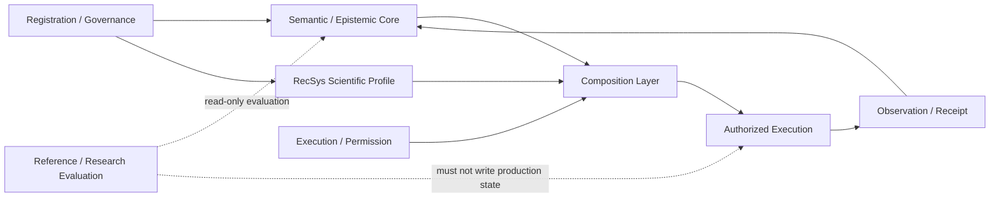

# RecClaw Research Core Architecture / Execution Specification v2.0-RC2

## 面向推荐系统研究代理的 claim–protocol-conditioned evidence-action system

> 发布快照（non-authoritative，2026-07-13）：Release Candidate 2；本文 exact bytes 发布时未随附任何可使 `SpecApproved`、`ReferenceImplementationConformant`、`PermissionReleaseGranted` 或 `ResearchClaimSupported` 派生为 true 的外部 GateDecision。
>
> 当前状态 MUST 从外部 scoped GateDecision 解析，不得通过原地修改本规范页首来更新；否则会改变被审批 subject 的 digest。
>
> 证据依据：`RecClaw Research Core v2.0 Evidence and Decision Record — Consolidated Final / Amendment 01（2026-07-13）`
>
> 本规范回答 MUST / MUST NOT、authority、接口边界、状态语义与验收；文献、调查过程、当前测试次数、临时 hash 和失败历史保留在 Evidence and Decision Record。

---

## 1. 规范性语言、范围与优先级

本文中的 **MUST / 必须**、**MUST NOT / 禁止**、**SHOULD / 应**、**MAY / 可** 为规范性词语。

本规范定义：

- Research Core 的职责与非职责；
- registration、semantic/epistemic、execution/permission、reference/research evaluation 四控制面；
- Stage 1A semantic microkernel；
- Stage 1B controlled execution/permission protocol；
- RecSys Scientific Protocol Profile RC1；
- 跨控制面的 composition、noninterference、状态与 gate；
- 独立验收所需的最小证据。

本规范不定义 Paper 1 的 case corpus、统计分析计划或结果；这些属于独立研究协议。

规范正文与 machine schema 必须相互可追踪。二者冲突时，相关 conformance gate 必须 `FAIL`；实现不得静默选择更宽松的一方。只有 acceptance envelope 精确绑定的 schema/registry/vector 字节才是某次验收的机械合同。

---

## 2. 冻结目标、非目标与 decision ledger

### 2.1 北极星

Research Core 的唯一核心职责是：

> Accepted claim、一个被独立接受的 protocol variant、frozen rule pack、accepted applicable profile 与 current evidence 共同决定 semantic action frontier；对任何生产性执行，permission policy 独立决定 execution eligibility；observation 只有经 exact binding、artifact closure 与 admissibility 判定形成 admissible event 后，才可与 current bounded claim state 及 frozen transition 共同产生 bounded state update。

### 2.2 冻结决定

| ID | 决定 |
|---|---|
| D1 | 核心科学问题是 claim–protocol-conditioned evidence authority，不是通用 AI Scientist 或实验编排。 |
| D2 | Registration/Governance、Semantic/Epistemic、Execution/Permission、Reference/Research Evaluation 四权分离。 |
| D3 | RecSys profile RC1 只包含 `OFFLINE_TOPN` 与 `SEQUENTIAL_NEXT_ITEM`；OPE 为未来独立 causal family。 |
| D4 | 本规范本身不开放任何权限；`CHECK_INTERFACE` 是第一个候选 action family，按任意不可信代码执行建模。缺少 exact release domain 的 active runtime-conformance `PASS` 时，只能派生 static Design/Policy candidate。 |
| D5 | `SpecApproved`、`ReferenceImplementationConformant`、`PermissionReleaseGranted`、`ResearchClaimSupported` 分别裁决且不可相互自动推导；外部 research protocol MAY 声明显式、claim-specific 前置。 |
| D6 | Router、Foundry、Architecture Lab 等 DecisionPolicy client 可在 authoritative core 外进行未注册探索，但只能产生 `authority=NONE`、`evidence_class=DEVELOPMENT_ONLY` 的 `ExplorationRecord`、candidate artifact 或既有 proposal；它们不得直接更新 accepted evidence、claim state、frontier、permission、promotion 或 GateDecision。 |

### 2.3 非目标

v2.0 MUST NOT 声称：

- 自动理解或接受 unrestricted natural-language research intent；
- schema-valid 等于科学正确、结果真实或可复现；
- 实验可运行或指标更高等于有资格更新 claim；
- runner、compiler、profile author 或 benchmark author 可自我授予 authority；
- WSL、普通 subprocess、容器或单一 syscall filter 自动构成安全 sandbox；
- 当前版本支持 OPE、online/human 或 general RecSys evaluation；
- 本地测试或同一团队复现等于独立 acceptance。

“Stage 1A 只处理 accepted typed specs”不表示每次探索都必须预先注册。未注册 hypothesis、候选代码与 search-memory update 可存在于第 7.5 节的非权威 Exploration Lane；一旦要进入 accepted semantics、受 Research Core 控制的执行、受控 evidence access、admission 或 claim transition，仍必须重新进入现有 registration、ActionContract、permission 与 evidence 链。

---

## 3. 术语、principals 与 authority ownership

| Principal / object | 唯一职责 | 明确禁止 |
|---|---|---|
| Protocol Registrar | 接受/拒绝/version protocol spec | 执行实验、产生 observation、修改 claim |
| Claim Registrar | 接受/拒绝/version bounded claim | 接受 protocol、判定运行结果 |
| RecSys Profile Registrar | 接受/拒绝/version scientific profile 与 primitive/artifact closure | 生成运行结果、补 framework default |
| Rule-pack Registrar | 冻结 transition/admissibility rules | 运行 action、事后改规则 |
| Action Proposer | 提交无 authority 的 action proposal | 自行生成 ActionContract |
| DecisionPolicy / ExplorationRecord Producer | 在独立 development namespace 中生成候选、proposal、`ExplorationRecord` 与 search-memory update | 接受 registration；签发 ActionContract/ScopeRef；写 accepted evidence/claim/frontier；授予执行权限；promotion、declassification 或 GateDecision |
| Semantic Core / ActionContract Issuer | 按 accepted inputs 计算 frontier、签发派生 ActionContract、判 admissibility、产生 transition-input envelope、replay | 接受自身 rule/claim/protocol；直接写 bounded claim state；执行不可信代码、开放 OS 权限 |
| Semantic State Ledger Arbiter | 对 evidence snapshots 与 bounded-claim-state transitions 执行唯一 durable CAS | 计算 scientific transition；接受 stale/replayed predecessor；修改 frozen rule |
| Adapter / ExecutionBinding Producer | 提交无 authority 的 ExecutionBinding、adapter 与 materialization candidate | 接受自身 binding；补 scientific default；宣称 runtime conformance |
| Permission Evaluation Authority | 只对隔离、非 production 的 backend/action-family conformance trials 签发并提交 `TEST_ONLY_CONFORMANCE_AUTHORIZATION` issuance command | 签发 production grant；将 trial output 接纳为 scientific evidence；promotion 或 agent-visible release |
| TEST_ONLY Fixture Authority | 签发 schema-equivalent synthetic ActionContract/ScopeRef fixture bundle，并冻结 fixture lineage | 签发 execution authorization 或 GateDecision；运行被评实现；把 fixture 当作 accepted scientific object |
| Authorization Service | 对精确 action/materials/backend 作一次性授权决定 | 改 scientific semantics 或 claim scope |
| Authorization Ledger Arbiter | 按冻结 transition-authority matrix 执行授权状态的唯一 durable CAS，强制 replay/time/epoch/fencing checks | 签发 grant；自行扩张 capability；接受 candidate/runner 写 ledger |
| Revocation Authority | 对 exact envelope/grant 提交已签名 revocation epoch/intent | 改写历史 ledger；将 post-launch revoke 伪装成 prelaunch cancellation |
| Reference Monitor / Backend | 强制 capability 与 information-flow policy | 声称 observation admissible |
| Receipt Authority / Backend Supervisor | 在 sandbox 外签发 content-bound、可验证的 lifecycle/effect receipt | 接受 candidate/runner 自报 receipt；决定 scientific admissibility |
| Receipt / Post-state Verifier | 按冻结 closure mapping 验证 lifecycle/effect receipts 与 post-state/restore，签发 RunClosureDecision 和 TerminalTransitionProposal | 执行 workload；写 authorization ledger；决定 scientific admissibility |
| Declassification Authority | 在 sandbox 外核验 projector candidate、signed receipt、active decisions 与 cumulative release-budget CAS，签发可见 release record | 运行 candidate code/parser；发布 raw channel；决定 scientific admissibility |
| Runner | 在授权环境执行并产生 observation | 自报 scientific evidence 或 promotion |
| Evidence Ingestor | append-only 记录 observation/event | 决定论文结论 |
| Claim Engine | 作为唯一 state-transition computer，按 accepted transition-input envelope 与 frozen rules 计算 bounded transition | 接受 protocol、选择实验、扩大 envelope 权限 |
| Promotion Reviewer | 独立决定 artifact/code promotion | 制造 scientific evidence |
| Reference Evaluator | 在隔离数据上产生 frozen metrics 与 signed evaluation record | 签发 GateDecision；写 production semantic state |
| Research Data Custodian / Access Controller | 保管 sealed final partition；在可信 access ledger 允许后执行 exact reads/releases | 编写 case/oracle、修改 analysis、签发 research GateDecision、允许 ledger 外访问 |
| Research Access Ledger Arbiter | 对 final-access 状态执行唯一 durable CAS，并保存 signed access/accounting events | 查看或分析 final labels；签发 GateDecision；接受 subject team 自报 access history |
| Research Independence Auditor | 审核角色互斥、custody/access transcript、leakage 与 contamination evidence，并可签发相应 incident evidence | 编写 case/oracle、运行或调整 SUT、签发 GateDecision、写 access ledger、把审计权扩成 final-data analysis权 |
| Spec / Implementation / Research Gate Reviewer | 在各自 gate domain 对 exact subject/evidence 签发 GateDecision | 生成 subject、运行被评对象、修改冻结 oracle/criteria |
| Migration Authority | 接受 version equivalence、migration、downgrade/rollback decision | 实现 subject；静默扩大 compatibility |
| Active Decision Resolver / Release Governance | 从 append-only decision ledger 解析 exact tuple 上未过期、未撤销、未被 supersede 且无冲突的 active `RegistrationDecision`、`GateDecision` 与 `MigrationDecision`，并发布 content-bound resolution/派生状态 | 自行签发被缺失的 decision；覆盖 negative/inconclusive verdict；将 stale/conflicting positive decision 解析为 active |

ActionContract 的唯一 issuer 是 Semantic Core 对 accepted inputs 的确定性投影；profile 的唯一 registrar 是 RecSys Profile Registrar。`RegistrationDecision`、`GateDecision` 与 `MigrationDecision` MUST 使用共同的 signed `AuthorityDecisionEnvelope`。该 envelope 至少绑定 `decision_kind/decision_id/authority_domain/canonical_subject_tuple/subject_digests/evidence_digests/decision_contract_version/decision_contract_digest/component_version_tuple/issuer/key_id/verdict/issued_at/trusted_epoch/expires_at_or_NONE/supersedes_or_NONE/revocation_ref_or_NONE/signature`。`RegistrationDecision.verdict` 只允许 `ACCEPTED/REJECTED/INCONCLUSIVE`；`GateDecision.verdict` 只允许 `PASS/FAIL/INCONCLUSIVE`；`MigrationDecision.verdict` 只允许 `COMPATIBLE/INCOMPATIBLE/INCONCLUSIVE`。Component tuple 中不适用的 slot MUST 显式为 `NOT_APPLICABLE`，不得省略，也不得绑定不存在的 backend/profile artifact。

每个 authority domain MUST 冻结 issuer/key trust registry、canonicalization、signature suite、trusted monotonic epoch/time contract、decision/revocation/supersession ledger schema 与 retention rule。Active Decision Resolver MUST 从该 append-only ledger 的完整 closure 对 exact kind/domain/subject/component tuple 检查 issuer authority、signature、contract/criteria digest、compatibility、issued/expiry time、revocation 与 supersession DAG，并产生 content-bound `DecisionResolutionRef`：它绑定 queried tuple、as-of epoch、完整 decision-set root、唯一 current head 或显式 `INCONCLUSIVE` 原因。仅当 DAG 无环、registry/ledger closure 完整、current head 唯一且 verdict 为对应 positive 值时，才可派生 active positive decision；缺失、分叉、冲突、过期、撤销、当前 negative 或 unresolved migration 均 fail closed。

Production authorization issuance、launch commit、declassification release、evidence admission 与 promotion MUST 分别在自身的 linearization point 重新解析并绑定所需 `DecisionResolutionRef`，不得只信任 envelope 内的历史 boolean。对已经发生的事件，historical authority 只能由该事件绑定的 as-of resolution 证明；expiry 后不抹除合法历史，但任何明确覆盖既往事件的 revocation/invalidation MUST 阻止后续 evidence admission 或 claim support。`G-H1-RESULT-V1` 尤其必须验证 preaccess `PASS` 在 access issue 与 consume 时均为 active，且当前 ledger 没有使该 access 无效的 revocation/invalidation。

每个 registration decision 上，Registrar MUST 与 proposal/subject author 及该 subject 的 implementer 互斥，禁止自我接受。同一 gate subject 上，Gate Reviewer MUST 与 subject producer/implementer/operator、fixture或case author、Authorization Service、Permission Evaluation Authority、Runner 和 Promotion Reviewer 互斥。Permission Evaluation Authority MUST 与 candidate/permission implementation producer、TEST_ONLY Fixture Authority、Runner 和该 gate 的 Reviewer 互斥；TEST_ONLY Fixture Authority MUST 与 candidate/permission implementation producer、Permission Evaluation Authority 和 Gate Reviewer 互斥。Promotion Reviewer MUST 与 proposer、runner、authorization issuer 和 Receipt Authority 互斥。不同 principal ID 不足以证明人员或判断独立；独立性 MUST 由身份、组织关系、数据可见性、写权限和执行 transcript 的外部证据建立。

以上是逻辑职责，不要求“一 principal 一个人”。角色 MAY 合并为较小人员拓扑，但互斥单位必须按 exact registration、gate subject、scoped claim 与 release tuple 判断；任何合并都 MUST 记录实际人员、组织关系、读写权限、数据可见性与 conflict disposition。实现/运行、case/oracle authoring、independent review、statistics/gate、custody/access 可由少数功能组承担；但同一 scoped decision 上的 producer–acceptor、subject/fixture author–reviewer、permission evaluator–implementation producer/fixture authority/reviewer、custodian–case/oracle/analysis/gate reviewer、promotion reviewer–proposer/runner/authorization/receipt authority等既有冲突不得因人员不足而豁免。

---

## 4. 信任模型与失败假设

系统 MUST 默认不信任：

- agent 生成的代码、配置、路径、argv、archive、serializer 与 dependency metadata；
- candidate/native extension/import hook 及其全部传递依赖；
- runner 自报的 success、admissibility、cleanup 或 no-effect；
- 内部 self-hash、同目录 manifest、同一文件中的 `verified=true`；
- framework defaults 与未显式 materialize 的 evaluator behavior；
- 作者提供的 benchmark labels、未冻结 comparator 与结果可见后的 gate 修改。

系统 MAY 信任的内容必须由验收范围明确列出，包括 exact bytes、package-owned schemas/registries/vectors、frozen backend/TCB、外部 digest/signature 与独立 GateDecision。未列入者均为 untrusted 或 unavailable。

所有 public verifier MUST 对不可信输入 total：返回稳定 `PASS/FAIL/INCONCLUSIVE/UNSUPPORTED/INTERNAL_ERROR`，不得把未捕获异常当作验收结果。

---

## 5. 四控制面与依赖边界



规范性依赖：

- Stage 1A MUST NOT import Stage 1B、profile family、framework adapter 或旧 Research Core。
- Stage 1A MUST NOT import DecisionPolicy、Exploration Lane 或 search-memory storage。DecisionPolicy MAY 只读消费稳定公开 projection，并只能经既有 proposal/registration boundary 向 authoritative core 提交候选；Exploration/search-memory namespace、writer 与 root MUST 与 accepted evidence ledger 隔离。
- RecSys profile MUST NOT import Stage 1B、framework、runner 或 legacy package。
- Stage 1B MUST NOT import RecSys profile 或决定 scientific semantics。
- Composition interface 现在即为规范性边界，其实现 MAY 后置。任何 production evidence-producing action MUST 经该接口消费 exact accepted Stage 1A semantic projection、通过稳定通用接口传入的 accepted applicable-profile semantic projection/ref，以及 permission policy；它 MUST NOT 要求 Stage 1A import 或解释具体 profile family。
- framework adapter MUST 位于 Core 之外；它只能投影 frozen semantics，MUST NOT 提供 scientific default。
- ReferenceEvaluator MUST 与 production writers 隔离。

---

## 6. 注册对象、内容身份与外部 trust binding

### 6.1 Authority rule

Proposal 永远无 authority。只有经第 3 节 resolver 证明为唯一 active、未撤销、未被 supersede 的 `RegistrationDecision.verdict=ACCEPTED`，才可产生 effective rule pack、claim、protocol 或 profile spec。

### 6.2 内容身份

所有 scientific、authorization、execution 与 evidence artifact MUST 使用 exact-byte content identity。内部 hash 可用于一致性检查，但 formal gate MUST 接收来自独立 evidence envelope 的 expected digest/signature。

ArtifactRef 至少 MUST 包含：

- lowercase SHA-256；
- media type；
- versioned schema identity；
- byte length。

展示名、路径、branch label 与 author-provided fingerprint MUST NOT 成为 scientific semantic identity。

### 6.3 Closure

Closure MUST 按 gate/object 的权责作用域分层，不能把四个 profile gate 合并：

- `byte/dependency closure` 验证 subject 自身声称覆盖的 exact bytes、schema、hash 与 rooted transitive dependencies；每个 formal gate 都必须完成其 acceptance criteria 指定的这一层。
- `G-PROFILE-STATIC-RC1` 只关闭 package-owned schema、primitive registry/handlers/contracts/vectors、static fixtures 与 release manifest；外部 scientific refs 只验证其 closed-world 结构、domain 与不可伪造性，不证明它们已注册或可取回。
- `scientific registration/role closure` 只在 `G-PROFILE-REGISTERED-RC1`、ActionContract issuance 与 evidence admission 等明确消费 accepted semantics 的决定中要求：必须解析 accepted claim/protocol/rule/profile decisions、全部 reachable bytes、typed roles/aliases 与 rooted transitive closure。
- RecSys Profile Registrar 对上述 accepted scientific closure 签发 content-bound `AcceptedScientificClosureRoot`。Stage 1B 只能验证其签名、exact bytes、freshness 与 ActionContract/ScopeRef 的机械一致性，并取 capability 交集；MUST NOT 重新裁决 scientific registration 或 role compatibility。

GateDecision 只证明其 gate-scoped subject/evidence closure；不得因通用 closure 条款暗含更高 conformance class。某层要求的 bytes 或 authority evidence不可用时为 `INCONCLUSIVE`，被证伪时为 `FAIL`，不得降级为本地 ref 字符串通过。

---

## 7. Stage 1A Semantic Microkernel

### 7.1 输入边界

Stage 1A 只处理 accepted typed specs。raw-text extraction、intent interpretation 与自动 scientific judgment 位于范围之外。`ExplorationRecord`、development observation 与 search-memory snapshot 不是 accepted input，MUST NOT 进入本节状态机或 `CURRENT_EVIDENCE_SNAPSHOT`。

### 7.2 规范状态机

```text
UNREGISTERED_PROPOSAL
  -> ACCEPTED_SPEC | REJECTED_SPEC

ACCEPTED_CLAIM + ACCEPTED_PROTOCOL_VARIANT + ACCEPTED_PROFILE_SEMANTIC_REF
  + FROZEN_RULE_PACK + CURRENT_EVIDENCE_SNAPSHOT
  -> ACTION_FRONTIER

ACTION_PROPOSAL + ACTION_FRONTIER
  -> LEGAL_ACTION_CONTRACT | ILLEGAL_ACTION

OBSERVATION + EXACT_ACCEPTED_BINDINGS + ARTIFACT_CLOSURE
  -> EVIDENCE_ADMISSION_DECISION

EVIDENCE_ADMISSION_DECISION=ADMISSIBLE
  -> ADMISSIBLE_EVENT

ADMISSIBLE_EVENT + CURRENT_EVIDENCE_SNAPSHOT
  -> PROPOSED_EVIDENCE_SNAPSHOT'

ADMISSIBLE_EVENT + CURRENT_BOUNDED_CLAIM_STATE + FROZEN_TRANSITION
  -> PROPOSED_BOUNDED_CLAIM_STATE'

EXPECTED_EVIDENCE_SNAPSHOT + EXPECTED_BOUNDED_CLAIM_STATE
  + ADMISSIBLE_EVENT + PROPOSED_EVIDENCE_SNAPSHOT'
  + PROPOSED_BOUNDED_CLAIM_STATE'
  -> SEMANTIC_STATE_CAS_COMMITTED | STALE_OR_CONFLICTING_TRANSITION
```

`CURRENT_EVIDENCE_SNAPSHOT` 与 `CURRENT_BOUNDED_CLAIM_STATE` MUST 分别是 append-only ledger 上的 content-bound refs，至少含 ledger/root digest、monotonic version、expected predecessor root/version、accepted event set或state digest、claim/protocol scope 与 canonical schema version。`ACTION_FRONTIER` MUST 绑定生成它的 exact evidence-snapshot root/version、bounded-claim-state root/version、accepted semantic tuple 与 transition/rule-pack digest；这些 predecessor 任一变化都会使 frontier stale。

`ACCEPTED_PROFILE_SEMANTIC_REF` 是稳定通用接口下的 accepted projection/ref、semantic root 与 `AcceptedScientificClosureRoot`，不授权 Stage 1A import 或解具体 profile family。`EXACT_ACCEPTED_BINDINGS` 至少绑定 claim、protocol variant、applicable rule pack、profile semantic ref/root、accepted scientific closure、ActionContract、frontier ref、expected evidence-snapshot root/version、expected bounded-claim-state root/version、observation/artifact closure、各 accepted decision/resolution refs 与 component version tuple；任一不精确、stale 或不可解析时不得产生 `ADMISSIBLE_EVENT`。

`EvidenceAdmissionDecision` MUST 由 Semantic Core 以 canonical、signed、content-bound、append-only record 签发，verdict 只允许 `ADMISSIBLE / INADMISSIBLE / INCONCLUSIVE`。它至少绑定 observation/ref、ActionContract、`EvidenceAdmissionScopeRef`、frontier、accepted scientific closure、artifact closure、required `RunClosureDecision`/declassification refs或显式 `NOT_APPLICABLE`、所有 active `DecisionResolutionRef`、expected evidence/claim predecessor roots/versions、rule/transition digests、decision/event IDs、issuer/key、issued/expiry/revocation epochs 与 replay key。只有在 Semantic State CAS linearization point 仍唯一、未过期、未撤销且 verdict 为 `ADMISSIBLE` 的 record 可被单次消费并产生同 digest 的唯一 `ADMISSIBLE_EVENT`；其他 verdict 只可进入 audit/provenance，不得更新 scientific state。

Claim Engine 只能产生 content-bound transition proposal；Semantic State Ledger Arbiter 是唯一 commit authority。每次 commit MUST 是 durable CAS，并绑定 expected predecessor roots/versions、admissible-event ID、transition/rule-pack digest、proposed next evidence-snapshot/claim-state digests、transition ID、issuer/signatures 与 replay key。Canonical `SemanticStateLedgerRoot` MUST 将 evidence snapshot 与 bounded claim state 作为一个 all-or-nothing versioned pair 提交；若物理实现使用多个 ledger，必须有可恢复的 transaction record 证明不存在只更新一侧的可见状态。相同 transition ID 与完全相同 content 重试必须幂等返回原结果；同 ID 不同 content、stale predecessor、并发冲突或重复 event 不得产生第二次更新，并返回稳定 `STALE_OR_CONFLICTING_TRANSITION` 诊断。

### 7.3 必须满足的不变量

- protocol registrar 与 claim registrar MUST 分离。
- action legality MUST 由 accepted specs 与 current frontier 决定，不能由 runner 决定。
- cross-protocol event MAY 被记录，但 MUST NOT 满足目标 protocol semantic units 或更新目标 claim。
- matched pilot observation MUST NOT 自动产生 terminal scientific conclusion。
- inadmissible evidence MUST NOT 改变 claim truth state；它 MAY 改变 provenance/audit state。
- branch label、opaque ID 与 collection order MUST NOT 改变语义结果。
- replay MUST 只依赖 content-bound inputs、frozen rules 与明确 runtime contract，不得读取 clock、network、current worktree 或 unregistered memory。
- `compiler` 能力只可描述为 accepted-spec normalizer/projector，不得描述为 research-intent compiler。

### 7.4 Stage 1A 输出

输出 MUST 包含稳定状态、diagnostics、evaluated layers、content identities 与明确 scope。Development fixture pass MUST 同时报告 `formal_acceptance=false` 与 independent review 状态。

### 7.5 非权威 Exploration Lane

Exploration Lane 是 authoritative Research Core 之外的 development client，不新增 semantic state、transition 或 gate。其唯一审计对象 `ExplorationRecord` MUST 使用 package-owned closed schema，至少绑定：`record_type=EXPLORATION_RECORD`、schema/version、record ID、`authority=NONE`、`evidence_class=DEVELOPMENT_ONLY`、producer/DecisionPolicy refs、objective/hypothesis、输入 search-memory snapshot 或 `NONE`、只读 semantic-context refs、development inputs、candidate/proposal/development-observation outputs、development execution ref 或 `NONE`、provenance/content root。以下 capability 字段 MUST 是 schema 常量：`may_update_search_memory=true`、`may_update_accepted_evidence_history=false`、`may_update_claim_state=false`、`may_trigger_registration_proposal=true`。

DecisionPolicy MAY 使用未注册 hypothesis、公开材料、development-only data 与隔离 search memory，生成候选代码、配置、spec、排序、`ActionProposal` 或 registration proposal，并把失败/成本写入独立 search-memory namespace。它 MUST NOT 生成 accepted spec/frontier、ActionContract、`EvidenceAdmissionScopeRef`、admissible event、claim transition、execution authorization、promotion、declassification 或 GateDecision；registration proposal 不得自动成为 accepted decision。

`ExplorationRecord`、development observation 或 search memory MUST NOT 写入或 alias `CURRENT_EVIDENCE_SNAPSHOT`，也不得原地升级为 accepted evidence。若 exact candidate 后续进入正式流程，必须重新解析 current registration/decision closure，并通过新的 ActionContract、适用的 permission/receipt 与 admission 链产生新的 observation。`authority=NONE` 是 epistemic status，不是 OS、数据或执行权限；凡由 Research Core 控制的不可信代码执行、受控 evidence access、promotion/final partition 读取，仍必须进入 Stage 1B 或相应 research-access 链。

---

## 8. Stage 1B Permission Protocol

### 8.1 当前 posture

本规范本身不授予执行权限。对任一 exact release domain，缺少 active `G-PERM-CHECK-INTERFACE-RC1=PASS` 时只能派生 static Design/Policy candidate；development checks 即使全部通过，也 MUST 分别报告 `authorization_decision=NOT_PERFORMED`、`permission_gate_passed=false` 与对应 verifier 的证据 verdict，三者不得互相代替。

### 8.2 第一个 action family

`CHECK_INTERFACE` MUST 按 `UNTRUSTED_ARBITRARY_CODE_EXECUTION` 建模。名称“检查接口”不得用于降低 threat classification。

Agent 只能选择：

- 由 signed ActionContract 精确引用、经 sandbox 外 exact-byte binding 与 transitive closure 验证的 candidate `ArtifactRef`；
- typed logical input slots；
- frozen action family parameters。

Agent MUST NOT 控制 interpreter、shell、raw argv、host path、online dependency resolution、network、credential、device、IPC、home/cache 或 writable host mount。

`G-PERM-CHECK-INTERFACE-RC1` 的 subject 是 exact `PermissionReleaseTuple`：action-family contract、permission implementation release、backend/TCB、policy snapshot、trusted harness/runtime、projector/declassification policy、receipt schema 与 threat matrix 的 content identities。它是对该 release tuple 的 runtime conformance certification，不是一个 live grant。Conformance trials MUST 使用同一 canonical envelope schema 中不可伪造的 `authority_domain=TEST_ONLY_EVALUATION` branch 与独立 `TEST_ONLY_CONFORMANCE_AUTHORIZATION`，并走与 production 相同的 ledger/state-machine、backend-enforcement、receipt、reconciliation 与 projector/declassification implementation。`TEST_ONLY_CONFORMANCE_AUTHORIZATION` MUST 是 canonical `ExecutionAuthorizationDecision` 的 branch-scoped subtype，verdict 只允许 `AUTHORIZED / DENIED / INCONCLUSIVE`；只有 Permission Evaluation Authority 可签发并提交其 `UNISSUED -> ISSUED` command。该 branch 的 runtime-certification slot MUST 绑定 active `G-PERM-STATIC-RC1=PASS`、exact candidate `PermissionReleaseTuple`、frozen evaluation-plan/challenge ref 与 `runtime_certification=UNDER_EVALUATION`，不得依赖待生成的 `G-PERM-CHECK-INTERFACE-RC1`、production Authorization Service 或 production Semantic Core；production Semantic-Core decision slot改为由 `TEST_ONLY Fixture Authority` 签发的 `TEST_ONLY_SEMANTIC_FIXTURE_BUNDLE` 与 `NOT_APPLICABLE_TEST_ONLY`，只测试同一 ActionContract/ScopeRef schema 的机械绑定。

TEST_ONLY 与 PRODUCTION MUST 使用同一 exact、attested backend enforcement implementation，但使用隔离、不可混淆的 endpoint/tenant、ledger namespace、issuer registry 与 keys。Production-facing issuance/backend/declassification/evidence endpoints MUST 拒绝 TEST_ONLY。Evaluation issuance endpoint 是 Authorization Ledger Arbiter 的 branch-scoped command endpoint：它只接受 Permission Evaluation Authority 签发、绑定 exact `UNISSUED` predecessor 的 TEST_ONLY issuance command并执行 `UNISSUED -> ISSUED` CAS，不执行 workload；`DENIED/INCONCLUSIVE` decision 不得提交该 command。Evaluation 的 post-issuance backend/projector/declassification endpoints MUST 只接受已由该 CAS 进入所需 lifecycle state 的 TEST_ONLY envelope并拒绝 PRODUCTION。Endpoint/tenant/domain routing MUST 绑定 envelope、attestation 与 issuer registry且不可由 agent控制。Evaluation projector/declassification 只能把任何逻辑 `RELEASED` 输出送入 sealed verifier-visible evidence vault；不得产生 agent-visible/production output。除 domain/issuer、上述 evaluation slots、更窄或等价 capability ceiling和 sealed/no-admission/no-promotion output policy 外，不得使用另一条执行实现。Trial authorization MUST NOT 被当作 production `PermissionReleaseGranted`。

Production Authorization Service 只能在 exact `PermissionReleaseTuple` 的 active `G-PERM-CHECK-INTERFACE-RC1=PASS` 与 exact Semantic Core issuer 的 active `G-SMK-RC2=PASS` 同时可解析时签发单次 grant。Release certification 不授权任何具体 run；单次 grant 不改写 release certification；post-run receipt 不得倒置成该 run 的事前权限来源。

### 8.3 授权生命周期

Production grant MUST 由 canonical `AuthorizationEnvelopeRoot` 绑定且由 Authorization Service 签名。该 root 至少覆盖：

- `PRODUCTION` branch 绑定 active `G-SMK-RC2` 与 `G-PERM-CHECK-INTERFACE-RC1` 的 content-bound `DecisionResolutionRef`、decision refs/digests 与 exact-compatible `PermissionReleaseTuple`；`TEST_ONLY_EVALUATION` branch 只使用第 8.2 节冻结的 evaluation slots；
- `PRODUCTION` branch 必须绑定 Semantic Core-signed ActionContract 与 `EvidenceAdmissionScopeRef` exact ref/digest；后者 MUST 单向绑定该 ActionContract ref、frontier ref、current evidence-snapshot root/version、current bounded-claim-state root/version、accepted claim/protocol/rule/profile refs、`AcceptedScientificClosureRoot`、allowed target units/evidence roles、transition ref、expiry、semantic/revocation epoch 与 signature。`TEST_ONLY_EVALUATION` branch 改为由 `TEST_ONLY Fixture Authority` 签名、schema-equivalent 的 synthetic action/scope bundle，全部 scientific registration/admission authority slots 为 `NOT_APPLICABLE_TEST_ONLY`，且 production authorization/backend/declassification/evidence path MUST 拒绝；
- 对 profile-backed action，exact ExecutionBinding ref/root、adapter/config/materialization closure 与 compatible active `G-PROFILE-REALIZED-RC1` `DecisionResolutionRef`；非 profile action 的这些 slot MUST 为 `NOT_APPLICABLE`；
- action family、candidate `ArtifactRef`/transitive closure root、trusted harness、runtime image、backend/TCB/policy、feature probe、threat matrix、projector/declassification policy 与 receipt-schema identities；
- 全部 transitive material closure、typed invocation、resolved backend handles/mounts 与 audience；
- effect lease：有限 mutation namespace、fencing token、pre-state root、restore-plan ref、persistent-effect closure、resource/time/evidence-access/egress budgets、revocation epoch、trusted monotonic execution expiry 与独立 release expiry；
- grant ID、single-use run nonce、issuer 与 canonicalization/version。

Envelope MUST 对上述内容派生唯一 content root，不得携带 mutable lifecycle state、未解析 path/ref、自报 gate boolean 或可由 agent 扩张的 semantic/capability 字段。分别合法但不属于同一 ActionContract/frontier/ScopeRef/release tuple 的对象不得拼装。任一 binding、active-decision resolution、semantic revision、attestation 或 freshness 检查不一致时不得进入 `ISSUED`。

每个 exact `AuthorizationEnvelopeRoot` MUST 在任何 `ExecutionAuthorizationDecision` 前由 Authorization Ledger Arbiter 创建唯一、signed、content-bound 的 `UNISSUED` genesis record，绑定 branch、release tuple、backend/ledger namespace、envelope root、genesis root与 `version=0`，但不授予 capability、prepared instance、fencing lease或 runnable state。Production/test authorization decision与 issuance command都 MUST 绑定该 genesis root/version；未经认证的“无记录”不得作为 issuance predecessor。

Authorization lifecycle MUST 使用独立的 scoped state machine：

```text
UNISSUED
  -> ISSUED

ISSUED
  -> RESERVED

RESERVED
  -> CONSUMED

CONSUMED
  -> LAUNCH_COMMITTED

LAUNCH_COMMITTED
  -> RUNNING | TERMINATING_REVOKE | TERMINATING_EXPIRY | TERMINATING_FAULT | LOST

RUNNING
  -> WORKLOAD_EXITED_SUCCESS | WORKLOAD_EXITED_FAILURE
  | TERMINATING_REVOKE | TERMINATING_EXPIRY | TERMINATING_FAULT | LOST

WORKLOAD_EXITED_SUCCESS | WORKLOAD_EXITED_FAILURE
| TERMINATING_REVOKE | TERMINATING_EXPIRY | TERMINATING_FAULT | LOST
  -> RECONCILING

RECONCILING
  -> CLOSED_SUCCESS | CLOSED_FAILURE | REVOKED | EXPIRED
  | REVOKED_PRELAUNCH | EXPIRED_PRELAUNCH | QUARANTINED

ISSUED | RESERVED | CONSUMED
  -> PRELAUNCH_REVOKING | PRELAUNCH_EXPIRING

PRELAUNCH_REVOKING | PRELAUNCH_EXPIRING
  -> RECONCILING
```

每次 transition MUST 是 Authorization Ledger Arbiter 执行的 durable CAS，并绑定 `authorization_envelope_root`、prepared workload instance或在 reservation 前显式 `NOT_APPLICABLE`、run nonce、ledger version、transition-command issuer/key 与 replay nonce。唯一 launch linearization point 是 `CONSUMED -> LAUNCH_COMMITTED` CAS：进入 `PRELAUNCH_REVOKING/PRELAUNCH_EXPIRING` 的 CAS 与它在同一 linearization domain 竞争，先合法提交者获胜。Launch CAS 本身 MUST 原子重新解析并验证 exact Gate/Registration `DecisionResolutionRef`、semantic revision 与 revocation epoch仍有效；envelope/grant/instance 完全一致；trusted monotonic `now < execution_expires_at`；active mutation-namespace fencing lease；prepared-instance/TCB attestation 与 backend epoch。Expiry correctness 不得依赖另一 actor 先抢到 expiry CAS。Backend 只有读到并验证自己的 `LAUNCH_COMMITTED` record 后才可让 prepared workload 变为 runnable，并 MUST 用不可绕过的 local expiry lease/watchdog 在控制面失联时按冻结策略终止。Launch 后任何 required active decision 失效 MUST 触发相应 termination/reconciliation workflow，不得继续开放新 effect 或 release。

Revocation/expiry 在 `LAUNCH_COMMITTED` 之后不能伪称“未启动”，而 MUST 分别进入 `TERMINATING_REVOKE` / `TERMINATING_EXPIRY` workflow；必须冻结最大响应/隔离时限，超限进入 unresolved `QUARANTINED`。Expiry MUST 使用冻结的 trusted monotonic time/epoch contract；wall-clock 回拨、重启与 epoch rollover 必须有 test vector。

若在 `LAUNCH_COMMITTED` 后、实际 workload 可观测启动前发生 crash，该 use 仍视为已消费，进入 `LOST -> RECONCILING`，不得退款、复用或自动 retry。若 prelaunch revoke/expiry CAS 先获胜，exact envelope/backend-epoch scoped 的 Backend Supervisor MUST 阻止任何 prepared instance runnable，并将 `PRELAUNCH_REVOKING/PRELAUNCH_EXPIRING` 推进到 `RECONCILING`。若 pending state 的 predecessor 为 `ISSUED` 且从未 reservation，该 Supervisor 的 command MUST 绑定 signed `NoPreparedInstanceRecord`，它同时绑定 authorization envelope、backend epoch、authorization-ledger root/version、reservation-handle namespace、查询时间/nonce、`issuer=exact Backend Supervisor`、key/signature，并证明不存在 prepared instance、handle、mount、namespace lease 或 effect；此 record 只有 exact backend-epoch scoped Backend Supervisor 可签发，Authorization Ledger Arbiter在接受 command 前、Receipt / Post-state Verifier在 terminal proposal 前都 MUST 按 backend issuer registry、epoch与 namespace closure重验。此路径的 command authority不要求虚构 attested instance。若 predecessor 为 `RESERVED/CONSUMED`，command MUST 绑定 exact attested instance。任何已有 prepared instance、handles/mounts、namespace 与 fencing lease保持 fenced，直至独立 verifier 证明 `launch_committed=false`、instance 已销毁、无 descendant/effect且 post-state/restore closure 成立。不存在的 instance/lease/restore slot MUST 显式为 `NOT_APPLICABLE`。Recovery MUST 对 ledger、prepared/running backend instances 与 Receipt Authority records 做 reconciliation。`LOST` 和 `QUARANTINED` 都不证明物理 workload 已终止；Backend Supervisor 仍须维持 containment/reconciliation obligation，且不确定状态均 fail closed。

`WORKLOAD_EXITED_SUCCESS/FAILURE` 只报告 workload outcome，不是安全闭包。任何路径只有在 descendants/async work 已终止或被证明从未存在、telemetry completeness 已裁决、persistent-effect pre/post/restore 已验证、final `SealedAuditReceipt` 已验证后，才可从 `RECONCILING` 进入相应非 quarantine terminal；prelaunch 路径还必须证明 `launch_committed=false`。任一条件不可用或被证伪均进入 `QUARANTINED`，并禁止 output release、evidence admission、promotion、namespace/lease 释放与 backend reuse。

Transition-command authority 为封闭表：`UNISSUED -> ISSUED` 按 branch 分权，PRODUCTION 仅由 Authorization Service 签发 `ExecutionAuthorizationDecision` 并提交，TEST_ONLY_EVALUATION 仅由 Permission Evaluation Authority 签发 `TEST_ONLY_CONFORMANCE_AUTHORIZATION` 并提交；Authorization Ledger Arbiter 对二者执行同一 CAS implementation，但必须按 branch-specific issuer registry、ledger namespace与 prerequisite slots 验证。Backend Supervisor 对 exact envelope/backend epoch拥有 reconciliation command scope：`ISSUED -> RESERVED`、`RESERVED -> CONSUMED` 及其后命令必须绑定 attested instance；仅当 prelaunch pending state 的 predecessor 是未 reservation 的 `ISSUED` 时，`PRELAUNCH_REVOKING/PRELAUNCH_EXPIRING -> RECONCILING` command可改为绑定第 8.3 节定义的 `NoPreparedInstanceRecord`。它可请求 `CONSUMED -> LAUNCH_COMMITTED`、`LAUNCH_COMMITTED -> RUNNING/TERMINATING_REVOKE/TERMINATING_EXPIRY/TERMINATING_FAULT/LOST`、`RUNNING -> WORKLOAD_EXITED_SUCCESS/WORKLOAD_EXITED_FAILURE/TERMINATING_REVOKE/TERMINATING_EXPIRY/TERMINATING_FAULT/LOST`、`PRELAUNCH_REVOKING -> RECONCILING`、`PRELAUNCH_EXPIRING -> RECONCILING` 与第 8.3 节状态机中其他进入 `RECONCILING` 的精确命令。Revocation Authority只提交 signed revocation intent/epoch；Authorization Ledger Arbiter 根据当前 state 将有效 intent 原子映射为 prelaunch-revoking 或 postlaunch-terminating CAS，并且只按冻结时间合同触发相应 prelaunch-expiring 或 postlaunch-expiry CAS；它是执行所有 durable CAS 的唯一 writer。Receipt / Post-state Verifier 按冻结 mapping 签发 `TerminalTransitionProposal`，它或 Backend Supervisor只能提交该 proposal。Terminal mapping 为：verified successful workload + preterminal closure PASS → `CLOSED_SUCCESS`；verified failed/faulted workload + preterminal closure PASS → `CLOSED_FAILURE`；verified postlaunch revoke/expiry termination + preterminal closure PASS → `REVOKED/EXPIRED`；verified prelaunch revoke/expiry + `launch_committed=false` + preterminal closure PASS → `REVOKED_PRELAUNCH/EXPIRED_PRELAUNCH`；required receipt/post-state/restore 缺失、冲突、被证伪或超时只能提议/触发 `QUARANTINED`。Candidate、runner、projector 与 Declassification Authority 对 authorization ledger 无写权。

`TerminalTransitionProposal` MUST 是 canonical、signed、append-only、content-bound record，至少绑定 `authorization_envelope_root`、run nonce、exact `RECONCILING` predecessor root/version、workload-outcome/lifecycle refs（prelaunch 路径为 signed `NOT_LAUNCHED`）、`SealedAuditReceipt`、telemetry-completeness、post-state与restore-verdict roots及显式 `NOT_APPLICABLE` slots、closure-mapping version/digest、`preterminal_closure_verdict`、proposed terminal state、issuer/key/time、transition/replay ID。`preterminal_closure_verdict` 只允许 `PASS / FAIL / INCONCLUSIVE`；只有 `PASS` 可提议非 quarantine terminal。该 verdict 只授权 terminal CAS，不是 `RunClosureDecision`；terminal CAS 完成后，Receipt / Post-state Verifier 才可签发绑定 exact terminal ledger root/version 的 `RunClosureDecision`。每个 command/proposal 必须绑定 key identity、exact allowed edge、expected predecessor root/version、envelope scope、transition ID 与 replay protection；相同 content 重试幂等，不同 content 复用 ID 必须拒绝。

此外 Runtime release MUST 实现：

1. exact action/material/backend binding 与 immutable authorization envelope；
2. expiry、revocation epoch 与 capability ceiling；
3. child process/async descendant 保持同一或更窄 capability；
4. cleanup/restore 与独立 promotion。

### 8.4 Backend 与 TCB

Formal permission release MUST 冻结单一 backend profile、TCB、required primitives、feature probe、known limitations 与 versioned threat matrix。Backend profile 至少绑定：

- isolation boundary，以及 host/operator/management-plane trust assumptions；
- 全部 TCB component exact bytes/version/measurements、image/dependency provenance；
- attestation format、trust anchors、nonce/freshness、key rotation/revocation；
- authorization/release ledgers、trusted monotonic clock、receipt keys 的 durability、anti-rollback 与 crash model；
- feature-probe issuer、measurement binding、freshness 与 required/optional primitive disposition；
- patch/update/migration 对 release/gate invalidation 的规则；
- control-plane partition、host reboot、snapshot rollback、ledger/clock recovery 的冻结处置；
- 每项 known limitation 在 threat matrix 中的 `FAIL / QUARANTINE / EXPLICITLY_UNSUPPORTED` disposition。

普通 signature 只证明某 key 的声明，不证明运行于冻结 TCB；feature probe、attestation、lifecycle/effect receipt MUST 共同绑定 exact TCB measurement、backend epoch、run nonce 与 `authorization_envelope_root`。缺失 primitive、stale attestation、measurement mismatch、rollback uncertainty 或 silent downgrade MUST `FAIL` 或按已冻结规则 quarantine，绝不近似运行。

Mutation namespace 的 exclusive fencing lease MUST 在 workload runnable 前持久取得。每个 mediated write、effect record 与 receipt MUST 绑定同一 fencing token；crash/`LOST` 后 lease 不自动释放，namespace 保持 fenced。只有 descendant termination、sandbox 外 post-state verification 与 restore closure 全部成立后，ledger 才可释放 lease 或复用 namespace；coverage/lease state 不确定时必须 quarantine。

普通 WSL、普通 subprocess、Python isolation flags、单独 seccomp 或普通容器均不足以单独通过该 gate。

### 8.5 Egress 与 receipt

Raw stdout/stderr/exception/artifact MUST 进入 quarantine。只有在 candidate sandbox 外运行、且不加载 candidate code/parser 的 content-bound projector 可产生 release candidate。每个可发布字段 MUST 冻结封闭值域、类型、最大长度、基数、排序、精度与总 release budget；fixed schema 中的自由字符串或无界集合不构成安全 declassification。

Projector 只能生成 candidate，不能 emit。所有 bytes、status、completion timing、termination reason、error、log、resource counter 与 retry response 都是 mediated output channel，只能经下列独立 release state machine：

```text
RAW_QUARANTINED
  -> PROJECTED_CANDIDATE | RELEASE_QUARANTINED

PROJECTED_CANDIDATE
  -> RELEASE_RESERVED | RELEASE_DENIED | RELEASE_QUARANTINED

RELEASE_RESERVED
  -> RELEASED | RELEASE_DENIED | RELEASE_QUARANTINED
```

`RELEASE_RESERVED` 是 Declassification Authority 在任何外部可观测事件前执行的 durable cumulative-budget CAS，必须绑定 `authorization_envelope_root`、run/release nonces、projected-bytes digest、recipient/security domain、channel/field policy、cumulative-budget key 与 prior ledger version。Budget 至少跨 run 按 recipient/security-domain、claim/material、candidate、projector 与 epoch 累计，不得只检查单次字段长度。不确定预留不退款；retry MUST 幂等引用同一 release nonce，不得重新获得预算。

Projector MUST 有独立 conformance/adversarial vectors。Declassification Authority 是 release-state ledger、cumulative-budget CAS 与 `DeclassificationDecision` 的唯一 authority；projector 只能提交 candidate 或 failure evidence。Projector failure、schema/closed-domain violation、unknown value或不可验证 projector result MUST 从 `RAW_QUARANTINED` 进入 `RELEASE_QUARANTINED`。验证成立但 policy 明确拒绝或已知 cumulative budget exhausted MUST 从 `PROJECTED_CANDIDATE` 进入 `RELEASE_DENIED`；budget-ledger missing/conflict/timeout、stale prerequisite或完整性不确定 MUST 进入 `RELEASE_QUARANTINED`。只有成功提交 exact budget reservation 后才可进入 `RELEASE_RESERVED`。`DeclassificationDecision.verdict` 只允许 `RELEASED / DENIED / INCONCLUSIVE`，并分别唯一映射到 `RELEASED / RELEASE_DENIED / RELEASE_QUARANTINED`；只有 `RELEASED` 可产生相应 audience 可见事件。TEST_ONLY 的 audience 仍受第 8.2 节 sealed-vault 限制。

Timing、termination、resource counters、telemetry、日志、agent-visible errors 与 retry behavior 必须分别声明接收者、量化/隐藏策略与预算；未声明通道不得 release，且按上述映射进入 `RELEASE_DENIED` 或 `RELEASE_QUARANTINED`，不得停留在无终态的中间状态。

EffectReceipt 只能报告 mediation 覆盖且观测到的事实，并 MUST 由 sandbox 外的 Receipt Authority/Backend Supervisor 签名或远程证明。Candidate、runner 或 sandbox 内进程自报 receipt MUST 被拒绝。完整 `SealedAuditReceipt` 只对 Backend Supervisor、Receipt verifier 与 recovery TCB 按访问策略可见，需冻结加密、retention 与 deletion policy；它的 quarantine 禁止外部 release，不禁止受信 recovery 使用。面向 agent/evidence consumer 的 `ProjectedPublicReceipt` 只含 declassification policy 允许的字段；低熵 private material/raw output/state 不得通过普通 SHA-256 digest 公开，需使用 domain-separated keyed commitment 或 opaque handle。Receipt 至少绑定：

- `authorization_envelope_root`、ledger CAS/use-record version、run nonce、prepared instance 与 backend attestation；
- authorization/backend/全部 material/projector/raw-output lineage，以及 profile-backed action 的 ExecutionBinding/adapter/materialization lineage或显式 `NOT_APPLICABLE`；
- lifecycle terminal/partial state 与 resource counters；
- denied attempts；
- raw/projected artifact digests；
- telemetry source/sequence/drop/completeness；
- 有界、隐私保护的 state-diff digest/summary、cleanup 与 restore outcome；raw private state MUST NOT 进入 receipt。

Receipt verifier 必须由独立 trusted component 执行。`no telemetry` MUST NOT 推导 `no effect`。若 required coverage/cleanup/lineage/restore 合同被证伪，verdict 为 `FAIL`；若 required evidence 不可用，verdict 为 `INCONCLUSIVE`。二者均禁止 evidence admission、promotion 与 backend instance 复用。

Receipt / Post-state Verifier 只有在 terminal CAS 已提交且能验证 proposal、terminal ledger version 与全部 closure evidence一致时，才可签发 scoped `RunClosureDecision=PASS`；它是运行后机械闭包决定，不是 GateDecision、ExecutionAuthorizationDecision 或 evidence-admission decision。`PASS` 可在 execution expiry 后产生，但必须证明该 per-run authorization 在 launch 时 historically active、未被覆盖既往事件的 revocation/invalidation。`RELEASED` 至少要求该 historical launch authority、当前 active release/declassification policy、trusted monotonic `now < release_expires_at`、trusted projector verdict、`RunClosureDecision=PASS`、required receipt/effect closure 与已提交 budget CAS；execution grant 的正常到期既不自动允许也不自动禁止后续 release。Declassification Authority 签发的 `DeclassificationDecision` 不得推导 scientific admissibility。

### 8.6 三权分离

Semantic Core 是 accepted `EvidenceAdmissionScopeRef` 的唯一 issuer；RecSys Profile 只提供 accepted semantic input，不签发 evidence authority。`EvidenceAdmissionScopeRef` 至少 MUST 绑定 exact ActionContract ref、frontier ref、claim/protocol-variant/rule-pack/applicable-profile refs 与 semantic roots、`AcceptedScientificClosureRoot`、current evidence-snapshot 与 bounded-claim-state revisions、allowed semantic-target units/evidence roles、evidence-access gate refs、transition ref、expiry/revocation epoch、schema/version、issuer 与 signature。对 profile-backed executable action，它还 MUST 只读绑定 exact ExecutionBinding/adapter/materialization refs 与 active `G-PROFILE-REALIZED-RC1` resolution；非 profile action显式 `NOT_APPLICABLE`。Stage 1B 只能精确绑定其 digest、验证 accepted closure authenticity 与 freshness，并将机械输出/capability ceiling 取更窄交集。Stage 1B MUST NOT 创设、替换、重新裁决或扩张 scientific registration、role、semantic target、claim scope 或 transition rule pack。实际 RecSys 数值 observation 进入 evidence admission 时，还必须绑定 exact `G-PROFILE-RUNTIME-RC1` resolution 与相应 runtime receipts；该 gate 不是纯 launch 的无条件前置。

三个独立决定是 execution authorization、Semantic Core 的 evidence admission、以及 independent promotion。Receipt 只报告机械事实；执行成功 MUST NOT 自动产生 scientific evidence、claim update 或 code promotion。现有 permission artifact 若持有可自行扩张的 semantic target/rule-pack 字段，则不符合本规范，必须改为只读 accepted-scope binding。

---

## 9. RecSys Scientific Protocol Profile RC1

### 9.1 Ownership

Profile 只拥有 registered scientific declaration 与 prospective evidence-access semantics。它 MUST NOT 包含 ExecutionBinding、RunReceipt、framework config、runtime fact、actual access ledger、SemanticDelta 或 evidence-to-claim result。

### 9.2 公共科学合同

每个 profile MUST closed-world 地声明：

- registered claim / protocol-variant / applicable rule-pack refs 与各自 accepted decision refs；
- estimand：unit、population、target/comparator、outcome、time origin/horizon、aggregation、missingness、repeat scope；
- observation population：raw snapshots、schema、feedback/timestamp/unexposed semantics、identity 与 availability；
- 唯一 partition contract 与 ordered derivation DAG；
- selection plan；
- prospective evidence access gates/plan；
- exactly-one family branch。

四个 partition outputs（development train/validation、promotion validation、untouched final）MUST 具有不同 content identities。Runtime/accepted manifest 还必须证明 lineage 与 disjointness；distinct hash 本身不足以证明数据不重叠。

每个 derivation step MUST 声明 direct read partitions 与 fit scope。对 fitted step，所有传递 ancestors 的 effective read scope MUST 不超出 development training。Operation 是否实际拟合或偷读 MUST 由 typed operation manifest、artifact closure 与 runtime receipt 验证；作者填写 `fit_scope=NONE` 不是证明。

### 9.3 Family A：OFFLINE_TOPN

- Candidate mode MUST exactly-one `FULL` 或 `SAMPLED`。
- RC1 sampled semantics MUST 为 registered decoy population/sampler/count/seed/dedup contract，目标恰好一次且 decoy 无放回。
- Sampled mode MUST NOT 声称 full-catalog scope，也不得由任意 correction ref 解锁。
- Training negative sampling 与 evaluation candidate sampling MUST 位于不同语义路径；同一 implementation hash MAY 在角色明确且完整语义相容时复用。
- seen/repeat、availability、metric cutoff/tie/short-list/zero-relevant/nonfinite/aggregation MUST 可执行或 content-bound。

### 9.4 Family B：SEQUENTIAL_NEXT_ITEM

- 只支持 implicit-feedback、next-event horizon 与 frozen update policy。
- split family MAY 为 global temporal 或 per-user temporal，但实际 cutoff、boundary assignment 与 tie semantics MUST 由 accepted split/partition artifact 完整定义。
- history、target construction、prediction time、sessionization、feature as-of、availability 与 repeat policy MUST content-bound。
- `GLOBAL_FULL_LOG` feature scope 与 temporal evaluation MUST `FAIL`。

### 9.5 Deferred families

`CONTEXTUAL_BANDIT_OPE`、slate/trajectory OPE、online/human 与 fairness confirmatory evaluation MUST 返回 `UNSUPPORTED`。OPE 只有在独立 causal family 同时闭合 identifiability、logging/target policy、propensity provenance、support、nuisance fitting、cross-fitting、estimator/normalization/clipping 与 inference 后才可新增。

### 9.6 Scientific primitive registry

任何裸 token 若选择了 scientific behavior，MUST 绑定 package-owned、versioned executable primitive semantics。Registry MUST：

- 与 schema 中每个 scientific-primitive slot/token 双向完整对应；
- 使用 closed operator/predicate handler table，不允许动态 import path；
- 为每个 primitive 绑定 exact input/output contracts 与 conformance vectors；
- 声明 determinism、allowed/forbidden read roles、failure mode 与 applicability；
- 对 RNG primitive 绑定 RNG-key contract；
- 派生 semantic entry hash，不接受 author-supplied hash；
- 在 report 中输出 registry hash 与 primitive semantics root。

只含 prose description 的 JSON glossary MUST NOT 通过该要求。非零参数 temporal split MUST 使用 accepted rule/manifest artifact，不能只靠 `GLOBAL_TEMPORAL` 名称声称 executable。

### 9.7 Derived fingerprints

Verifier 从规范化语义投影派生：

- estimand；
- observation population；
- data derivation；
- candidate/action space；
- comparison/selection；
- measurement/inference；
- evidence access；
- scientific semantics root；
- epistemic protocol root。

Fingerprints MUST NOT 由 profile author 输入。Execution hash 与 receipt root 不属于 registered scientific profile。

---

## 10. Cross-plane composition 与 noninterference

任何 production evidence-producing action 只有同时满足下列条件才可进入可运行状态；不执行不可信代码的纯静态研究评测不因本节而自动依赖 Stage 1B：

```text
semantic frontier permits
AND scientific evidence-access policy permits
AND Stage 1B capability permits
AND authorization scope exactly matches action/material/backend
AND prelaunch lifecycle permits the launch-commit CAS
AND backend observes its own durable LAUNCH_COMMITTED record before runnable
```

执行许可不产生 evidence authority。Observation 只有经 exact claim/protocol/rule/profile binding、artifact closure 与 admissibility transition 后才可影响 claim。

必须验证：

- cross-protocol evidence 可审计但不更新目标 claim；
- scientific profile 改变不会被 adapter/runtime hash 掩盖；
- adapter 变化不得改变 scientific root；
- access policy 变化只改变 evidence-access/epistemic root，不静默改变 scientific root；
- presentation metadata 与 opaque IDs 不改变 scientific semantics；
- 在 adapter 选择前的 capability discovery 中，版本外语义返回 `UNSUPPORTED`；adapter 已被选择/接受用于该 profile 后仍无法表达 frozen semantics，则为 conformance `FAIL`。两者均不得近似运行。

---

## 11. 状态、错误与诊断语义

### 11.1 不相混的状态类型

`VerificationVerdict`：

| 值 | 语义 | stable exit code |
|---|---|---:|
| `PASS` | 验收范围内全部必要证据已提供并满足合同。 | 0 |
| `FAIL` | 至少一项必要合同被证伪。 | 2 |
| `INCONCLUSIVE` | 证据缺失、外部 binding/closure/review 不可用。 | 2 |
| `UNSUPPORTED` | 输入 semantic family 不在该版本 closed world。 | 2 |
| `INTERNAL_ERROR` | verifier/package contract 故障；不得归咎于候选 artifact。 | 3 |

`EvidenceAdmissionDecision` 只允许 `ADMISSIBLE / INADMISSIBLE / INCONCLUSIVE`；它不是 verifier verdict。`ExecutionAuthorizationDecision` 只对 exact `AuthorizationEnvelopeRoot` 允许 `AUTHORIZED / DENIED / INCONCLUSIVE`，且 `AUTHORIZED` 只是单次 live grant。`RunClosureDecision.verdict` 只允许 `PASS / FAIL / INCONCLUSIVE`；`DeclassificationDecision.verdict` 只允许 `RELEASED / DENIED / INCONCLUSIVE`，且只裁决 exact projected bytes/channel/recipient。三者均不是 GateDecision 或 scientific admissibility。`AuthorizationLifecycleState` 使用第 8.3 节状态机。各 authority decision 的 verdict 域按第 3 节；version 外或 unsupported subject 对要求该 subject 的 gate 构成 `FAIL`，不得产生 `PASS`。

`ExplorationRecord.authority=NONE` 与 `evidence_class=DEVELOPMENT_ONLY` 只是对象分类，不是 `VerificationVerdict`、registration、GateDecision、admissibility、authorization 或 claim status；任何消费方 MUST 拒绝从它们派生 positive authority state。

上述运行决定都必须 canonical、signed、append-only 且 content-bound：`ExecutionAuthorizationDecision` 至少绑定 envelope/release-tuple roots、exact authorization-ledger `UNISSUED` genesis root/version、required `DecisionResolutionRef`、grant/run nonce、issuer、issued/expiry/revocation epochs 与 verdict；`RunClosureDecision` 至少绑定 envelope root、terminal ledger version、sealed lifecycle/effect receipt roots、post-state/restore verdict、issuer 与 verdict。`DeclassificationDecision` 使用 closed reason-discriminated record，始终绑定 envelope/run/release nonces、raw-output opaque commitment、projector identity/version/verdict/evidence、recipient/security domain、channel/field policy、required closure ref、exact release-state predecessor/result roots、issuer、reason code 与 verdict，并按 reason 绑定：`RELEASED` 必须有 projected-bytes digest与 successful reservation-CAS ref/version；known budget exhaustion 的 `DENIED` 必须有 projected-bytes digest与 budget-ledger rejection/observation root/version，successful reservation slot为 `NOT_APPLICABLE_BUDGET_REJECTION`；pre-reservation policy denial 的 `DENIED` 必须有 projected-bytes digest，reservation/budget-observation slots分别为 `NOT_APPLICABLE_POLICY_DENIAL`；post-reservation policy/revocation denial 的 `DENIED` 必须有 projected-bytes digest、successful reservation-CAS ref/version、current policy/revocation `DecisionResolutionRef`、denial evidence与 `budget_disposition=NO_REFUND`；projector failure/unknown 的 `INCONCLUSIVE` 必须有 projector failure evidence，projected-bytes/reservation/budget-observation slots为 `NOT_APPLICABLE_PROJECTOR_FAILURE`；post-reservation uncertainty 的 `INCONCLUSIVE` 必须绑定 successful reservation-CAS ref/version、conflict/timeout/staleness evidence与 `budget_disposition=NO_REFUND`；其他 pre-reservation 不确定路径必须绑定相应 evidence及适用的 observed ledger root。缺失、冲突、stale、reason/slot组合非法或不可解析均不得派生 positive state。

`authorization_decision=NOT_PERFORMED`、`permission_gate_passed=false` 与 verifier `INCONCLUSIVE` 是不同字段：前两者描述没有授权/没有 gate pass，后者解释其证据状态。任何 boolean 只能由 scoped decision record 派生，不得充当 authority。

### 11.2 验证顺序与诊断

Public artifact verifier MUST 按以下层次 fail-closed：package contract/internal audit；strict input；schema/unsupported discriminator；semantic invariants；external byte binding；artifact/registration closure；independent acceptance。更早层失败时不得执行需要不可信后续结构的层。

诊断码、排序、JSON serialization 与 exit code MUST 稳定。新的 false-allow MUST 先形成单故障 negative fixture 及独立 expected-verdict record，再修改 verifier。多个同层错误按 versioned pointer/code order 排序，不得依赖异常、hash-map 或集合遍历顺序。

---

## 12. Conformance classes 与四种完成状态

### 12.1 Conformance classes

| Class | 内容 |
|---|---|
| `C-SMK` | Stage 1A schema/hash/reference/authority/semantics/replay/release closure |
| `C-PROFILE-STATIC` | 两类 profile schema、primitive semantics、fingerprints、static challenges；不证明 refs 已接受 |
| `C-PROFILE-REGISTERED` | exact profile/registration/ArtifactRef closure 与 role compatibility |
| `C-PROFILE-REALIZED` | untrusted ExecutionBinding candidate、adapter materialization 与 reverse-normalized semantic equality 的独立 acceptance |
| `C-PROFILE-RUNTIME` | data derivation、access 与 run receipts 对 accepted profile 的实际 conformance |
| `C-PERM-STATIC` | Stage 1B Design/Policy closed-world 与 threat requirements；不授权 |
| `C-PERM-RUNTIME` | exact PermissionReleaseTuple 的 frozen backend、test-only authorization lifecycle、confinement/egress、receipt/restore 与 promotion-separation mechanism；不授权具体 run |

研究资源使用独立 `R-H1-RESOURCE` 记录，不属于 implementation conformance class。实现 MUST 只声明已独立通过的 class。

前置 lattice 为 `G-PROFILE-STATIC-RC1 → G-PROFILE-REGISTERED-RC1 → G-PROFILE-REALIZED-RC1 → G-PROFILE-RUNTIME-RC1` 与 `G-PERM-STATIC-RC1 → G-PERM-CHECK-INTERFACE-RC1`。下游 `PASS` MUST 绑定 exact-compatible 上游 `PASS` decision digests 与同一 component/subject tuple；缺上游 decision 为 `INCONCLUSIVE`，上游被证伪或 tuple 不兼容为 `FAIL`。上游 pass 永远不反向推导下游 pass。

### 12.2 完成状态

| 状态 | 必要 gate |
|---|---|
| `SpecApproved` | `G-SPEC-V2-RC2` |
| `ReferenceImplementationConformant` | 对 exact subject/version tuple 的非空、显式 class set，每个 class 均具有下表对应的独立 `PASS` GateDecision |
| `PermissionReleaseGranted` | 对 exact `PermissionReleaseTuple` release domain 的 active `G-PERM-CHECK-INTERFACE-RC1=PASS`；表示该 domain 可被 production Authorization Service 考虑，不是单次 grant 或 output release |
| `ResearchClaimSupported` | 对精确 research protocol/subjects/claim 的 active `G-H1-RESULT-V1=PASS`，并同时有 query-time `ResearchClaimStateResolutionRef` 证明当前 access head 为 exact `H1_ACCESS_CLOSED`、无覆盖该 tuple 的有效 contamination block/invalidation |

四者必须是从第 3 节 signed authority records 及其明确列出的 current-ledger negative prerequisites 解析的 scoped derived states，至少绑定 exact subject/version tuple、`DecisionResolutionRef` 与 evidence digests。`ResearchClaimSupported` 不是历史 result PASS 的缓存别名；它还必须按第 15.9 节从完整 access/block closure 重新派生 `ResearchClaimStateResolutionRef`。任何人类可读状态只能是这些外部 records 对某精确 tuple 的派生展示，不得作为 authority。规范批准不开放权限、不验收实现、不支持论文结论；`PermissionReleaseGranted` 也不替代 per-run `ExecutionAuthorizationDecision`、post-run `RunClosureDecision` 或 `DeclassificationDecision`。

| Implementation class | Canonical gate |
|---|---|
| `C-SMK` | `G-SMK-RC2` |
| `C-PROFILE-STATIC` | `G-PROFILE-STATIC-RC1` |
| `C-PROFILE-REGISTERED` | `G-PROFILE-REGISTERED-RC1` |
| `C-PROFILE-REALIZED` | `G-PROFILE-REALIZED-RC1` |
| `C-PROFILE-RUNTIME` | `G-PROFILE-RUNTIME-RC1` |
| `C-PERM-STATIC` | `G-PERM-STATIC-RC1` |
| `C-PERM-RUNTIME` | `G-PERM-CHECK-INTERFACE-RC1` |

`ReferenceImplementationConformant` record MUST 显示 exact nonempty class set、每个 class 的 subject tuple 和 GateDecision digest；空集合、隐式类别或无作用域的“实现已符合”主张均无效。

---

## 13. Versioning、迁移、兼容与废弃

- Canonical gate IDs 为：`G-SPEC-V2-RC2`、`G-SMK-RC2`、`G-PROFILE-STATIC-RC1`、`G-PROFILE-REGISTERED-RC1`、`G-PROFILE-REALIZED-RC1`、`G-PROFILE-RUNTIME-RC1`、`G-PERM-STATIC-RC1`、`G-PERM-CHECK-INTERFACE-RC1`、`G-H1-PREACCESS-V1`、`G-H1-RESULT-V1`。Underscore 或旧 alias 只能出现在显式 migration map，MUST NOT 被静默视为同一 gate。
- Schema、rule pack、primitive registry、handler table、vectors、backend profile、threat matrix、receipt 与所有 `AuthorityDecisionEnvelope` MUST 独立 version/content-bind。
- 每个 GateDecision MUST 绑定 closed component version tuple：spec、Stage 1A schema/release、profile schema/primitive registry、permission schema/backend/threat matrix，以及 research protocol；适用 slot 必须精确绑定，不适用 slot 必须显式为 `NOT_APPLICABLE`。
- Scientific semantic change 默认 MUST `FORK`；只有 Migration Authority 签发的 accepted equivalence/migration decision 可声明语义等价。该 decision 必须绑定 source/target digests、适用对象、proof/challenge evidence、loss policy 与 expiry。
- Runtime-only change MUST NOT 伪装成 scientific ProtocolFlip。
- Profile/Stage 1A/Stage 1B 的 release ownership MUST component-scoped；下游组件变化不得改变上游 component identity。
- 新 family MUST 作为 closed discriminated branch 和独立 negative matrix 加入，不得通过 optional-field accumulation。
- Package-owned compatibility matrix MUST 明确每个 tuple 为 `EXACT / ACCEPTED_MIGRATION / INCOMPATIBLE`。Mixed version、downgrade、rollback 或 deprecated schema 默认 `INCOMPATIBLE`；只有 exact accepted migration/rollback decision 可改变。Deprecated schema MAY 被隔离读取用于迁移，但 MUST NOT 被当前 gate 或 runtime 静默接受。

---

## 14. Security、privacy、恢复与运行限制

- Secrets、private data、credentials、cookies 与 user data MUST NOT 进入 fixtures、logs、receipts 或论文 artifacts。
- Evidence access MUST 按 development/promotion/final 分区、role、query、release 与 budget 控制。
- Final access MUST 有 preaccess gate、single-use/registered analysis、append-only accounting 与 contamination disposition。
- Telemetry MUST 最小化敏感内容，同时覆盖 threat model 所需事件；coverage 与 privacy 冲突必须在 backend profile 中显式裁决。
- Backend profile MUST 冻结有限的 persistent-effect closure：所有可达持久写通道、mediator coverage、mutation namespace、pre-state snapshot、exclusive fencing lease/token、descendant/async-work termination、restore-plan digest 与 post-state verifier。Lease 必须在 runnable 前获得；每个 mediated write/receipt 必须绑定 token；crash/`LOST` 不释放 lease；只有外部 termination/post-state/restore closure 后才能释放 namespace。Restore MUST content-bound、可演练并由 sandbox 外组件报告；cleanup success 不得由 runner 自报。
- 系统 MUST NOT 声称证明整个 host/外部世界“绝对无变化”。若 scoped channel coverage、pre/post verification 或 descendant termination 不完整，run/backend instance MUST quarantine，禁止复用、evidence admission 与 promotion。
- Resource DoS、dependency/import escape、path/link/archive escape、network/IPC、output prompt injection、telemetry evasion、receipt spoof、semantic escalation 与 promotion bypass MUST 进入 versioned threat matrix。

---

## 15. Normative acceptance criteria

### 15.1 `G-SPEC-V2-RC2`

必须提供：

- 本规范 exact bytes 与独立 expected digest；
- 规范到 machine schemas/registries/vectors 或显式 future implementation-gate obligation 的 traceability matrix；每个 normative token/interface 必须在语义上已定义，但 `G-SPEC-V2-RC2` 不要求未来 primitive/backend 实现已存在；
- authority/信息流/状态机审查；
- open issue/P0/P1 清单；
- 独立 reviewer identity 与逐项 `PASS/FAIL/INCONCLUSIVE`；
- decision ledger 与冲突裁决。

任何未解决规范矛盾、未定义 normative token、不可判 gate 或 authority 合并均阻塞 `SpecApproved`。

### 15.2 `G-SMK-RC2`

必须提供 strict JSON、schema/hash/ref closure、authority negatives、protocol contamination、replay determinism、component release、outside-cwd package、独立 challenge 与外部 evidence envelope。若实现提供 Exploration Lane，还必须包含 `ExplorationRecord` closed schema、search-memory/accepted-evidence namespace isolation，以及对 authority widening、自动 registration、development-evidence laundering、permission/final-access bypass 与 stale advisory context 的单故障 negatives；未实现该可选 client 不阻塞 Stage 1A，但 Stage 1A 必须拒绝其对象作为 accepted input。

### 15.3 `G-PROFILE-STATIC-RC1`

必须提供：

- 两类 profile closed schema；
- executable primitive registry/handler/contracts/vectors；
- transitive derivation read/fit audit；
- material/non-material fingerprint tests；
- component release manifest 与 outside-cwd package；
- independent adversarial review 与 GateDecision。

该 gate 只产生 `C-PROFILE-STATIC`；MUST NOT 报告 registered、realized 或 runtime acceptance。

### 15.4 `G-PROFILE-REGISTERED-RC1`

必须提供 accepted profile、claim、protocol variant、applicable rule pack 与各自 registration decisions，全部 reachable ArtifactRef/dependency bytes、typed role/alias policy、rooted closure、RecSys Profile Registrar decision 与外部 exact binding。缺 bytes/acceptance 为 `INCONCLUSIVE`；内容、角色或 registration 合同被证伪为 `FAIL`。

### 15.5 `G-PROFILE-REALIZED-RC1`

Adapter / ExecutionBinding Producer 提交的 ExecutionBinding 是无 authority 的 candidate；`G-PROFILE-REALIZED-RC1=PASS` 才是它针对 exact accepted profile 的唯一 conformance acceptance。必须提供 binding、adapter artifact/config/defaults、framework/runtime requirements、materialization plan、capability declaration与 reverse-normalized semantic projection。Projection 必须等于 accepted scientific semantics；adapter 不得补 default。Adapter 选择前的 capability discovery 对版本外语义返回 verifier `UNSUPPORTED`；一旦 binding candidate 已提交给该 gate，若无法精确表达 frozen semantics，则必须 `FAIL`，不得先假定“已接受”再启动验收。Gate Reviewer MUST 与 binding/adapter producer、selector 与 operator 互斥。

### 15.6 `G-PROFILE-RUNTIME-RC1`

必须提供 content-bound data-derivation/access/run receipts、operation manifests、actual partition/read/fit evidence、framework execution outputs、telemetry completeness 与 accepted profile/ExecutionBinding exact binding。Runtime conformance 不推导结果正确或 claim admissible。

### 15.7 `G-PERM-STATIC-RC1`

必须提供 Stage 1B Design/Policy closed schema、external exact-byte binding、threat requirements、cross-object substitution/widening/escalation negatives 与独立 static GateDecision。所有候选 authorization 字段必须为 `NOT_PERFORMED`；该 gate 只产生 `C-PERM-STATIC`。

### 15.8 `G-PERM-CHECK-INTERFACE-RC1`

Subject MUST 是第 8.2 节定义的 exact `PermissionReleaseTuple`，不得包含或追认某个 future production grant。必须提供：

- permission implementation、action-family、backend/TCB/attestation、policy、harness/runtime、projector/declassification、receipt 与 threat-matrix 的 closed content identities；
- 独立 Permission Evaluation Authority 签发的 `TEST_ONLY_CONFORMANCE_AUTHORIZATION`，以及与 production authority/domain 隔离的 acceptance-only challenge runs；
- 完整第 8.3 节状态机的 durable ledger 与 concurrency/crash/replay/revocation/expiry/decision-revocation vectors；
- candidate/material substitution、capability escape、confinement/egress/side-channel、projector/declassification、cumulative-budget 与 receipt-spoof attacks；
- signed coverage-aware `SealedAuditReceipt`、RunClosure evidence、fencing/persistent-effect pre/post/restore 与 backend recovery evidence；
- promotion 与 evidence-admission separation mechanism 的 negative evidence；不得要求或冒充对 trial artifact 的实际 PromotionDecision；
- 独立 threat-matrix `GateDecision`。

Acceptance-only outputs MUST 全部 sealed，MUST NOT 进入 production evidence、claim update、promotion 或 agent-visible release。该 gate 的 `PASS` 只为 exact release domain 产生 `C-PERM-RUNTIME` 与 `PermissionReleaseGranted`；production run 仍需 exact active `G-SMK-RC2`、accepted semantic closure、fresh ActionContract/ScopeRef 与独立 per-run `ExecutionAuthorizationDecision`。Post-run receipt 只能支持 `RunClosureDecision`/release/admission，绝不追溯授权 launch。

### 15.9 `G-H1-PREACCESS-V1`

该 gate 只授权一次 untouched-final research access，不支持论文 claim。它必须绑定外部 versioned research protocol、exact bounded claim wording、subject/SUT bytes 与 config、sealed case/independent-adjudication custody、source-group partition-assignment/传递 `CaseLineageRoot`/preaccess cross-partition leakage attestation、subject-input/information-parity envelope、analysis/scoring plan、content-bound confirmatory decision rule、allowed readers/queries/releases、exact `H1_ACCESS_UNISSUED` genesis root/version、claim-specific gate dependency map及各 required active GateDecision/Resolution digests或显式 `NOT_APPLICABLE`；若 scoped claim 依赖 benchmark/publication floor，还必须绑定相应独立 signed validity record。若 bounded claim 含 novelty 表述，还必须绑定 preaccess 前刷新的检索快照、scope 与独立 claim-wording review。若 Paper 1 评估或主张 RecClaw reference implementation，则 exact `G-SMK-RC2=PASS` 是机械前置；若接纳实际运行产生的 RecSys 数值 evidence，则必须绑定 `G-PROFILE-RUNTIME-RC1=PASS` 及其完整前置链；只评估静态 protocol declaration 时，外部 protocol MAY 选择较低 profile gate，但必须给出为何足够的 machine-readable理由；若执行不可信代码，则必须绑定 canonical `G-PERM-CHECK-INTERFACE-RC1=PASS` 与 exact release tuple。

Final-access authorization 使用独立状态机：

```text
H1_ACCESS_UNISSUED
  -> H1_ACCESS_ISSUED | H1_ACCESS_CONTAMINATED

H1_ACCESS_ISSUED
  -> H1_ACCESS_CONSUMED | H1_ACCESS_REVOKED_PREACCESS
  | H1_ACCESS_EXPIRED_PREACCESS | H1_ACCESS_CONTAMINATED

H1_ACCESS_CONSUMED
  -> H1_ACCESS_CLOSED | H1_ACCESS_CONTAMINATED

H1_ACCESS_CLOSED | H1_ACCESS_REVOKED_PREACCESS | H1_ACCESS_EXPIRED_PREACCESS
  -> H1_ACCESS_CONTAMINATED
```

每个 exact research-access tuple MUST 在 preaccess review 前由 Research Access Ledger Arbiter 创建唯一、signed、content-bound 的 `H1_ACCESS_UNISSUED` genesis record，绑定 protocol/claim/subjects/SUT/config/adapter/analysis/scoring/partition/allowed-reader-query-release tuple、ledger namespace、genesis root与 `version=0`，但不包含 final labels/rationales、不向任何 forbidden principal 泄漏这些内容，且不签发 final-read capability。`G-H1-PREACCESS-V1` MUST 绑定该 genesis root/version；未经认证的“无记录”不得替代 genesis。

Transition authority 为封闭表：独立 Research Gate Reviewer 只签发 preaccess/result GateDecision及其 revocation/invalidation；Research Data Custodian / Access Controller 只有在 exact preaccess resolution active 后才能请求 `H1_ACCESS_UNISSUED -> H1_ACCESS_ISSUED`，并可提交 preaccess revocation intent；Research Access Ledger Arbiter 是唯一 state-CAS authority，且只有它可按冻结 trusted-monotonic-time/deadline contract 触发 expiry；allowed reader/execution service 只能请求一次 `ISSUED -> CONSUMED`；Custodian 只有读到并验证 exact `H1_ACCESS_CONSUMED` record 后才能释放相应 bytes/query；Custodian在 analysis/artifact seal 后请求 `CLOSED`。只有 Research Data Custodian / Access Controller、Research Independence Auditor 或 Research Gate Reviewer可签发/提交 `H1ContaminationIncident`；只有 Arbiter可验证其 access-domain 合同、签发 canonical block并写入状态。Case/subject/SUT author、analysis runner 与 result reviewer均无 access-ledger 写权；Reviewer签 incident evidence不等于签 GateDecision或执行 CAS。

`H1ContaminationIncident` 使用闭合 `event_phase`：`PREISSUE / POSTISSUE_PRECONSUME / POSTCONSUME`。该 phase MUST 由 trusted `occurred_at` 相对 exact issuance/consume linearization refs机械派生，reporter不得自选；`discovered_at` 与发现时 current head只选择哪条 late-discovery CAS edge，不得改变事件发生阶段。`PREISSUE` 覆盖 issuance 前的 label/rationale或 final-case-fact 泄漏、source-group/partition lineage 泄漏、pilot/final reuse、artifact mismatch及外部协议冻结 taxonomy 中的其他事件；后两类覆盖 issuance 后的未授权读取、custody failure、结果可见后的 protocol/claim/SUT/adapter/analysis/scoring/comparator 修改、tuple drift、ledger gap或不完整 custody。若证据证明事件早于 issuance，就必须归为 `PREISSUE`，不得用迟发现伪装成 postissue。

每个 incident MUST 绑定 incident/contract ID、version与 digest，exact genesis root/version与 ledger namespace，protocol/claim/subjects/SUT/config/adapter/analysis/scoring/partition/source-group/lineage scope，frozen taxonomy ID/version/digest/code，event/evidence digests，`event_phase`、occurred-at/discovered-at trusted epochs及 phase basis，exact issuance/consume transition refs或 phase-specific `NONE_NOT_YET_OCCURRED`，发现时 current access-state root/version，issuer role/principal/key/signature，当时已存在的 preaccess/result decision refs与 latest resolutions（未解析为 `NONE_NOT_YET_RESOLVED`，从未签发为 `NONE_NO_DECISION_YET`），以及非权威的 requested disposition。其 gate-target set由 phase与冻结 taxonomy机械派生：`PREISSUE` 影响 preaccess与result；两种 postissue phase只影响result，且不得回写历史 preaccess-at-issue事实。Incident MUST NOT 绑定未来 invalidation/superseding record；若存在 active positive，follow-up slot只能为 `PENDING_NOT_YET_ISSUED`。

Research Access Ledger Arbiter 验证 incident issuer、签名、taxonomy、phase basis与evidence closure后，MUST 在同一 access-ledger原子事务中签发 `H1AccessContaminationBlockRecord` 并把发现时 current non-contaminated state推进为 `H1_ACCESS_CONTAMINATED`。Block至少绑定 incident digest、phase、derived gate-target/taxonomy-mapping digest、exact affected scope、prior/result state roots与versions、transition ID/replay nonce、trusted epoch、issuer/key/signature。合法边为 `UNISSUED/ISSUED/CONSUMED/CLOSED/REVOKED_PREACCESS/EXPIRED_PREACCESS -> CONTAMINATED`；`CONTAMINATED` absorbing。Issuance、consume、每次 final query/release与claim-state resolution MUST在同一线性化视图重检 current head和block-set root；若 issuance已先完成，历史仍保留为 `ISSUED`，但后续路径被污染。对已 contaminated tuple 后发现的其他 incident只追加content-bound evidence attachment，不得建立自环、替换首个block、reopen或refund。

该 block是 access-domain negative evidence，不是 GateDecision、revocation或result verdict。若其 derived target set中存在active positive，相应 Research Gate Reviewer MUST随后签发 `GateDecisionInvalidationRecord`，单向绑定 exact gate/domain/tuple、target PASS ID/digest、incident/block digests、coverage scope、taxonomy reason、trusted epoch与issuer/key/signature；随后由同一 gate domain签发引用该 invalidation与旧head的 superseding `GateDecision`。冻结准则已被证明违反时 verdict为 `FAIL`；影响/closure尚不能解析时为 `INCONCLUSIVE`。没有active positive时不得伪造 invalidation；下次正式 gate evaluation仍由Reviewer依据incident/block作出FAIL或INCONCLUSIVE。Incident与block不得反向引用这些未来 records；Reporter、Custodian、Auditor、Arbiter与Resolver均不因此取得gate authority。

Release Governance MUST对每次 publication、promotion、claim reuse或状态查询确定性地产生可独立验证的 `ResearchClaimStateResolutionRef`，绑定 exact research tuple/as-of epoch、current result `DecisionResolutionRef`与decision-set root、完整access-ledger closure root/version/unique head、block-set root与covering digests或显式 `NONE`、gate-invalidation set root、derived value与reason code。`ResearchClaimSupported=true` 当且仅当 exact `G-H1-RESULT-V1=PASS` 唯一且active、current head为`H1_ACCESS_CLOSED`、不存在覆盖该tuple的有效block或invalidation；任一closure缺失/冲突不得派生true。Block/CAS一旦成立就立即使当前claim不受支持并标记pending gate follow-up，但不会改写历史GateDecision verdict。

每次 transition MUST single-use、durable，并绑定 exact protocol、claim、subjects/SUT/config、adapter、analysis/scoring、partition、allowed reader/query/release、expected predecessor root/version、resulting root/version、transition ID、trusted epoch、issuer/key 与 replay nonce。普通 access transition还 MUST 绑定 exact preaccess `DecisionResolutionRef`；contamination edge改为绑定 signed `H1ContaminationIncident`与`H1AccessContaminationBlockRecord`，以及发现时已有decision/resolution refs或显式 `NONE_NO_DECISION_YET`，不绑定未来 invalidation。相同 transition ID/content重试幂等；ID/content冲突必须拒绝。Validated `PREISSUE` block使相应preaccess/result gate不再具备PASS资格并使partition永久失去untouched-final资格；validated postissue block保留historical preaccess-at-issue事实但使result gate不再具备PASS资格。只有相应Reviewer的后续GateDecision才能把某gate的current verdict写为`FAIL/INCONCLUSIVE`；incident或block本身绝不改变gate verdict。

### 15.10 `G-H1-RESULT-V1`

只有该 gate 可提供 `ResearchClaimSupported` 的正向 GateDecision，但历史 PASS 本身不是充分条件。它 MUST 绑定同一 research tuple 的 `G-H1-PREACCESS-V1=PASS` 在 access issue/consume 时的 active resolutions、完全相同的 protocol、claim、subjects/SUT/config、adapter、analysis/scoring、confirmatory-decision-rule 与 partition digests，以及从未进入 contamination、current head仍为 exact `H1_ACCESS_CLOSED` 且无covering block的完整 signed access closure。此外必须提供 completed frozen analysis、由已定义独立 Reference Evaluator 依据 signed evaluation-record schema 产生的 records、final-access ledger、deviation/missingness/contamination disposition、按冻结 rule 机械计算的 uncertainty/error-control 与 joint endpoint verdict、bounded claim-language audit 与独立 Research Gate Reviewer decision。若路径执行过不可信代码，result gate还必须逐 run 绑定同一 tuple 的 production `ExecutionAuthorizationDecision`、terminal lifecycle、`RunClosureDecision=PASS`、允许相关可见输出的 `DeclassificationDecision`/release record，并证明没有使用 `TEST_ONLY_CONFORMANCE_AUTHORIZATION` 输出；纯静态路径的这些 slot 必须显式为 `NOT_APPLICABLE`。Preaccess pass、资源发布、历史result PASS或零观测错误单独均不支持研究 claim；每次外部使用还必须重算第15.9节的`ResearchClaimStateResolutionRef`。

---

## 16. 执行顺序与 stop rules

### 16.1 顺序

以下为可并行的收敛分支，只在精确 subject/claim 需要时建立依赖，不得把某分支的未完成扩大为全局阻塞：

1. 完成本规范 RC2 的独立规范审查，目标是 `G-SPEC-V2-RC2`；不等待 runtime 或 Paper 1 结果。RC1 的既往审查证据可作 provenance，但不得自动批准新的 exact bytes。
2. 完成 Stage 1A 外部 acceptance，对 exact component release 裁决 `G-SMK-RC2`；不再扩对象。
3. 先关闭 profile primitive semantics 与 component release，裁决 `G-PROFILE-STATIC-RC1`；仅当具有真实 registration、artifact bytes、ExecutionBinding 或 runtime receipts 时，再分别进入 registered、realized 与 runtime gate。
4. 在外部 versioned research protocol 中启动小型独立 H1 pilot，产生 `R-H1-RESOURCE` evidence；formal access 与结果只分别由 `G-H1-PREACCESS-V1` 和 `G-H1-RESULT-V1` 裁决。
5. 选择并冻结一个真实 Stage 1B backend，只实现 `CHECK_INTERFACE` vertical slice，并分别裁决 static/runtime permission gates。
6. Release Governance 只根据各自 scoped GateDecision 派生实现、权限与研究状态，不得跨 domain 推导。

Exploration Lane 可与第 2–5 项并行开展 development work，但只产生 development-only artifacts/search memory；它不得成为 formal branch 的隐藏前置、替代 accepted registration，或把探索结果原地升级为 evidence。

### 16.2 Stop / pivot

- producer/compiler 可自我接受或 runner 可自报 admissible：停止 promotion。
- 同一语义修补连续产生 special cases 而不增加可证伪能力：停止实现，做 plateau review。
- framework adapter 需要决定 split、metric、candidate universe、target 或 sampling：返回规范层修订，禁止 adapter default。
- backend 缺 required primitive、存在 silent downgrade，或无法覆盖/复核冻结的 persistent-effect closure：permission gate `FAIL`；不得把有限 coverage 写成全局无副作用证明。
- 外部 research protocol 的必需 case-custody/adjudication 证据不可用：按第 11 节为 `INCONCLUSIVE`并禁止 access；若独立性合同被证伪、存在答案泄漏，或已声明的必要覆盖被证伪，`G-H1-PREACCESS-V1` 必须 `FAIL`。
- primitive registry/handlers/contracts/vectors 不可用：profile gate 为 `INCONCLUSIVE`；若以 prose glossary 声称已完成 executable closure，profile gate 必须 `FAIL`。
- OPE 需要复用当前 ranking branch 的 optional fields：拒绝扩展，另立 causal family。
- 发现 Exploration Lane 自动 registration、accepted-evidence/search-memory root alias、development evidence 原地升级、permission bypass 或 promotion/final 信息泄漏：立即停止该 lane、隔离其 artifacts，并按受影响 gate/research protocol 处理 contamination。

---

## Appendix A. 外部研究协议接口（normative summary）

本规范不冻结 Paper 1 的研究问题、case family、system pool、统计方法、阈值或 publication/degradation rule。这些必须存在于独立、versioned、content-bound 的 research protocol 中；冲突时，研究协议不得修改本规范的 architecture truth，本规范也不得替代 research protocol 的实验裁决。

为使用第 15.9–15.10 节的 gate，外部 research protocol 至少必须暴露 exact `research_protocol_ref`、bounded `research_claim_ref`、subjects/SUT bytes 与 configs、case/adjudication custody refs、source-group partition-assignment/`CaseLineageRoot`/preaccess cross-partition leakage-attestation refs、subject-input/information-parity envelope、analysis/scoring 与 confirmatory-decision-rule refs、适用的 independent validity record、final-access policy、claim-specific conformance dependencies、signed evaluation-record schema，以及 preaccess/result GateDecision 的输入映射。
